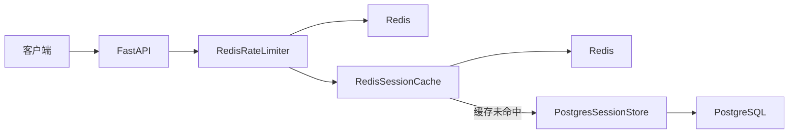
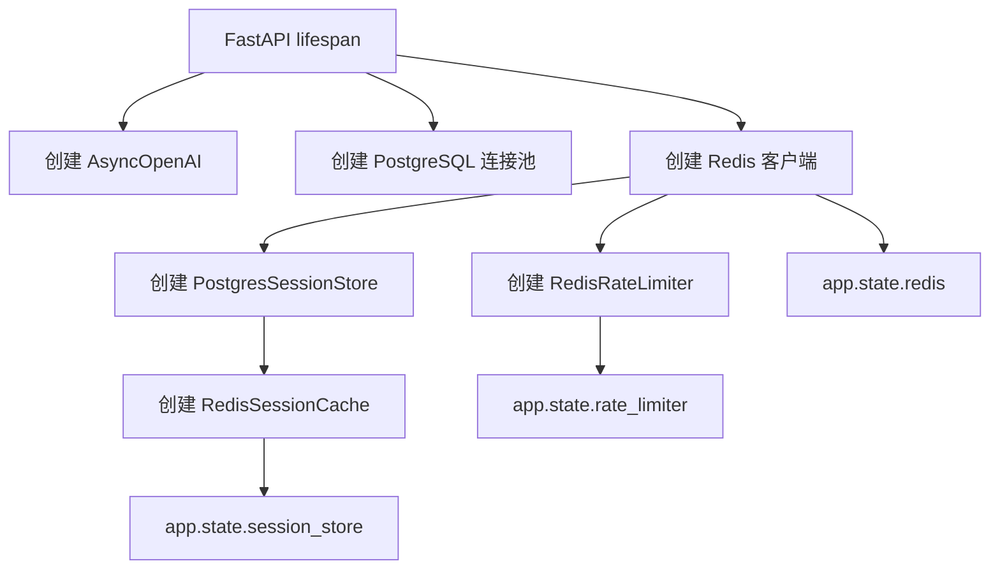
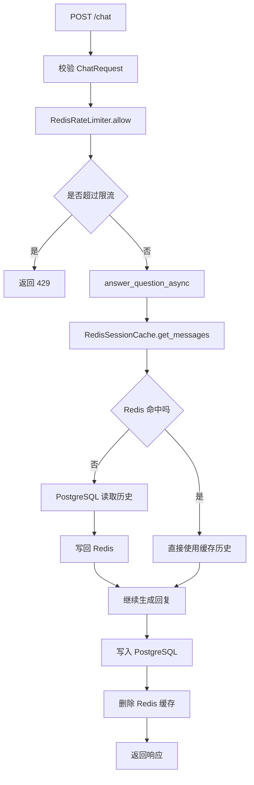
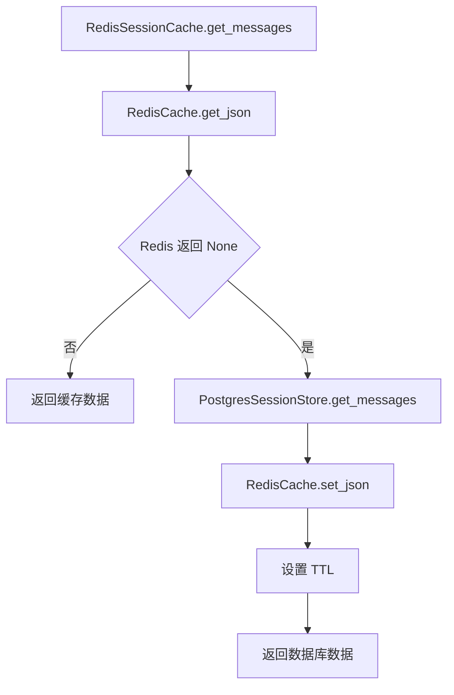
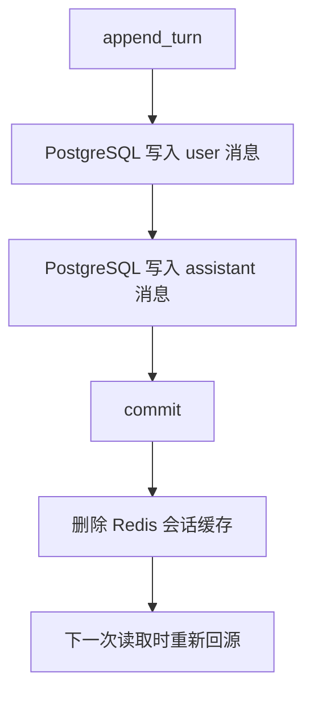
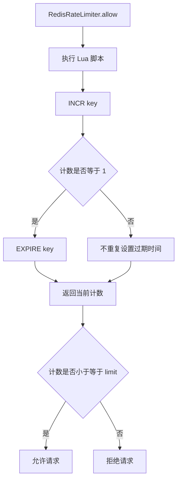

# Day 59 学习笔记

日期：2026-09-17

项目：`ai-job-agent`

主题：Redis 缓存、会话加速和分布式限流

## 1. Day 59 做了什么

Day 58 已经把聊天历史持久化到 PostgreSQL。

但还存在两个生产问题：

```text
每次聊天都读取 PostgreSQL
  ->
数据库读取压力会随着用户增长
```

```text
每个进程只能做本地并发限制
  ->
多进程部署时无法统一限制用户请求
```

Day 59 增加：

```text
Redis 客户端
  ->
JSON 缓存封装
  ->
聊天会话缓存
  ->
分布式限流
  ->
Redis 健康检查
  ->
Docker Redis 服务
```

## 2. Day 59 改了哪些文件

| 文件 | 变化 | 作用 |
|---|---|---|
| `app/redis_client.py` | 新增 | 创建异步 Redis 客户端 |
| `app/redis_cache.py` | 新增 | JSON 缓存读写和删除 |
| `app/redis_session_cache.py` | 新增 | 缓存聊天历史，回源 PostgreSQL |
| `app/redis_rate_limiter.py` | 新增 | 基于 Redis 的分布式限流 |
| `app/main.py` | 修改 | 创建 Redis 客户端、缓存和限流器 |
| `docker-compose.yml` | 修改 | 增加 Redis 服务 |
| `tests/test_redis_backend.py` | 新增 | 测试缓存、失效、限流和真实 Redis |

## 3. 当前改动和项目架构的关系

Day 58：

```text
FastAPI
  ->
async_agent
  ->
PostgresSessionStore
  ->
PostgreSQL
```

Day 59：

```text
FastAPI
  ->
RedisRateLimiter
  ->
RedisSessionCache
  ->
Redis
  ->
未命中时回源 PostgresSessionStore
  ->
PostgreSQL
```



## 4. Day 59 项目闭环实际流程

### 4.1 服务启动流程



### 4.2 `/chat` 请求流程



### 4.3 会话缓存读取流程



### 4.4 会话写入和缓存失效流程



### 4.5 分布式限流流程



## 5. 核心概念解释

### 5.1 Redis

Redis 是一个内存键值数据库。

它把数据存在内存里，所以读写非常快。

常见用途：

- 缓存。
- 会话。
- 限流。
- 排行榜。
- 分布式锁。
- 消息队列。

### 5.2 键值模型

Redis 的基本操作：

```text
SET key value
GET key
DEL key
```

例如：

```text
SET chat:session:s1:messages "[...]"
GET chat:session:s1:messages
```

### 5.3 TTL

TTL 是 Time To Live，表示 key 多久后自动过期。

本项目：

```python
await redis.set(key, raw, ex=300)
```

表示 300 秒后缓存自动删除。

好处：

- 防止缓存无限堆积。
- 让旧数据最终被清理。
- 避免长期保存过期内容。

### 5.4 JSON 缓存

Redis 主要存字符串。

Python 的列表和字典不能直接写入，需要：

```python
json.dumps(value, ensure_ascii=False)
```

读取后需要：

```python
json.loads(raw)
```

### 5.5 Cache Aside

Cache Aside 是最常见的缓存模式：

```text
读取：
先查缓存
命中返回
未命中查数据库
把数据库结果写回缓存

写入：
先写数据库
再删除缓存
```

本项目：

```text
get_messages
  ->
先查 Redis
  ->
未命中查 PostgreSQL
  ->
写回 Redis
```

```text
append_turn
  ->
写 PostgreSQL
  ->
删除 Redis key
```

### 5.6 缓存命中与缓存未命中

缓存命中：

```text
Redis 里已经有数据，直接返回。
```

缓存未命中：

```text
Redis 里没有数据，需要访问 PostgreSQL。
```

生产系统会监控缓存命中率：

```text
命中率越高，数据库压力越小。
```

### 5.7 缓存失效

当数据库数据变化时，旧缓存不能再使用。

本项目采用删除缓存：

```text
写入新消息
  ->
删除 Redis 缓存
  ->
下次读取重新加载最新数据
```

### 5.8 分布式限流

如果服务有多个进程：

```text
进程 A 不知道进程 B 已经放行了多少请求。
```

Redis 是共享存储，多个进程都能访问同一个计数。

所以 Redis 限流是分布式限流。

### 5.9 Lua 脚本

Redis 支持执行 Lua 脚本。

本项目：

```lua
local current = redis.call('INCR', KEYS[1])
if current == 1 then
    redis.call('EXPIRE', KEYS[1], ARGV[1])
end
return current
```

脚本在 Redis 内部原子执行。

不会出现：

```text
两个请求同时 INCR
  ->
两个请求都判断自己是第一次
  ->
两个请求都设置 EXPIRE
```

### 5.10 异步 Redis 客户端

本项目使用：

```python
import redis.asyncio as aioredis
```

异步客户端通过 `await` 调用：

```python
await redis.get(key)
await redis.set(key, value)
```

等待 Redis 响应时，事件循环可以处理其他请求。

## 6. 每个改动在业务中负责什么

### 6.1 app/redis_client.py

负责：

- 读取 `REDIS_URL`。
- 创建异步 Redis 客户端。
- 复用连接。

### 6.2 app/redis_cache.py

负责：

- JSON 序列化。
- JSON 反序列化。
- 设置 TTL。
- 删除缓存。

### 6.3 app/redis_session_cache.py

负责：

- 缓存聊天历史。
- 缓存未命中时回源 PostgreSQL。
- 写入新消息后删除缓存。

### 6.4 app/redis_rate_limiter.py

负责：

- 按 key 限制请求次数。
- 使用 Redis Lua 脚本保证原子性。
- 返回是否允许请求。

### 6.5 app/main.py

负责：

- 创建 Redis 客户端。
- 创建缓存和限流器。
- 提供 `/health/redis`。
- 在 `/chat` 和 `/chat/stream` 中接入限流和缓存。

### 6.6 tests/test_redis_backend.py

验证：

- 缓存命中。
- 缓存未命中回源。
- 写入后缓存失效。
- 限流到达上限后拒绝。
- Lua 脚本使用 INCR 和 EXPIRE。

## 7. 实际生产对标方案

| Day 59 的做法 | 生产中的常见方案 |
|---|---|
| Redis Cache Aside | Redis Cluster、多级缓存 |
| TTL 300 秒 | 按业务设置不同 TTL |
| 会话缓存 | 用户 Session Store |
| 固定窗口限流 | 滑动窗口、令牌桶 |
| Lua 原子脚本 | 网关限流、中间件 |
| 单 Redis | Redis Sentinel、Cluster |
| Docker Redis | 云 Redis、Memorystore、ElastiCache |
| `/health/redis` | Kubernetes readiness probe |

生产系统还会：

- 区分 IP、用户、接口、租户的限流维度。
- 监控缓存命中率、Redis 内存和延迟。
- 防止缓存穿透、击穿和雪崩。
- 对 Redis 做持久化、备份和主从复制。
- 使用 Redis Stream 或队列处理异步任务。

## 8. Day 59 开发中遇到的报错及原因

### 8.1 TypeError: JSON object must be str, bytes or bytearray, not AsyncMock

原因：

测试直接 mock 了：

```python
redis.get_json.return_value = ...
```

但 `RedisSessionCache` 内部实际调用：

```text
RedisCache.get_json()
  ->
redis.get()
```

它不会调用 `redis.get_json`。

解决：

测试应 mock Redis 底层命令：

```python
redis.get.return_value = json.dumps([...])
redis.set = AsyncMock()
redis.delete = AsyncMock()
```

### 8.2 测试通过但真实请求仍无法连接 Redis

原因：

本地没有启动 Redis，或者 `REDIS_URL` 配置错误。

解决：

```bash
docker compose up -d redis
.venv/bin/python -c "import asyncio; from app.redis_client import create_redis_client; asyncio.run(create_redis_client().ping())"
```

### 8.3 Docker 中 backend 无法连接 Redis

原因：

backend 容器访问 Redis 时不能使用：

```text
localhost
```

应该使用 Docker 服务名：

```text
redis
```

正确地址：

```text
redis://redis:6379/0
```

## 9. Day 59 检查清单

- [ ] 已添加 `redis` 依赖
- [ ] `.env` 已配置 `REDIS_URL`
- [ ] `app/redis_client.py` 已新增
- [ ] `app/redis_cache.py` 已新增
- [ ] `app/redis_session_cache.py` 已新增
- [ ] `app/redis_rate_limiter.py` 已新增
- [ ] `/health/redis` 已实现
- [ ] `/chat` 已接入限流
- [ ] `/chat/stream` 已接入限流
- [ ] 聊天历史已接入缓存
- [ ] Docker Redis 服务已增加
- [ ] `tests/test_redis_backend.py` 已通过
- [ ] 全量测试已通过

## 10. 当前已知限制

### 10.1 固定窗口限流有边界问题

固定窗口在时间边界可能产生突刺。

生产环境可以使用滑动窗口或令牌桶。

### 10.2 单 Redis 没有高可用

当前只有一个 Redis 实例。

生产环境通常使用 Redis Sentinel 或 Redis Cluster。

### 10.3 缓存只覆盖聊天历史

当前没有缓存 RAG 检索结果、模型响应和工具结果。

后续可以继续扩展。

### 10.4 热点 key 失效可能击穿

如果某个会话缓存刚失效，大量请求同时到达，可能同时回源 PostgreSQL。

生产环境需要分布式锁或互斥加载。

### 10.5 Docker backend 环境变量需要检查

backend 容器需要配置：

```text
REDIS_URL=redis://redis:6379/0
```

并等待 Redis 健康后再启动。

## 11. 下一步

Day 60 进入任务队列：

```text
长任务
  ->
异步任务
  ->
重试
  ->
死信队列
  ->
任务状态
```
