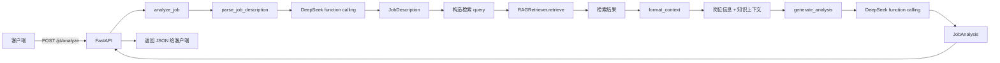

# Day 6 学习笔记

日期：2026-08-21

项目：`ai-job-agent`

目标：把 JD 解析、RAG 检索和 DeepSeek 生成串联成一个多步流程，新增 `/jd/analyze` 接口。

## 1. Day 6 完成的项目闭环



一句话描述：

> 客户端提交 JD，系统先解析岗位，再用岗位关键词检索知识库，最后把岗位信息和检索结果一起交给 DeepSeek，生成岗位分析并返回。

## 2. 今天改了哪些文件

| 文件 | 变化 | 作用 |
|---|---|---|
| `app/models.py` | 新增 `JobAnalysis` | 定义分析结果结构 |
| `app/agent.py` | 新增 | 编排多步流程 |
| `app/main.py` | 新增 `/jd/analyze` | 暴露分析接口 |
| `tests/test_agent.py` | 新增 | 测试多步流程 |

## 3. 多步流程编排

### 3.1 什么是多步流程

之前每个函数只做一件事：

- `parse_job_description()` 只解析 JD
- `retriever.retrieve()` 只做检索

Day 6 把这些能力组合起来：

```text
解析岗位 -> 检索知识 -> 组装上下文 -> 生成分析
```

这是 AI Agent 最常见的编排方式：模型负责推理，Python 负责调用工具和组织数据。

### 3.2 为什么需要编排

单独调用一次模型无法完成复杂任务，因为模型需要：

- 外部数据
- 结构化中间结果
- 多个工具的输出

因此 Python 代码要控制步骤顺序，并在步骤之间传递数据。

## 4. RAG 上下文注入

RAG 不是单独回答用户问题，而是把检索结果放进 Prompt。

### 4.1 没有 RAG 时

模型只能依赖自己的训练知识，可能不知道你的私有资料。

### 4.2 有 RAG 时

系统会构造类似这样的输入：

```text
岗位信息：
{"title":"AI Agent 工程师","keywords":["Agent","RAG"]}

知识库：
RAG: RAG 通过 Embedding 和向量检索找到相关资料...
AI Agent: AI Agent 需要任务规划、工具调用、记忆管理...
```

模型能根据这些知识生成更可靠的回答。

### 4.3 项目中的实现

```python
def format_context(results: list[dict]) -> str:
    lines = []

    for item in results:
        doc = item["doc"]
        score = item["score"]
        lines.append(f"{doc['title']}: {doc['text']} (score={score:.3f})")

    return "\n".join(lines)
```

这段代码把检索结果转换成可读文本。

## 5. lru_cache 的作用

### 5.1 问题

`build_retriever()` 会加载 Embedding 模型。

如果每次请求都执行：

```python
retriever = build_retriever(Path("data/knowledge_base.json"))
```

每次请求都会重新加载模型，非常慢。

### 5.2 解决方式

```python
from functools import lru_cache

@lru_cache(maxsize=1)
def get_retriever():
    return build_retriever(Path("data/knowledge_base.json"))
```

作用：

- 第一次调用时执行函数
- 缓存返回值
- 后续调用直接返回缓存结果
- `maxsize=1` 表示最多缓存一个结果

这样整个服务只需要加载一次 Embedding 模型。

## 6. model_dump_json 的作用

Pydantic 对象不能直接放进字符串，需要先序列化。

```python
job.model_dump_json()
```

作用：

- 把 Pydantic 对象转成 JSON 字符串
- 便于拼进 Prompt

例如：

```python
user_content = f"岗位信息：\n{job.model_dump_json()}\n\n知识库：\n{context}"
```

如果使用普通字典，还需要手动处理类型和编码。

## 7. analyze_job 的完整数据流

### 7.1 入口

```python
def analyze_job(jd_text: str, retriever=None) -> JobAnalysis:
    job = parse_job_description(jd_text)

    retriever = retriever or get_retriever()

    query = " ".join(job.keywords) if job.keywords else job.title

    results = retriever.retrieve(query, top_k=3)

    context = format_context(results)

    return generate_analysis(job, context)
```

### 7.2 每一步数据变化

| 步骤 | 函数 | 输入 | 输出 |
|---|---|---|---|
| 1 | `parse_job_description` | JD 文本 | `JobDescription` |
| 2 | `" ".join(job.keywords)` | 岗位关键词 | 查询字符串 |
| 3 | `retriever.retrieve` | 查询字符串 | 检索结果列表 |
| 4 | `format_context` | 检索结果列表 | 知识上下文文本 |
| 5 | `generate_analysis` | `JobDescription` 和上下文 | `JobAnalysis` |

### 7.3 generate_analysis 内部

```python
def generate_analysis(job, context: str) -> JobAnalysis:
    user_content = f"岗位信息：\n{job.model_dump_json()}\n\n知识库：\n{context}"

    response = client.chat.completions.create(
        model=os.environ["OPENAI_MODEL"],
        messages=[
            {"role": "system", "content": ANALYSIS_SYSTEM_PROMPT},
            {"role": "user", "content": user_content},
        ],
        tools=[ANALYSIS_TOOL],
        tool_choice={
            "type": "function",
            "function": {"name": "save_job_analysis"},
        },
    )

    message = response.choices[0].message

    if not message.tool_calls:
        raise RuntimeError("模型没有返回 tool_calls")

    arguments = json.loads(message.tool_calls[0].function.arguments)
    return JobAnalysis.model_validate(arguments)
```

这里再次使用 function calling，让模型调用 `save_job_analysis`，并返回结构化分析。

## 8. 如何 mock 多步流程

测试多步流程时，不希望真实调用 DeepSeek，也不想加载真实 Embedding 模型。

### 8.1 使用 FakeRetriever

```python
class FakeRetriever:
    def retrieve(self, query: str, top_k: int = 3):
        return [
            {
                "doc": {
                    "id": "doc-rag",
                    "title": "RAG",
                    "text": "RAG 通过 Embedding 和向量检索找到相关资料。",
                },
                "score": 0.9,
            }
        ]
```

它实现了 `retrieve()`，但不需要加载模型。

### 8.2 mock 解析函数

```python
with patch("app.agent.parse_job_description", return_value=fake_job):
    ...
```

注意 patch 路径是 `app.agent.parse_job_description`，因为 `agent.py` 导入了这个函数。

### 8.3 mock DeepSeek 调用

```python
tool_call = MagicMock()
tool_call.function.arguments = '{"summary":"AI Agent 岗位",...}'

message = MagicMock()
message.tool_calls = [tool_call]

choice = MagicMock()
choice.message = message

response = MagicMock()
response.choices = [choice]

with patch.object(
    agent.client.chat.completions,
    "create",
    return_value=response,
):
    result = agent.analyze_job("某 JD", retriever=FakeRetriever())
```

### 8.4 测试目的

测试只验证多步流程是否正确串联，不验证 DeepSeek 的真实质量。

真实模型质量应该通过单独的手动测试或评估集验证。

## 9. Day 6 检查清单

- [ ] `JobAnalysis` 模型已创建
- [ ] `app/agent.py` 已创建
- [ ] `/jd/analyze` 接口已创建
- [ ] 多步流程可以解析、检索、生成
- [ ] `tests/test_agent.py` 通过
- [ ] 理解 RAG 上下文注入
- [ ] 理解 `lru_cache`
- [ ] 理解 `model_dump_json`
- [ ] 理解 `analyze_job` 完整数据流
- [ ] 能 mock 多步流程

## 10. 明天要做什么

Day 7 进行第 1 周收尾，包括完整测试、README、接口联调、Git 提交和第 1 周复盘。
