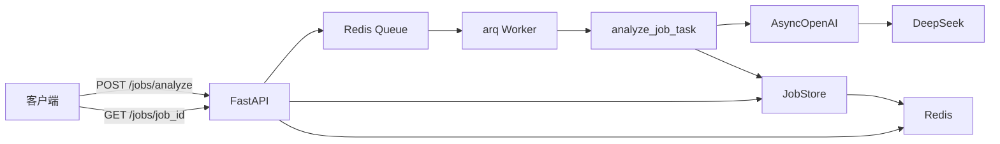
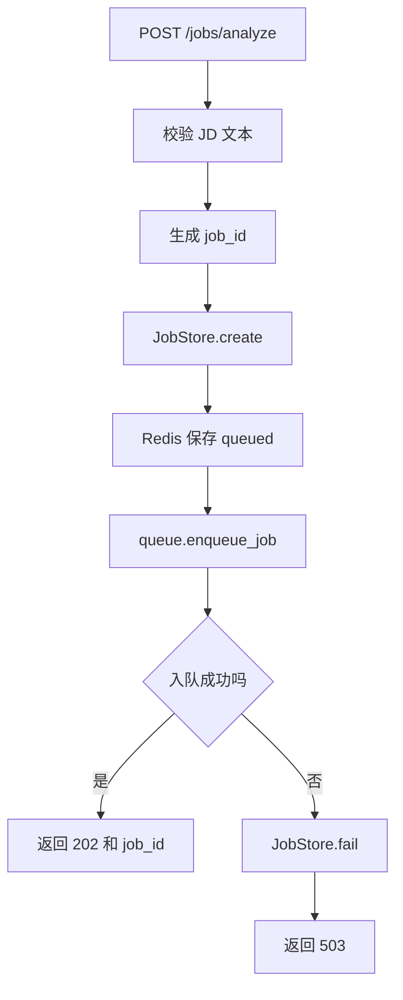
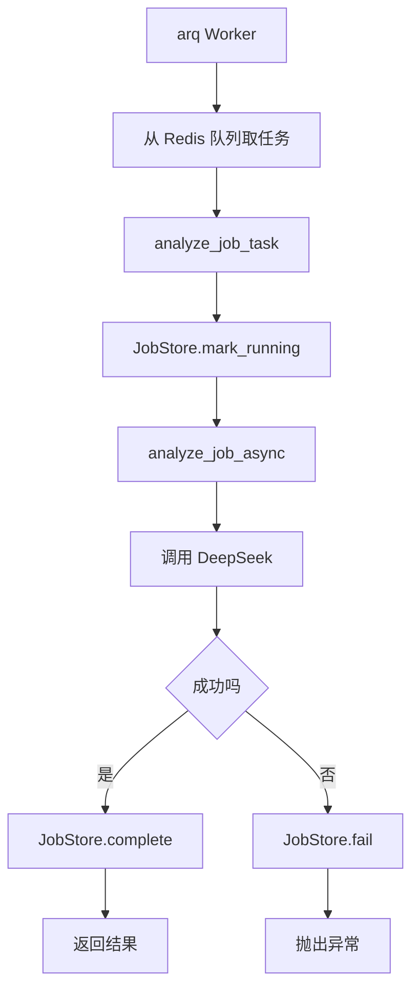
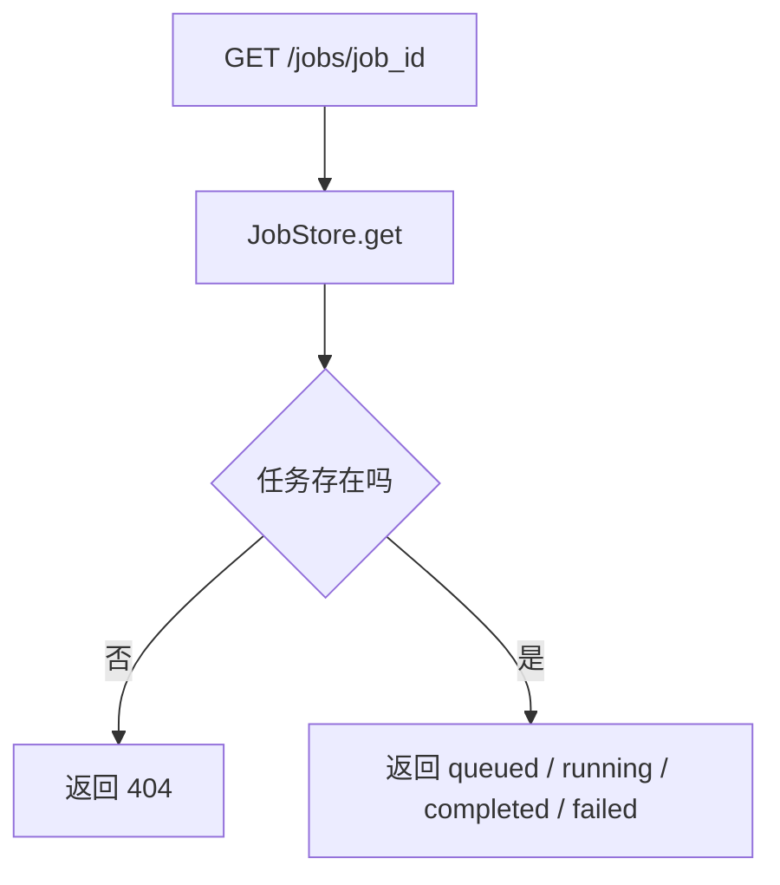

# Day 60 学习笔记

日期：2026-09-17

项目：`ai-job-agent`

主题：任务队列、arq、后台 Worker 和异步任务状态

## 1. Day 60 做了什么

Day 58 把聊天历史放进 PostgreSQL。

Day 59 用 Redis 做缓存和限流。

Day 60 用 Redis 继续解决：

```text
耗时任务不能一直占用 HTTP 请求
  ->
API 应该快速返回
  ->
后台 Worker 再执行真正任务
```

Day 60 增加：

```text
arq 任务队列
  ->
Redis JobStore
  ->
后台任务 analyze_job_task
  ->
Worker 进程
  ->
/jobs/analyze
  ->
/jobs/{job_id}
  ->
/health/queue
```

## 2. Day 60 改了哪些文件

| 文件 | 变化 | 作用 |
|---|---|---|
| `app/job_store.py` | 新增 | 保存任务状态、结果和错误 |
| `app/queue.py` | 新增 | 创建 arq 队列连接 |
| `app/tasks.py` | 新增 | 后台任务和 Worker 生命周期 |
| `app/worker.py` | 新增 | arq Worker 配置 |
| `app/main.py` | 修改 | 增加任务提交和状态查询接口 |
| `docker-compose.yml` | 修改 | 增加独立 Worker 服务 |
| `tests/test_job_queue.py` | 新增 | 测试任务状态和后台任务逻辑 |

## 3. 当前改动和项目架构的关系

Day 60 之前：

```text
用户请求
  ->
FastAPI 同步等待分析完成
  ->
返回结果
```

Day 60 之后：

```text
用户请求
  ->
FastAPI 创建 job_id
  ->
任务进入 Redis 队列
  ->
API 立即返回 202
  ->
Worker 从 Redis 取任务
  ->
Worker 调用 DeepSeek
  ->
Worker 保存结果
  ->
用户轮询 /jobs/{job_id}
```



## 4. Day 60 项目闭环实际流程

### 4.1 提交任务流程



### 4.2 Worker 执行任务流程



### 4.3 查询任务状态流程



## 5. 核心概念解释

### 5.1 为什么需要任务队列

如果 HTTP 请求直接执行耗时任务：

```text
用户请求
  ->
FastAPI 等待 30 秒
  ->
用户一直转圈
```

还会导致：

- 占用 HTTP 连接。
- 占用事件循环或线程池。
- 前端容易超时。
- 服务重启时任务丢失。

任务队列把任务交给后台：

```text
API 快速返回 job_id
  ->
Worker 慢慢执行
  ->
用户稍后查询结果
```

### 5.2 同步请求与异步任务

同步请求：

```text
用户必须等整个任务完成。
```

异步任务：

```text
用户先拿到任务编号，任务在后台完成。
```

前端类比：

```text
同步请求：
你在餐厅点餐后站在窗口等。

异步任务：
你点餐后拿到取餐号，可以先坐下，等叫号。
```

### 5.3 arq 是什么

arq 是 Python 的异步任务队列。

它依赖 Redis：

```text
API 把任务放进 Redis。
Worker 从 Redis 取任务。
```

arq 适合：

- FastAPI 异步项目。
- Python `async/await` 代码。
- 调用异步 HTTP 接口。
- 调用 AsyncOpenAI。
- 执行耗时 I/O 任务。

### 5.4 arq 在生产项目中的角色

arq 承担：

```text
任务接收
  ->
任务排队
  ->
任务分发
  ->
Worker 并发执行
  ->
结果保留
```

它解决：

- 不让 HTTP 请求等待长任务。
- 多个 Worker 可以并行处理。
- 任务失败后可以被重试。
- 任务执行可以设置超时。
- API 和 Worker 可以独立部署。

### 5.5 Worker

Worker 是一个独立进程。

它不断从 Redis 队列取任务并执行。

本项目启动 Worker：

```bash
.venv/bin/arq app.worker.WorkerSettings
```

Worker 配置：

```python
class WorkerSettings:
    functions = [analyze_job_task]
    max_jobs = 10
    job_timeout = 120
    keep_result = 3600
```

解释：

- `functions`：可以执行的任务。
- `max_jobs`：最大并发任务数。
- `job_timeout`：单个任务超时。
- `keep_result`：结果保留时间。

### 5.6 JobStore

JobStore 负责保存任务状态。

当前状态：

```text
queued
running
completed
failed
```

JobStore 使用 Redis Hash：

```text
job:{job_id}
  ->
status
type
payload
result
error
created_at
updated_at
```

### 5.7 job_id

`job_id` 是任务的唯一编号。

客户端：

```text
提交任务后拿到 job_id。
之后用 job_id 查询状态。
```

### 5.8 202 状态码

`POST /jobs/analyze` 返回 202：

```text
202 Accepted
```

含义：

```text
请求已经接收，但还没有处理完。
```

这比直接返回 200 更准确。

### 5.9 轮询

当前客户端通过轮询查看任务：

```text
GET /jobs/{job_id}
```

生产系统还会使用：

- WebSocket。
- SSE。
- Webhook。
- 消息推送。

## 6. arq 解决的问题

### 6.1 长任务不阻塞 API

API 只负责创建任务和返回 `job_id`。

真正耗时的 LLM 调用由 Worker 完成。

### 6.2 任务可以横向扩展

一个 Worker 不够时，可以启动多个 Worker：

```text
Worker 1
Worker 2
Worker 3
```

它们都从同一个 Redis 队列取任务。

### 6.3 失败和超时可见

任务失败时写入 `failed` 和错误信息。

任务超时可以配置 `job_timeout`。

### 6.4 API 和 Worker 独立部署

API 服务崩溃，Worker 还能继续处理已经进入队列的任务。

Worker 重启后可以继续消费 Redis 队列。

## 7. 每个改动在业务中负责什么

### 7.1 app/job_store.py

负责：

- 创建任务。
- 保存任务状态。
- 标记运行中。
- 保存成功结果。
- 保存失败错误。
- 查询任务。

### 7.2 app/queue.py

负责：

- 读取 Redis 配置。
- 创建 arq 队列连接。

### 7.3 app/tasks.py

负责：

- Worker 启动时创建资源。
- Worker 关闭时释放资源。
- 执行 `analyze_job_task`。

### 7.4 app/worker.py

负责：

- 配置 arq Worker。
- 注册可执行任务。
- 设置并发、超时和结果保留时间。

### 7.5 app/main.py

负责：

- 创建 arq 队列。
- 创建 JobStore。
- 提供任务提交接口。
- 提供任务状态接口。
- 提供 `/health/queue`。

### 7.6 docker-compose.yml

负责：

- 增加独立 Worker 服务。
- 让 Worker 和 API 共享 Redis、PostgreSQL。

## 8. 实际生产对标方案

| Day 60 的做法 | 生产中的常见方案 |
|---|---|
| arq + Redis | Celery、Dramatiq、Kafka Workers |
| Redis Hash 保存状态 | 数据库任务表 |
| 单 Worker | 多 Worker、Kubernetes HPA |
| `max_jobs=10` | 根据资源动态配置 |
| `job_timeout=120` | 任务超时和取消 |
| 客户端轮询 | Webhook、SSE、WebSocket |
| Worker 独立容器 | Kubernetes Deployment |
| Redis 队列 | RabbitMQ、Kafka、云队列 |

生产系统还会：

- 任务幂等，避免重复提交。
- 自动重试和指数退避。
- 死信队列。
- 任务优先级。
- 定时任务。
- 任务执行监控和告警。
- 结果持久化到 PostgreSQL 或对象存储。

## 9. Day 60 开发中遇到的报错及原因

### 9.1 uv 安装 arq 失败

报错：

```text
Because arq==0.26.0 depends on redis[hiredis]>=4.2.0,<5
and arq>=0.26.1 depends on redis[hiredis]>=4.2.0,<6
And because your project depends on arq>=0.26.0 and redis>=6.0.0
```

原因：

项目已有 `redis>=6.0.0`，但 arq 要求 Redis 小于 6。

解决：

```bash
uv remove redis
uv add "redis>=5,<6" "arq>=0.26.1"
```

### 9.2 timezone.UTC 不存在

报错：

```text
AttributeError: type object 'datetime.timezone' has no attribute 'UTC'
```

原因：

使用了：

```python
datetime.now(timezone.UTC)
```

但当前运行环境要求从 `datetime` 导入 `UTC`。

解决：

```python
from datetime import UTC, datetime

datetime.now(UTC)
```

### 9.3 ruff 提示使用 datetime.UTC

报错：

```text
UP017 Use datetime.UTC alias
```

原因：

ruff 希望使用 Python 3.11+ 的 `UTC` 别名。

解决：

```python
from datetime import UTC, datetime

datetime.now(UTC)
```

## 10. Day 60 检查清单

- [ ] 已添加 `arq>=0.26.1`
- [ ] Redis 依赖已调整为 `redis>=5,<6`
- [ ] `app/job_store.py` 已新增
- [ ] `app/queue.py` 已新增
- [ ] `app/tasks.py` 已新增
- [ ] `app/worker.py` 已新增
- [ ] `/jobs/analyze` 已实现
- [ ] `/jobs/{job_id}` 已实现
- [ ] `/health/queue` 已实现
- [ ] Docker Worker 服务已增加
- [ ] `tests/test_job_queue.py` 已通过

## 11. 当前已知限制

### 11.1 任务结果只在 Redis

结果没有持久化到 PostgreSQL。

生产系统应把最终结果写入数据库或对象存储。

### 11.2 没有自动重试

当前任务失败后需要人工处理。

生产系统通常配置自动重试和死信队列。

### 11.3 没有取消任务

当前只能查询状态，不能取消排队任务。

### 11.4 没有任务优先级

所有任务按先进先出处理。

生产系统可能需要优先级队列。

### 11.5 没有定时任务

当前只处理手动提交的任务。

后续可以使用 arq cron 或 Celery Beat。

## 12. 下一步

Day 61 进入身份认证：

```text
JWT
  ->
RBAC
  ->
租户隔离
  ->
令牌刷新
  ->
权限校验
```
