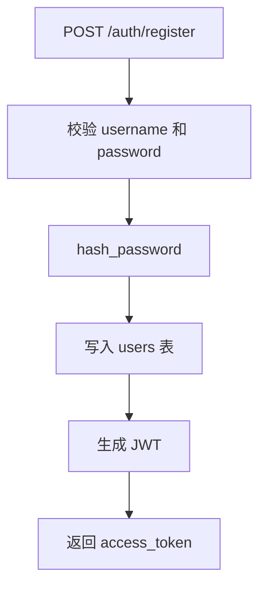
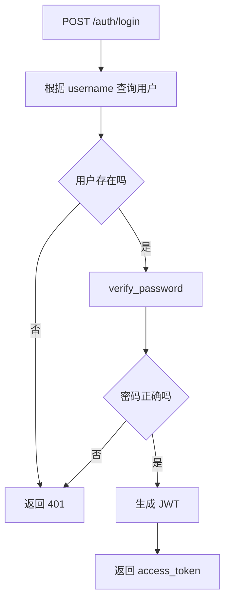
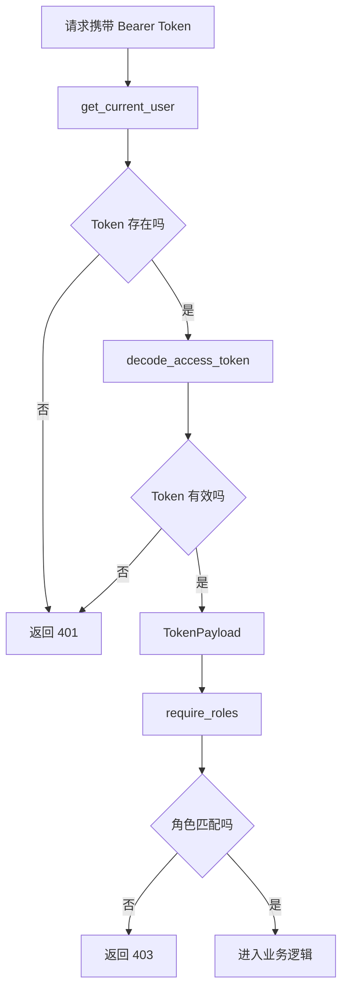
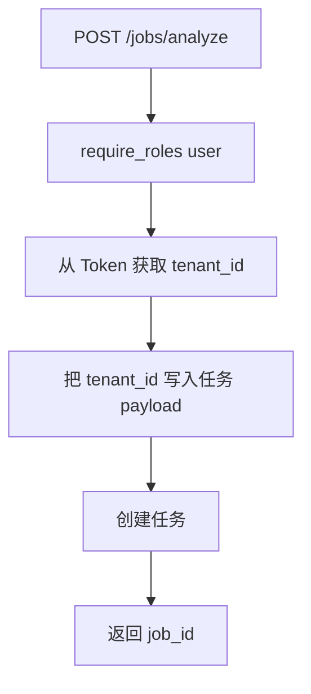
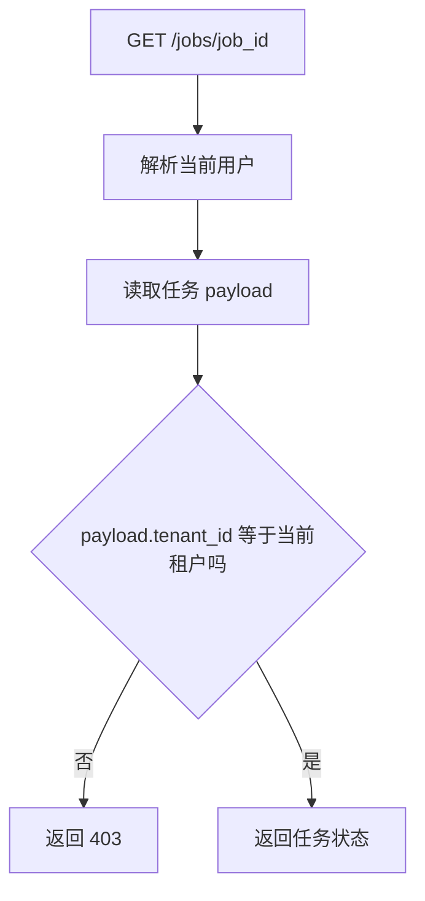
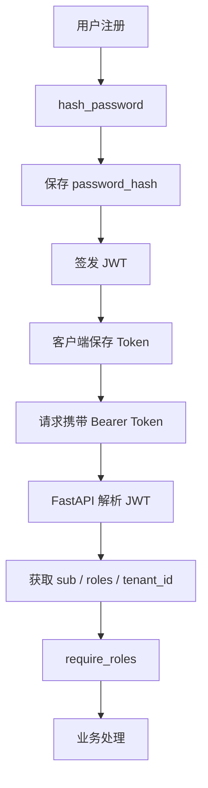

# Day 61 学习笔记

日期：2026-09-18

项目：`ai-job-agent`

主题：JWT、密码哈希、RBAC 和租户隔离

## 1. Day 61 做了什么

Day 60 已经实现任务队列，但接口没有身份边界。

Day 61 增加：

```text
用户表
  ->
密码哈希
  ->
JWT Token
  ->
Bearer Token 解析
  ->
RBAC 角色控制
  ->
租户隔离
  ->
/auth/register
  ->
/auth/login
  ->
/auth/me
  ->
/auth/admin/users
```

## 2. Day 61 改了哪些文件

| 文件 | 变化 | 作用 |
|---|---|---|
| `app/auth_models.py` | 新增 | 注册、登录、Token、用户响应模型 |
| `app/auth_security.py` | 新增 | JWT 和密码哈希 |
| `app/auth_dependencies.py` | 新增 | 当前用户和角色权限依赖 |
| `app/user_repository.py` | 新增 | 用户数据访问 |
| `app/auth_router.py` | 新增 | 注册、登录、查询用户接口 |
| `migrations/002_auth.sql` | 新增 | 用户表 |
| `app/main.py` | 修改 | 挂载认证路由，保护任务接口 |
| `pyproject.toml` | 修改 | 添加 PyJWT、pwdlib，配置 ruff |
| `tests/test_auth.py` | 新增 | 测试密码、JWT、角色和登录 |

## 3. 当前改动和项目架构的关系

Day 61 之前：

```text
客户端
  ->
FastAPI
  ->
业务逻辑
```

Day 61 之后：

```text
客户端
  ->
登录获取 Token
  ->
携带 Bearer Token
  ->
FastAPI
  ->
解析 Token
  ->
检查角色
  ->
业务逻辑
```

## 4. Day 61 项目闭环实际流程

### 4.1 注册流程



### 4.2 登录流程



### 4.3 访问受保护接口流程



### 4.4 任务接口租户隔离流程



查询任务时：



## 5. 核心概念解释

### 5.1 认证与授权

认证：

```text
你是谁？
```

授权：

```text
你能做什么？
```

本项目：

```text
认证：JWT 验证用户身份。
授权：require_roles 检查角色。
```

### 5.2 为什么密码不能存明文

如果数据库泄露，明文密码会直接暴露。

正确做法是保存密码哈希：

```text
用户输入密码
  ->
哈希函数计算
  ->
保存哈希值
```

登录时：

```text
用户再次输入密码
  ->
哈希计算
  ->
比较哈希值
```

### 5.3 pwdlib

`pwdlib` 是 Python 密码哈希库。

本项目使用：

```python
password_hasher = PasswordHash.recommended()
```

它负责：

- 生成强密码哈希。
- 使用 Argon2 等现代算法。
- 校验密码。
- 处理盐值。

生产项目中，密码存储通常使用：

- Argon2id。
- bcrypt。
- PBKDF2。

### 5.4 JWT

JWT 是 JSON Web Token。

它由三部分组成：

```text
Header
Payload
Signature
```

本项目 Payload：

```json
{
  "sub": "alex",
  "roles": ["user"],
  "tenant_id": "tenant-a",
  "iat": 1234567890,
  "exp": 1234567890
}
```

说明：

- `sub`：用户名。
- `roles`：角色。
- `tenant_id`：租户。
- `iat`：签发时间。
- `exp`：过期时间。

### 5.5 JWT 的作用

JWT 让服务端不用保存用户会话。

传统 Session：

```text
服务端保存 session。
```

JWT：

```text
Token 里已经包含用户信息。
```

客户端每次请求带上 Token，服务端验证签名即可。

### 5.6 JWT 的优点

- 无状态。
- 适合多服务。
- 适合前后端分离。
- 适合多副本部署。

### 5.7 JWT 的注意事项

- 不要放敏感信息。
- 必须设置过期时间。
- 使用 HTTPS。
- 密钥不能泄露。
- 生产环境建议使用 RS256。

### 5.8 Bearer Token

HTTP 请求头：

```http
Authorization: Bearer <token>
```

FastAPI 使用：

```python
HTTPBearer()
```

解析这个请求头。

### 5.9 RBAC

RBAC 是 Role-Based Access Control，基于角色的访问控制。

本项目：

```text
user：普通用户
admin：管理员
```

`require_roles("admin")`：

```text
只有 admin 可以访问 /auth/admin/users。
```

### 5.10 租户隔离

租户表示一个独立用户或组织。

例如：

```text
tenant-a
tenant-b
```

不同租户的数据不能互相访问。

本项目把 `tenant_id` 放进 JWT 和任务 payload，查询任务时校验。

## 6. JWT 和 pwdlib 在生产项目中承担的角色

### 6.1 JWT 的角色

```text
用户登录后
  ->
签发 Token
  ->
后续请求携带 Token
  ->
服务端验证 Token
  ->
确认身份和角色
```

它解决：

- 多服务之间共享身份。
- 无状态认证。
- 前后端分离。
- 多副本部署时无需共享 Session。

### 6.2 pwdlib 的角色

```text
用户注册
  ->
密码哈希
  ->
保存哈希
```

登录时：

```text
用户提交密码
  ->
计算哈希
  ->
比较保存的哈希
```

它解决：

- 数据库泄露后密码不直接暴露。
- 防止使用快速、可逆的密码存储方式。
- 使用盐值和现代哈希算法增强安全性。

## 7. JWT 与密码哈希完整流程图



## 8. 每个改动在业务中负责什么

### 8.1 app/auth_models.py

定义：

- 注册请求。
- 登录请求。
- Token 响应。
- Token Payload。
- 用户公开信息。

### 8.2 app/auth_security.py

负责：

- 密码哈希。
- 密码校验。
- 创建 JWT。
- 解析 JWT。

### 8.3 app/auth_dependencies.py

负责：

- 解析 Bearer Token。
- 获取当前用户。
- 检查角色权限。

### 8.4 app/user_repository.py

负责：

- 创建用户。
- 根据用户名查询用户。
- 查询所有用户。

### 8.5 app/auth_router.py

负责：

- 注册。
- 登录。
- 当前用户。
- 管理员用户列表。

### 8.6 migrations/002_auth.sql

负责：

- 创建用户表。
- 建立用户名唯一约束。
- 建立租户索引。

## 9. 实际生产对标方案

| Day 61 的做法 | 生产中的常见方案 |
|---|---|
| JWT HS256 | RS256、OIDC、Keycloak |
| Argon2 | Argon2id、bcrypt |
| PostgreSQL users 表 | 用户中心、LDAP、SSO |
| RBAC | RBAC、ABAC、ReBAC |
| tenant_id | 多租户隔离 |
| Access Token 60 分钟 | Access Token + Refresh Token |
| 手工 JWT_SECRET | Vault、KMS、Secret Manager |
| HTTPBearer | Cookie、OAuth2、mTLS |

生产系统还会：

- 使用 Refresh Token。
- 使用非对称签名。
- 支持令牌吊销。
- 增加登录失败限流。
- 增加多因素认证。
- 审计认证和授权事件。

## 10. Day 61 开发中遇到的报错及原因

### 10.1 ruff B008 报错

报错：

```text
B008 Do not perform function call Depends in argument defaults
```

原因：

FastAPI 使用：

```python
async def me(user: TokenPayload = Depends(get_current_user)):
    ...
```

这是 FastAPI 官方依赖注入写法，但 ruff 会把它当成普通 Python 默认参数。

解决：

在 `pyproject.toml` 中按文件忽略：

```toml
[tool.ruff.lint.per-file-ignores]
"app/auth_dependencies.py" = ["B008"]
"app/auth_router.py" = ["B008"]
"app/main.py" = ["B008"]
```

### 10.2 数据库连接 refused

报错：

```text
connection refused on localhost:5432
```

原因：

电脑重启后 PostgreSQL 容器没有自动启动。

解决：

```bash
open -a Docker
docker compose up -d postgres redis qdrant
.venv/bin/python -m app.db_cli migrate
```

### 10.3 登录返回 401

原因：

用户名不存在，或密码错误。

检查：

- 是否先注册用户。
- 密码是否正确。
- 数据库迁移是否执行。

### 10.4 注册重复用户名

原因：

用户表 `username` 有唯一约束。

解决：

使用其他用户名，或接口返回 409 冲突。

## 11. Day 61 检查清单

- [ ] 已添加 `pyjwt`
- [ ] 已添加 `pwdlib[argon2]`
- [ ] 已配置 `JWT_SECRET`
- [ ] 已创建 `users` 表
- [ ] 密码使用哈希
- [ ] JWT 签发和解析已实现
- [ ] RBAC 已实现
- [ ] 租户隔离已实现
- [ ] `/auth/register` 已实现
- [ ] `/auth/login` 已实现
- [ ] `/auth/me` 已实现
- [ ] `/auth/admin/users` 已实现
- [ ] 任务接口已保护
- [ ] `tests/test_auth.py` 已通过

## 12. 当前已知限制

### 12.1 没有 Refresh Token

当前只有短期 Access Token。

生产系统通常增加 Refresh Token。

### 12.2 没有令牌吊销

用户登出后 Token 仍然有效，直到过期。

### 12.3 注册接口公开

生产系统通常限制注册或由管理员创建用户。

### 12.4 只保护了任务接口

其他业务接口仍需逐步接入认证。

### 12.5 JWT_SECRET 仍是环境变量

生产环境应使用 Secret Manager。

## 13. 下一步

Day 62 进入压力测试：

```text
并发
  ->
吞吐
  ->
p50 / p95 / p99
  ->
瓶颈定位
  ->
容量评估
```
