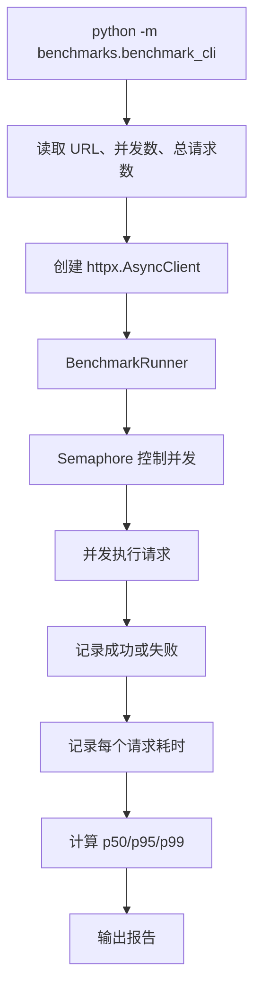
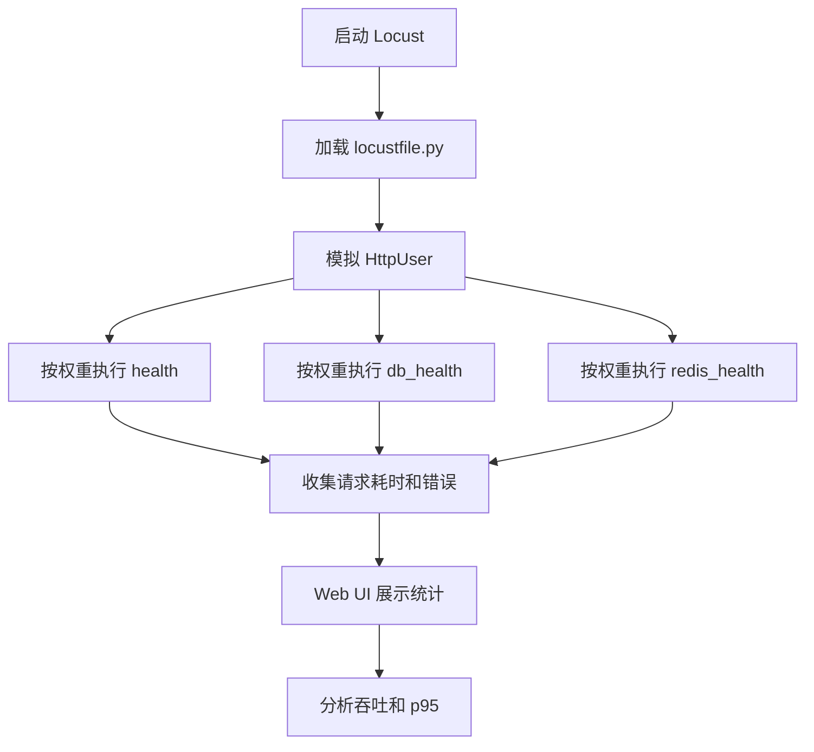
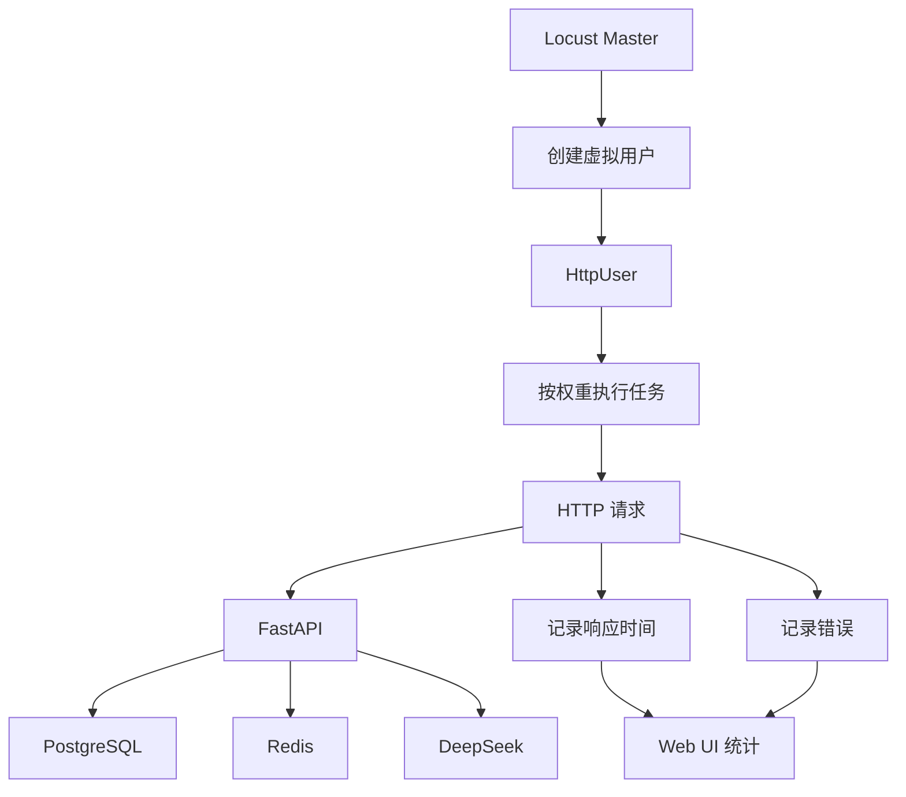

# Day 62 学习笔记

日期：2026-09-18

项目：`ai-job-agent`

主题：压力测试、并发、吞吐、延迟指标和 Locust

## 1. Day 62 做了什么

Day 61 完成了认证和授权。

Day 62 开始验证：

```text
服务能承受多少请求？
  ->
并发上升后延迟如何变化？
  ->
有多少请求会失败？
  ->
瓶颈在哪里？
```

Day 62 增加：

```text
BenchmarkRunner
  ->
快速 HTTP 压测 CLI
  ->
Locust 压测脚本
  ->
p50 / p95 / p99
  ->
吞吐量
  ->
错误率
  ->
单元测试
```

## 2. Day 62 改了哪些文件

| 文件 | 变化 | 作用 |
|---|---|---|
| `benchmarks/http_benchmark.py` | 新增 | 并发压测、统计指标 |
| `benchmarks/benchmark_cli.py` | 新增 | 快速 HTTP 压测命令 |
| `benchmarks/locustfile.py` | 新增 | Locust 用户场景 |
| `tests/test_http_benchmark.py` | 新增 | 测试统计和压测逻辑 |
| `pyproject.toml` | 修改 | 添加 Locust 开发依赖 |

## 3. 当前改动和项目架构的关系

Day 62 不修改业务代码，而是在业务服务外面增加测试层：

```text
压测客户端
  ->
HTTP 请求
  ->
FastAPI
  ->
PostgreSQL / Redis / DeepSeek
```

压测工具负责模拟多个用户同时访问服务。

## 4. Day 62 项目闭环实际流程

### 4.1 快速压测流程



### 4.2 Locust 压测流程



## 5. 核心概念解释

### 5.1 为什么需要压力测试

功能测试回答：

```text
接口是否正确？
```

压力测试回答：

```text
接口在多少并发下仍然可用？
```

一个接口在 1 个用户时正常，不代表 100 个用户时也正常。

### 5.2 并发

并发表示同一时刻有多少请求正在处理。

```text
concurrency = 20
```

表示最多同时有 20 个请求。

### 5.3 吞吐量

吞吐量表示单位时间完成多少请求。

例如：

```text
100 requests / second
```

本项目 CLI 输出：

```text
throughput_rps
```

### 5.4 延迟

延迟表示一个请求从发出到收到响应的时间。

常见指标：

```text
p50：50% 请求低于这个时间
p95：95% 请求低于这个时间
p99：99% 请求低于这个时间
```

### 5.5 为什么不能只看平均值

假设：

```text
100 个请求
平均延迟 200ms
p99 延迟 5s
```

说明大多数请求很快，但少量请求非常慢。

平均值会掩盖长尾问题。

生产系统更关注 p95 和 p99。

### 5.6 错误率

错误率：

```text
失败请求数 / 总请求数
```

例如：

```text
100 个请求
3 个失败
error_rate = 0.03
```

### 5.7 asyncio.Semaphore

压测工具使用：

```python
semaphore = asyncio.Semaphore(concurrency)
```

它限制最多同时执行多少个请求。

### 5.8 百分位计算

项目中的 `percentile()`：

```python
sorted_values = [1, 2, 3, 4, 5]
percentile(sorted_values, 50) == 3
percentile(sorted_values, 95) == 5
```

它是简化版百分位计算。

生产级压测工具会使用更精确的百分位算法。

## 6. Locust 的作用

### 6.1 Locust 是什么

Locust 是 Python 编写的负载测试工具。

它使用 Python 代码定义用户行为：

```python
class JobAgentUser(HttpUser):
    @task(3)
    def health(self):
        self.client.get("/health")
```

### 6.2 Locust 在项目中承担什么角色

Locust 负责：

- 模拟大量虚拟用户。
- 执行真实 HTTP 请求。
- 收集响应时间。
- 收集错误。
- 展示吞吐量。
- 展示百分位延迟。

### 6.3 Locust 解决了什么问题

简单 `curl` 或 `ab` 只能做基本测试。

Locust 解决：

- 用户场景更真实。
- 可以设置不同任务权重。
- 可以逐步增加用户。
- 有 Web UI 查看结果。
- 更容易集成 Python 项目和 CI。

### 6.4 HttpUser

`HttpUser` 是 Locust 的 HTTP 用户类。

它提供：

```python
self.client.get(...)
self.client.post(...)
```

### 6.5 task 权重

```python
@task(3)
def health(self):
    ...

@task(2)
def db_health(self):
    ...

@task(1)
def redis_health(self):
    ...
```

权重越高，执行频率越高。

### 6.6 wait_time

```python
wait_time = between(1, 3)
```

表示用户每次请求之间等待 1 到 3 秒。

这更接近真实用户行为。

## 7. Locust 完整流程图



## 8. 每个改动在业务中负责什么

### 8.1 benchmarks/http_benchmark.py

负责：

- 控制并发。
- 记录每个请求。
- 计算报告指标。
- 计算 p50、p95、p99。

### 8.2 benchmarks/benchmark_cli.py

负责：

- 接收 URL、总请求数和并发数。
- 发起 HTTP 请求。
- 输出压测报告。

### 8.3 benchmarks/locustfile.py

负责：

- 定义 Locust 用户。
- 定义压测任务。
- 设置任务权重和等待时间。

### 8.4 tests/test_http_benchmark.py

验证：

- 百分位计算。
- 报告统计。
- 并发执行数量。
- 错误记录。

## 9. 实际生产对标方案

| Day 62 的做法 | 生产中的常见方案 |
|---|---|
| BenchmarkRunner | k6、Locust、JMeter、Gatling |
| Locust | 分布式 Locust、Kubernetes Job |
| p50/p95/p99 | 监控平台百分位 |
| 错误率 | SLO、告警 |
| 快速 CLI | CI 冒烟压测 |
| 本地压测 | 独立压测集群 |
| 健康检查压测 | 真实业务链路压测 |

生产系统还会：

- 压测真实聊天和任务接口。
- 观察 PostgreSQL、Redis、Worker 指标。
- 设置 SLO。
- 压测后生成容量报告。
- 压测时监控 CPU、内存、连接池和队列积压。

## 10. Day 62 开发中遇到的报错及原因

### 10.1 RuntimeError: boom

原因：

`BenchmarkRunner` 最初只捕获：

```python
except (httpx.HTTPError, httpx.TimeoutException)
```

测试中抛出的 `RuntimeError` 没有被捕获。

解决：

压测工具应捕获所有异常：

```python
except Exception as exc:  # noqa: BLE001
    ...
```

### 10.2 ruff BLE001

原因：

Ruff 认为：

```python
except Exception as exc:
```

是盲目的异常捕获。

但对压测工具来说，这是合理行为。

解决：

在该行添加：

```python
# noqa: BLE001
```

或者按文件忽略。

### 10.3 Locust 启动后服务连接失败

原因：

目标服务没有启动，或者 URL 不正确。

解决：

```bash
.venv/bin/uvicorn app.main:app --reload
```

然后使用：

```text
http://127.0.0.1:8000
```

### 10.4 压测结果吞吐量异常低

原因：

- 并发设置太低。
- 请求超时。
- 本机资源被压测工具占用。
- 数据库或 Redis 成为瓶颈。

解决：

- 逐步提高并发。
- 查看错误率。
- 查看服务日志。
- 监控数据库、Redis 和 CPU。

## 11. Day 62 检查清单

- [ ] 已添加 `locust`
- [ ] `benchmarks/http_benchmark.py` 已新增
- [ ] `benchmarks/benchmark_cli.py` 已新增
- [ ] `benchmarks/locustfile.py` 已新增
- [ ] p50/p95/p99 已实现
- [ ] 错误率已实现
- [ ] 吞吐量已实现
- [ ] 快速压测 CLI 可运行
- [ ] Locust 可启动
- [ ] `tests/test_http_benchmark.py` 已通过

## 12. 当前已知限制

### 12.1 压测主要覆盖健康检查

还没有覆盖真实聊天、JD 分析、任务接口。

### 12.2 没有自动生成报告

当前只输出到终端。

### 12.3 没有接入 CI

当前需要手动运行。

### 12.4 没有监控服务端指标

当前只观察客户端延迟和错误。

### 12.5 本地压测结果受本机影响

生产环境应使用独立压测机。

## 13. 下一步

Day 63 进入错误处理体系：

```text
重试
  ->
降级
  ->
熔断
  ->
超时
  ->
背压
```
