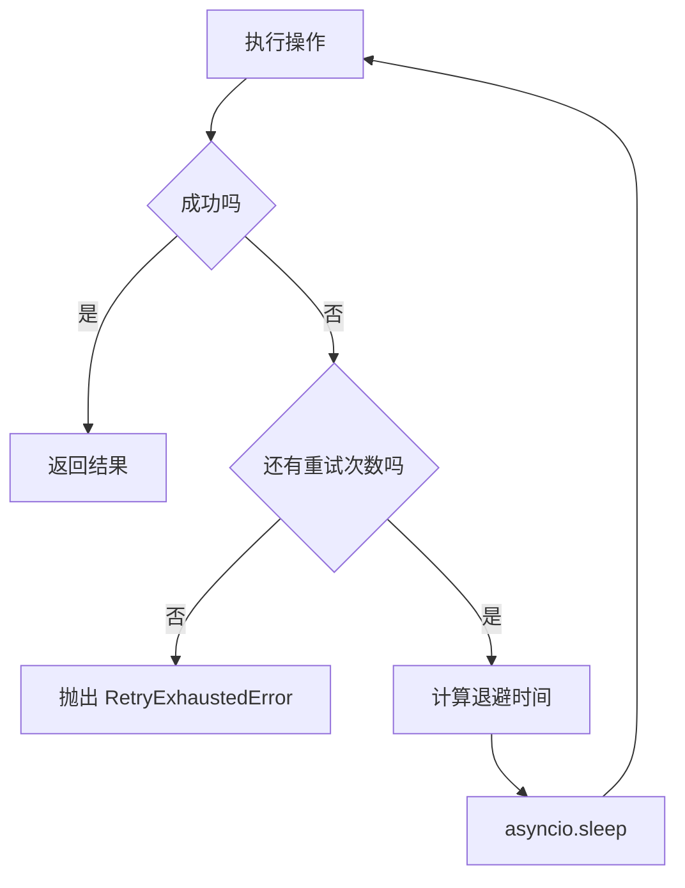
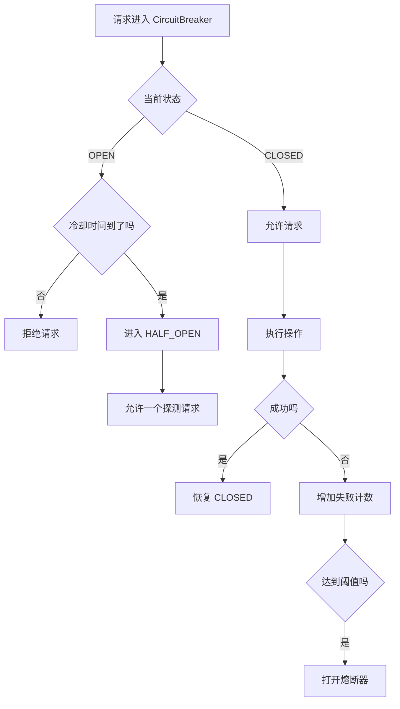
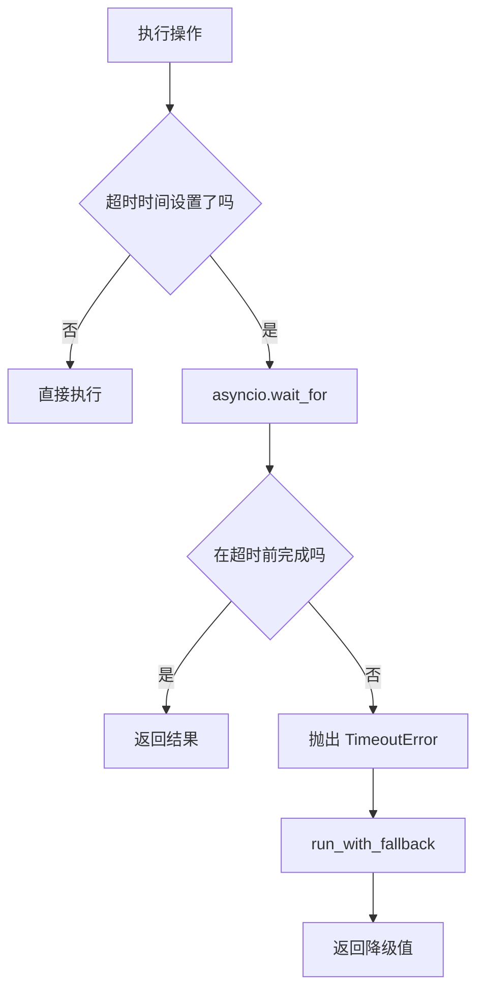
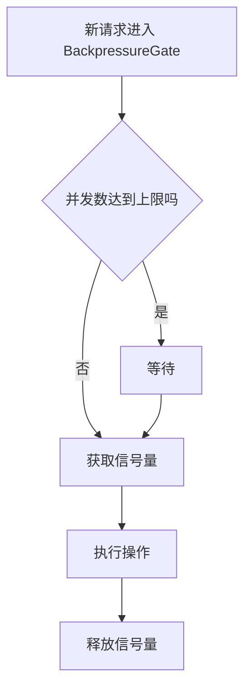

# Day 63 学习笔记

日期：2026-09-18

项目：`ai-job-agent`

主题：重试、熔断、降级、超时和背压

## 1. Day 63 做了什么

Day 62 用压力测试暴露系统在高并发下的行为。

Day 63 处理异常情况：

```text
网络抖动
  ->
上游服务暂时不可用
  ->
请求超时
  ->
并发过高
  ->
系统过载
```

Day 63 增加：

```text
async_retry
  ->
CircuitBreaker
  ->
with_timeout
  ->
run_with_fallback
  ->
BackpressureGate
  ->
CLI 演示
  ->
单元测试
```

## 2. Day 63 改了哪些文件

| 文件 | 变化 | 作用 |
|---|---|---|
| `app/resilience.py` | 新增 | 重试、熔断、超时、降级、背压 |
| `app/resilience_cli.py` | 新增 | 命令行演示 |
| `tests/test_resilience.py` | 新增 | 测试稳定性组件 |

## 3. 当前改动和项目架构的关系

Day 63 没有增加业务接口，而是提供一组可复用稳定性组件。

```text
业务代码
  ->
resilience 组件
  ->
实际外部调用
```

这些组件后续可以接入：

- LLM 调用。
- PostgreSQL 查询。
- Redis 调用。
- 任务队列。
- MCP 工具调用。

## 4. Day 63 项目闭环实际流程

### 4.1 重试流程



### 4.2 熔断流程



### 4.3 超时与降级流程



### 4.4 背压流程



## 5. 核心概念解释

### 5.1 为什么需要错误处理体系

外部服务可能：

- 网络超时。
- 暂时不可用。
- 返回限流错误。
- 数据库连接断开。
- LLM API 失败。

如果不处理：

```text
单个依赖故障
  ->
整个请求失败
  ->
用户看到 500
```

稳定性组件让系统在部分依赖异常时仍能降级运行。

### 5.2 重试

重试是遇到暂时错误后再次执行。

适合：

- 网络抖动。
- 限流。
- 暂时超时。

不适合：

- 参数错误。
- 权限错误。
- 业务逻辑错误。

### 5.3 指数退避

不能每次失败都马上重试。

等待时间逐步增加：

```text
第 1 次：0.1 秒
第 2 次：0.2 秒
第 3 次：0.4 秒
```

### 5.4 抖动

在退避时间中加入随机值：

```python
jitter = random.uniform(0, delay * config.jitter_ratio)
```

避免大量请求在同一时间重试。

### 5.5 熔断

熔断器像电路保险丝。

当连续失败达到阈值，就暂时拒绝请求。

三种状态：

```text
CLOSED：正常放行。
OPEN：拒绝请求。
HALF_OPEN：放行一个探测请求。
```

如果探测请求成功，恢复 CLOSED。

如果探测请求失败，继续保持 OPEN。

### 5.6 降级

当主逻辑失败时，返回一个可用的兜底结果。

例如：

```text
LLM 调用失败
  ->
返回缓存答案
```

或者：

```text
数据库失败
  ->
返回默认配置
```

### 5.7 超时

不能让请求无限等待。

`asyncio.wait_for()` 设置最大等待时间。

超时后抛出 `TimeoutError`。

### 5.8 背压

背压是限制同时处理的任务数量。

如果并发过高，新的请求需要等待，而不是无限进入系统。

本项目使用：

```python
asyncio.Semaphore()
```

## 6. 每个改动在业务中负责什么

### 6.1 async_retry

负责：

- 执行操作。
- 捕获可重试异常。
- 指数退避和抖动。
- 重试耗尽后抛出统一错误。

### 6.2 CircuitBreaker

负责：

- 记录失败次数。
- 达到阈值后打开熔断器。
- 冷却后进入半开状态。
- 半开探测成功后恢复。

### 6.3 with_timeout

负责：

- 给异步操作设置超时。

### 6.4 run_with_fallback

负责：

- 捕获错误。
- 返回降级值。

### 6.5 BackpressureGate

负责：

- 限制并发数量。
- 保护系统资源。

### 6.6 resilience_cli.py

负责：

- 本地演示这些组件。

### 6.7 tests/test_resilience.py

验证：

- 重试恢复。
- 重试耗尽。
- 熔断打开。
- 超时。
- 降级。
- 背压。

## 7. 实际生产对标方案

| Day 63 的做法 | 生产中的常见方案 |
|---|---|
| `async_retry` | Tenacity、Resilience4j、Polly |
| `CircuitBreaker` | Hystrix、Resilience4j、Envoy |
| `with_timeout` | HTTP timeout、任务超时 |
| `run_with_fallback` | 缓存兜底、降级 |
| `BackpressureGate` | 信号量、队列上限、令牌桶 |
| 单进程熔断 | 分布式熔断、服务网格 |

生产系统还会：

- 区分可重试和不可重试错误。
- 对熔断、降级、重试做监控。
- 记录每次重试和熔断事件。
- 使用分布式熔断。
- 对降级结果设置 TTL。
- 将背压和任务队列结合。

## 8. Day 63 开发中遇到的报错及原因

### 8.1 ruff BLE001

原因：

`run_with_fallback()` 捕获了所有 `Exception`。

Ruff 认为这是盲目捕获异常。

解决：

```python
except Exception:  # noqa: BLE001
    return fallback_value
```

### 8.2 F841 未使用变量 breaker

原因：

CLI 中创建了 `breaker` 但没有使用。

解决：

```python
breaker = CircuitBreaker(...)
await breaker.call(lambda: asyncio.sleep(0))
```

### 8.3 RuntimeError 未被重试捕获

原因：

如果 `async_retry` 的 `retry_exceptions` 设置过窄，某些异常不会重试。

解决：

确认需要重试的异常类型，或者使用：

```python
retry_exceptions=(Exception,)
```

### 8.4 熔断器打开后请求全部失败

原因：

连续失败达到阈值，熔断器已经打开。

解决：

- 等待冷却时间。
- 检查依赖服务是否恢复。
- 熔断器进入 HALF_OPEN 后会探测。

## 9. Day 63 检查清单

- [ ] `async_retry` 已实现
- [ ] 指数退避和抖动已实现
- [ ] `CircuitBreaker` 已实现
- [ ] `with_timeout` 已实现
- [ ] `run_with_fallback` 已实现
- [ ] `BackpressureGate` 已实现
- [ ] `app/resilience_cli.py` 已实现
- [ ] `tests/test_resilience.py` 已通过

## 10. 当前已知限制

### 10.1 单进程状态

熔断器和背压是单进程状态。

多副本部署时需要分布式熔断。

### 10.2 还没有接入真实业务

当前是基础组件，尚未接入 LLM、数据库和任务队列。

### 10.3 没有监控指标

重试次数、熔断状态、降级次数还没有可观测性。

### 10.4 没有区分错误类型

当前默认重试所有异常，生产系统应区分。

## 11. 下一步

第 9 周后端工程到这里闭环。

下一步进入第 10 周生产化和部署：

```text
Dockerfile
  ->
docker-compose
  ->
配置和密钥
  ->
日志和指标
  ->
可观测性
  ->
成本和延迟
  ->
CI/CD
```
