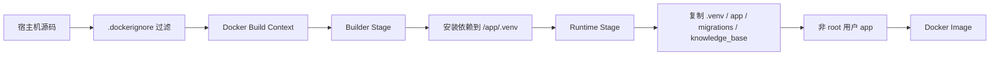
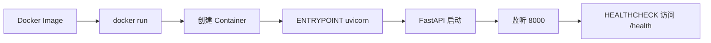
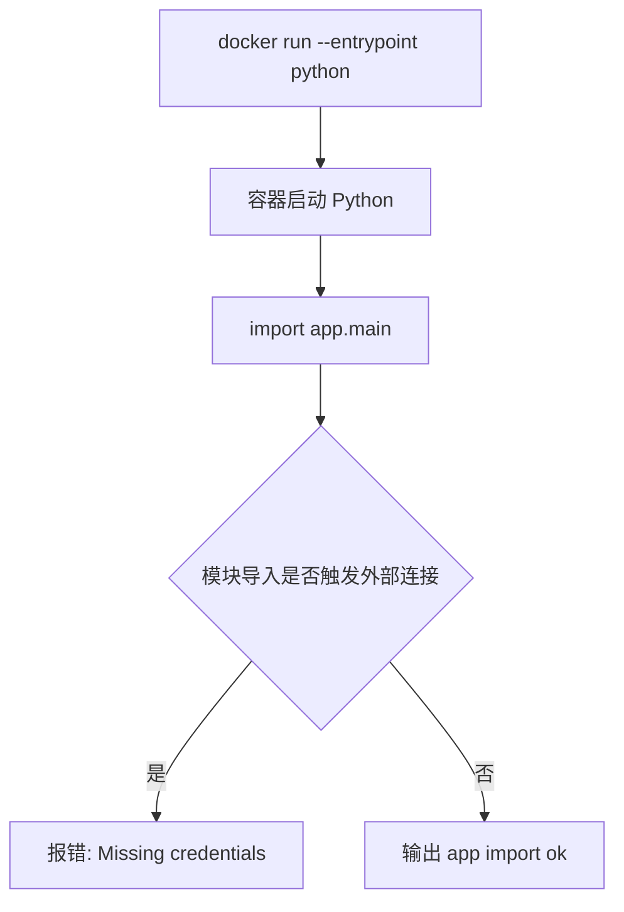

# Day 64 学习笔记

日期：2026-09-18

项目：`ai-job-agent`

主题：生产级 Dockerfile、构建上下文、非 root 运行和懒加载 LLM 客户端

## 1. Day 64 做了什么

第 4 周 Day 28 已经让项目第一次跑进 Docker，但当时的目标是“能运行”。

第 10 周的目标从“能运行”升级为“能稳定、安全、可观测地进入生产环境”。

Day 64 主要做了四件事：

1. 把后端 `Dockerfile` 从单阶段 MVP 改成多阶段生产镜像。
2. 收紧 `.dockerignore`，避免密钥、测试、SQLite 和本地运行数据进入镜像。
3. 增加非 root 用户和 `HEALTHCHECK`。
4. 修复 `app/llm.py` 在模块导入时就创建 OpenAI 客户端的问题，改成懒加载。

最终交付物：

```text
Dockerfile
  ->
生产镜像
  ->
非 root 运行
  ->
健康检查
  ->
可以安全进入 CI/CD
```

## 2. Day 64 改了哪些文件

| 文件 | 变化 | 作用 |
|---|---|---|
| `Dockerfile` | 重写 | 多阶段构建、固定版本、非 root、健康检查 |
| `.dockerignore` | 修改 | 排除密钥、测试、文档、本地数据库和向量库 |
| `app/llm.py` | 修改 | OpenAI 客户端改为懒加载，避免 import 时要求密钥 |
| `tests/test_docker_production.py` | 新增 | 用文本检查锁定 Docker 生产基线 |
| `docs/day64.md` | 新增 | 当前文档 |

## 3. 项目闭环实际流程

### 3.1 从源码到镜像



这个流程表达了一个关键点：

```text
宿主机上的所有文件
  ->
先经过 .dockerignore 过滤
  ->
剩下才是构建上下文
  ->
Dockerfile 只从构建上下文中复制需要的文件
```

`.dockerignore` 不只是一个“要不要传文件”的配置，它还决定：

- 构建快不快。
- 本地密钥会不会泄露进镜像。
- 测试代码、文档、本地数据库会不会被复制进去。

### 3.2 从镜像到容器



镜像和容器不是同一个东西：

```text
镜像 = 只读模板
容器 = 基于镜像启动的运行实例
```

可以理解为：

```text
镜像像安装包
容器像安装并运行起来的软件
```

### 3.3 导入冒烟测试的流程



Day 64 之前的 `app/llm.py` 在导入阶段就创建 OpenAI 客户端：

```python
client = OpenAI(
    api_key=os.getenv("OPENAI_API_KEY"),
    base_url=os.getenv("OPENAI_BASE_URL"),
)
```

当 Docker 容器内没有 `OPENAI_API_KEY` 时，`import app.main` 会立刻失败。

Day 64 改成：

```python
client = _LazyOpenAI()
```

这不会马上创建真正的 OpenAI 客户端，只有业务代码真正访问 `client.chat.completions` 时才会创建。

## 4. 生产级 Dockerfile 解释

### 4.1 当前完整 Dockerfile

```dockerfile
# syntax=docker/dockerfile:1.7

FROM python:3.12.9-slim AS builder

ARG UV_VERSION=0.12.5

ENV UV_COMPILE_BYTECODE=1 \
    UV_LINK_MODE=copy \
    UV_PROJECT_ENVIRONMENT=/app/.venv

WORKDIR /app

COPY pyproject.toml uv.lock ./

RUN pip install --no-cache-dir "uv==${UV_VERSION}" \
    && uv sync --frozen --no-dev --no-install-project

FROM python:3.12.9-slim AS runtime

ENV PYTHONUNBUFFERED=1 \
    PYTHONDONTWRITEBYTECODE=1 \
    PATH="/app/.venv/bin:${PATH}"

WORKDIR /app

RUN groupadd --system app \
    && useradd --system --gid app --create-home --home-dir /app app \
    && mkdir -p /app/data/chroma /app/data/shared_memory \
    && chown -R app:app /app

COPY --from=builder --chown=app:app /app/.venv /app/.venv
COPY --chown=app:app app /app/app
COPY --chown=app:app migrations /app/migrations
COPY --chown=app:app data/knowledge_base.json /app/data/knowledge_base.json

USER app

EXPOSE 8000

HEALTHCHECK --interval=30s --timeout=5s --start-period=20s --retries=3 \
    CMD python -c "import urllib.request; urllib.request.urlopen('http://127.0.0.1:8000/health', timeout=3)" || exit 1

ENTRYPOINT ["uvicorn", "app.main:app"]
CMD ["--host", "0.0.0.0", "--port", "8000"]
```

### 4.2 `# syntax=docker/dockerfile:1.7`

这一行指定 Dockerfile 语法版本。

它告诉 Docker 使用 BuildKit 的现代语法。

Python 初学者可以把它理解为：

```text
告诉工具：请按新版规则解释这个文件。
```

### 4.3 `FROM ... AS builder` 和 `FROM ... AS runtime`

这表示镜像有两个阶段。

```text
builder 阶段：
只负责安装依赖，最终会被丢弃。

runtime 阶段：
只复制 builder 已经安装好的 .venv 和运行代码。
```

好处：

- 最终镜像里没有 `uv`。
- 最终镜像里没有 `pip`。
- 最终镜像里没有构建工具。
- 攻击面更小。

对应到前端 Day 28 的 `frontend/Dockerfile`：

```dockerfile
FROM node:22-alpine AS build
...
FROM nginx:alpine
COPY --from=build /app/dist /usr/share/nginx/html
```

前端第一阶段用 Node 构建，第二阶段只保留 Nginx 和静态文件。

### 4.4 为什么固定 `python:3.12.9-slim`

`python:3.12-slim` 会随着上游更新变化。

今天构建和一个月后构建，即使代码完全一样，基础镜像也可能不同。

生产系统追求：

```text
同一个 commit
  ->
构建出尽可能一致的镜像
```

因此应该固定到具体 patch 版本：

```text
python:3.12.9-slim
```

生产更严格的做法还会使用 digest：

```text
python@sha256:xxxx
```

### 4.5 `ARG`

`ARG` 是构建参数。

```dockerfile
ARG UV_VERSION=0.12.5
```

它只在构建期间存在，可以这样覆盖：

```bash
docker build --build-arg UV_VERSION=0.12.5 -t ai-job-agent:day64 .
```

固定工具版本和固定依赖版本一样重要。

### 4.6 `ENV`

`ENV` 设置容器运行时环境变量。

```dockerfile
ENV PYTHONUNBUFFERED=1 \
    PYTHONDONTWRITEBYTECODE=1 \
    PATH="/app/.venv/bin:${PATH}"
```

三个变量的作用：

| 变量 | 作用 |
|---|---|
| `PYTHONUNBUFFERED=1` | Python 日志不会积压在缓冲区，容器能实时看到输出 |
| `PYTHONDONTWRITEBYTECODE=1` | 运行时不再生成 `.pyc` 文件 |
| `PATH` | 让容器能直接执行 `.venv/bin/uvicorn` |

生产环境中，Python 应用通常都设置 `PYTHONUNBUFFERED=1`，否则日志可能延迟甚至丢失。

### 4.7 `WORKDIR`

```dockerfile
WORKDIR /app
```

它设置当前工作目录。

后面的 `COPY . .`、`RUN ...`、`CMD ...` 都会以 `/app` 为基准。

### 4.8 依赖安装为什么只复制两个文件

```dockerfile
COPY pyproject.toml uv.lock ./
RUN pip install --no-cache-dir "uv==${UV_VERSION}" \
    && uv sync --frozen --no-dev --no-install-project
```

这里只复制依赖声明和锁文件，不复制整个 `app/`。

原因是 Docker 有层缓存：

```text
如果 pyproject.toml 和 uv.lock 没变
  ->
依赖层可以复用
  ->
只改业务代码时不需要重新安装依赖
```

参数解释：

| 命令参数 | 作用 |
|---|---|
| `uv sync` | 按 `uv.lock` 安装依赖 |
| `--frozen` | 严格使用锁文件，不允许自动修改 |
| `--no-dev` | 不安装 pytest、ruff、locust 等开发依赖 |
| `--no-install-project` | 不安装当前项目本身，因为当前项目不是标准 Python 包结构 |

### 4.9 `UV_COMPILE_BYTECODE`

```dockerfile
ENV UV_COMPILE_BYTECODE=1
```

让 uv 在安装阶段生成 `.pyc` 字节码。

这样运行阶段不需要在第一次导入时再编译。

### 4.10 `UV_LINK_MODE=copy`

```dockerfile
ENV UV_LINK_MODE=copy
```

uv 默认可能使用硬链接或符号链接来节省空间。

当 `.venv` 需要从一个 Docker 阶段复制到另一个阶段时，符号链接可能失效。

`copy` 模式让依赖以普通文件形式存在，跨阶段复制更可靠。

### 4.11 `UV_PROJECT_ENVIRONMENT`

```dockerfile
ENV UV_PROJECT_ENVIRONMENT=/app/.venv
```

它明确指定虚拟环境位置。

这样 runtime 阶段可以稳定地从：

```text
/app/.venv
```

复制依赖。

### 4.12 非 root 用户

```dockerfile
RUN groupadd --system app \
    && useradd --system --gid app --create-home --home-dir /app app \
    && mkdir -p /app/data/chroma /app/data/shared_memory \
    && chown -R app:app /app

USER app
```

默认情况下，容器进程可能是 root。

如果应用被攻击，root 权限会让攻击者更容易控制容器。

生产原则是：

```text
最小权限
```

应用只需要：

- 读代码。
- 写自己的数据目录。
- 监听 8000 端口。

不需要 root。

`groupadd` 创建组，`useradd` 创建用户，`chown` 把 `/app` 交给 `app` 用户，最后 `USER app` 切换到该用户。

### 4.13 `HEALTHCHECK`

```dockerfile
HEALTHCHECK --interval=30s --timeout=5s --start-period=20s --retries=3 \
    CMD python -c "import urllib.request; urllib.request.urlopen('http://127.0.0.1:8000/health', timeout=3)" || exit 1
```

健康检查回答：

```text
容器进程活着，不等于服务真的可用。
```

参数解释：

| 参数 | 作用 |
|---|---|
| `--interval=30s` | 每 30 秒检查一次 |
| `--timeout=5s` | 每次检查最多等待 5 秒 |
| `--start-period=20s` | 容器启动 20 秒内即使失败也不立即标记 unhealthy |
| `--retries=3` | 连续 3 次失败才判定 unhealthy |

命令内部使用 Python 标准库访问：

```text
http://127.0.0.1:8000/health
```

不额外安装 `curl`。

### 4.14 `ENTRYPOINT` 和 `CMD`

```dockerfile
ENTRYPOINT ["uvicorn", "app.main:app"]
CMD ["--host", "0.0.0.0", "--port", "8000"]
```

`ENTRYPOINT` 是固定入口程序。

`CMD` 是默认参数。

组合后，容器默认执行：

```bash
uvicorn app.main:app --host 0.0.0.0 --port 8000
```

为什么这样拆分：

- 编排系统可以保留固定入口。
- 部署时可以替换端口参数。
- 调试时可以覆盖入口。

## 5. `.dockerignore` 解释

```gitignore
.venv/
__pycache__/
.pytest_cache/
.git/
.github/
.env
.env.*
!.env.example
.DS_Store
docs/
tests/
frontend/
src/
benchmarks/
data/chroma/
data/qdrant_storage/
data/postgres/
data/redis/
data/*.sqlite
data/eval_set.json
data/rag_eval_set.json
data/agent_eval_set.json
```

### 5.1 为什么要排除 `.env`

`.env` 通常包含：

```text
OPENAI_API_KEY
DATABASE_URL
REDIS_URL
JWT_SECRET
```

如果进入镜像，任何能拿到镜像的人都能提取这些密钥。

所以：

```text
.env 只能运行时注入，不能构建进镜像。
```

### 5.2 为什么要排除 SQLite 和向量库

```text
data/shared_memory.sqlite
data/langgraph_checkpoints.sqlite
data/chroma/
data/qdrant_storage/
data/postgres/
data/redis/
```

这些是运行状态，不是源码。

镜像应该保持“无状态”，运行数据通过 Volume 或外部服务保存。

### 5.3 为什么 `knowledge_base.json` 要保留

`knowledge_base.json` 是项目运行需要的静态知识库，属于应用资产。

所以 Dockerfile 明确复制它：

```dockerfile
COPY --chown=app:app data/knowledge_base.json /app/data/knowledge_base.json
```

## 6. `app/llm.py` 懒加载解释

### 6.1 之前的问题

```python
client = OpenAI(
    api_key=os.getenv("OPENAI_API_KEY"),
    base_url=os.getenv("OPENAI_BASE_URL"),
)
```

这发生在模块导入阶段。

结果：

```text
import app.main
  ->
import app.agent
  ->
import app.llm
  ->
OpenAI() 马上要求 api_key
  ->
容器内没有 api_key
  ->
OpenAIError
```

### 6.2 修复后的代码

```python
@lru_cache(maxsize=1)
def get_client() -> OpenAI:
    api_key = os.getenv("OPENAI_API_KEY")

    if not api_key:
        raise RuntimeError(
            "OPENAI_API_KEY is required to create the OpenAI client"
        )

    return OpenAI(
        api_key=api_key,
        base_url=os.getenv("OPENAI_BASE_URL"),
    )


class _LazyOpenAI:
    def __getattr__(self, name: str):
        return getattr(get_client(), name)


client = _LazyOpenAI()
```

### 6.3 `@lru_cache(maxsize=1)`

`lru_cache` 是 Python 的缓存装饰器。

`maxsize=1` 表示最多缓存一个结果。

第一次调用 `get_client()` 时：

```text
读取密钥
  ->
创建 OpenAI 客户端
  ->
缓存结果
```

之后再次调用时：

```text
直接返回已经创建好的客户端
```

这样不会每次请求都创建新客户端。

### 6.4 `__getattr__`

`__getattr__` 是 Python 的特殊方法。

当访问对象上不存在的属性时，Python 会调用它。

```python
client.chat
```

由于 `_LazyOpenAI` 自己没有 `chat` 属性，会触发：

```python
def __getattr__(self, name: str):
    return getattr(get_client(), name)
```

它等价于：

```text
第一次使用 client.chat 时，才真正创建 OpenAI 客户端，然后返回 OpenAI 客户端的 chat。
```

### 6.5 生产对标

懒加载解决了导入问题，但还不是最终形态。

生产项目更推荐：

- 在 FastAPI `lifespan` 中创建客户端。
- 通过依赖注入传给路由。
- 不保留模块级全局客户端。

这样可以更容易地：

- 测试。
- 切换不同环境。
- 做 A/B 测试。
- 控制客户端生命周期。

## 7. 测试文件分析

`tests/test_docker_production.py` 不启动 Docker，而是检查关键配置文本。

| 测试 | 检查什么 | 为什么重要 |
|---|---|---|
| `test_dockerfile_uses_pinned_python_and_slim` | Python 版本固定且使用 slim | 防止基础镜像漂移 |
| `test_dockerfile_pins_uv_and_skips_dev_dependencies` | uv 固定，且不安装 dev 依赖 | 保证生产依赖可复现 |
| `test_dockerfile_runs_as_non_root_user` | 有 `USER app` | 防止容器以 root 运行 |
| `test_dockerfile_has_healthcheck` | 有健康检查 | 编排系统能判断服务是否可用 |
| `test_dockerignore_blocks_secrets_and_runtime_state` | 密钥和运行态数据被排除 | 防止密钥和本地数据库进入镜像 |

运行：

```bash
.venv/bin/pytest tests/test_docker_production.py -q
```

如果 `.venv` 中没有 pytest，则使用：

```bash
uv run pytest tests/test_docker_production.py -q
```

## 8. Docker 命令详解

### 8.1 `docker build`

```bash
docker build -t ai-job-agent:day64 --progress=plain .
```

逐段解释：

| 片段 | 含义 |
|---|---|
| `docker build` | 构建镜像 |
| `-t ai-job-agent:day64` | 给镜像命名和打 tag |
| `--progress=plain` | 使用普通文本显示构建过程 |
| `.` | 构建上下文是当前目录 |

`ai-job-agent:day64` 中：

```text
ai-job-agent 是镜像名
day64 是 tag
```

### 8.2 `docker image history`

```bash
docker image history ai-job-agent:day64
```

它显示镜像的每一层。

怎么判断：

```text
看到 COPY .venv 层很大
  ->
说明依赖占主要体积
```

```text
看到 USER app 层
  ->
说明非 root 设置已进入镜像
```

```text
看到 HEALTHCHECK 层
  ->
说明健康检查已进入镜像
```

`<missing>` 不是错误，只表示这些中间层没有单独 tag。

### 8.3 `docker inspect`

```bash
docker inspect --format '{{.Config.User}} | {{json .Config.Healthcheck}}' ai-job-agent:day64
```

`docker inspect` 查看镜像或容器的元数据。

`--format` 使用 Go 模板只输出我们关心的字段。

判断标准：

```text
.Config.User 应该是 app
.Config.Healthcheck 应该存在 /health
```

输出中的 `Interval` 单位是纳秒：

```text
30000000000 ns = 30 秒
5000000000 ns = 5 秒
20000000000 ns = 20 秒
```

### 8.4 `docker run`

```bash
docker run --rm --entrypoint python ai-job-agent:day64 -c "import app.main; print('app import ok')"
```

逐段解释：

| 片段 | 含义 |
|---|---|
| `docker run` | 从镜像启动容器 |
| `--rm` | 容器退出后自动删除 |
| `--entrypoint python` | 覆盖镜像默认入口，改用 Python |
| `ai-job-agent:day64` | 使用哪个镜像 |
| `-c "..."` | 传给 Python 的命令 |

这个命令不是启动 FastAPI 服务，而是做一次“容器内导入检查”。

### 8.5 常用本地 Docker 命令

```bash
docker image ls
```

查看本机镜像和大小。

```bash
docker ps
```

查看正在运行的容器。

```bash
docker ps -a
```

查看所有容器，包括已经退出的容器。

```bash
docker logs <container_id>
```

查看容器日志。

```bash
docker exec -it <container_id> sh
```

进入正在运行的容器执行命令。

```bash
docker rmi <image>
```

删除镜像。

```bash
docker rm <container_id>
```

删除容器。

## 9. 实际生产项目中的 Docker 命令

本地学习主要用 `docker build`、`docker run`、`docker ps`。

生产项目还会使用更多命令。

### 9.1 多平台构建

```bash
docker buildx build \
  --platform linux/amd64,linux/arm64 \
  -t registry.example.com/ai-job-agent:day64 \
  --push .
```

作用：

```text
同时构建 x86 和 ARM 两种平台镜像。
```

生产服务器可能是 Linux x86，开发者电脑可能是 Apple Silicon ARM。

### 9.2 推送到镜像仓库

```bash
docker login registry.example.com
docker push registry.example.com/ai-job-agent:day64
```

生产环境中，镜像不是只留在开发者电脑，而是推送到：

- Docker Hub。
- GitHub Container Registry。
- AWS ECR。
- 阿里云 ACR。
- Harbor。

### 9.3 拉取镜像

```bash
docker pull registry.example.com/ai-job-agent:day64
```

服务器通过拉取镜像来部署。

### 9.4 镜像安全检查

```bash
docker scan ai-job-agent:day64
```

扫描已知漏洞。

生产环境中还会使用：

- Trivy。
- Grype。
- Snyk。

### 9.5 查看镜像 SBOM

```bash
docker sbom ai-job-agent:day64
```

SBOM 是 Software Bill of Materials，软件物料清单。

它列出镜像中包含哪些软件包和版本，用于安全审计和供应链追踪。

### 9.6 检查磁盘占用

```bash
docker system df
```

查看：

- 镜像占用多少空间。
- 容器占用多少空间。
- 构建缓存占用多少空间。

清理无用资源：

```bash
docker system prune
```

生产服务器上不能随意清理正在使用的资源，需要确认策略。

### 9.7 查看容器资源使用

```bash
docker stats
```

实时查看容器 CPU、内存、网络、磁盘使用。

### 9.8 Compose 配置检查

```bash
docker compose config
```

验证 `docker-compose.yml` 是否合法，并展开环境变量。

```bash
docker compose logs -f backend
```

持续跟踪 backend 服务日志。

### 9.9 查看镜像内容

```bash
docker run --rm --entrypoint sh ai-job-agent:day64 -c "ls -la /app && whoami"
```

可以进入一个临时容器查看：

- 镜像内文件。
- 当前用户。
- 环境变量。

## 10. 常见报错及原因

### 10.1 `Missing credentials`

完整报错：

```text
openai.OpenAIError: Missing credentials. Please pass an `api_key`, ...
```

原因：

`app/llm.py` 在模块导入阶段就创建 OpenAI 客户端，而容器内没有 `OPENAI_API_KEY`。

解决：

把客户端改成懒加载，只有真正调用模型时才创建客户端。

### 10.2 镜像 `.venv` 层 5.71GB

`docker image history` 中：

```text
COPY --chown=app:app /app/.venv /app/.venv
5.71GB
```

原因：

项目依赖 `sentence-transformers`、`torch`、`transformers`、`chromadb` 等大型包。

这不是构建失败，但会让镜像很大。

生产项目可能的优化方向：

- 把 Embedding 和 Reranker 拆成独立服务。
- 使用远程 Embedding API。
- 使用更小的 CPU 推理镜像。
- 使用 Qdrant 托管服务或独立向量库。

Day 64 先记录，不强行瘦身，避免破坏功能。

### 10.3 导入冒烟测试期望看到什么

修复前：

```text
Traceback ...
openai.OpenAIError: Missing credentials
```

修复后：

```text
app import ok
```

如果没有修复，也可以临时用：

```bash
docker run --rm --entrypoint python \
  -e OPENAI_API_KEY=dummy \
  ai-job-agent:day64 \
  -c "import app.main; print('app import ok')"
```

但这只是测试绕过，不是生产修复。

### 10.4 容器内 `/health` 健康检查失败

如果 Docker 显示 unhealthy，先查看日志：

```bash
docker ps -a
docker logs <container_id>
```

可能原因：

- FastAPI 没有启动。
- Postgres 或 Redis 没有启动，导致 lifespan 启动失败。
- 健康检查端口不对。
- 非 root 用户没有权限访问数据目录。

Day 64 只验证镜像构建和导入，完整端到端启动留给 Day 65 的 Compose。

## 11. Day 64 检查清单

- [ ] `Dockerfile` 使用固定 Python 版本
- [ ] `Dockerfile` 是多阶段构建
- [ ] uv 版本固定
- [ ] dev 依赖未安装
- [ ] 运行时使用非 root 用户
- [ ] 镜像包含 `HEALTHCHECK`
- [ ] `.dockerignore` 排除了 `.env`
- [ ] `.dockerignore` 排除了 SQLite 和向量库数据
- [ ] `app/llm.py` 改为懒加载
- [ ] `docker build` 成功
- [ ] `docker inspect` 显示 `app` 用户
- [ ] 无密钥导入测试输出 `app import ok`
- [ ] `tests/test_docker_production.py` 通过

## 12. 下一步

Day 64 解决的是“如何构建一个安全的镜像”。

Day 65 要解决的是：

```text
如何把 backend、worker、frontend、Postgres、Redis、Qdrant
安全地编排起来。
```

重点会包括：

- `depends_on` 和健康检查。
- 服务启动顺序。
- 数据卷。
- 密钥传递。
- 非 root 用户与卷权限。
- 生产环境网络暴露。
