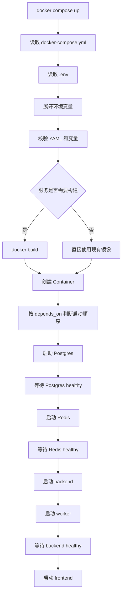
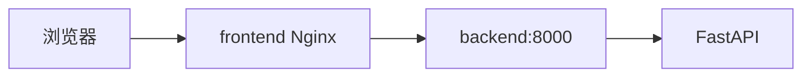

# Day 65 学习笔记

日期：2026-09-18

项目：`ai-job-agent`

主题：生产级 Docker Compose、多服务编排、健康检查、Named Volume 和容器启动命令

## 1. Day 65 做了什么

Day 64 解决了“怎么构建一个安全的生产镜像”。

Day 65 要解决的是：

```text
多个容器之间如何协作？
谁先启动？
谁依赖谁？
数据放在哪里？
密钥怎么传？
服务失败后是否自动恢复？
```

Day 65 主要完成：

1. 把 `docker-compose.yml` 从本地 MVP 改成生产化编排。
2. 使用 named volume 保存数据库、Redis、向量库和模型缓存。
3. 不再把 Postgres、Redis、Qdrant 直接暴露到宿主机端口。
4. 给服务增加 `restart: unless-stopped`。
5. 使用 `depends_on` 和健康检查控制启动顺序。
6. 使用 `${VAR:?...}` 在启动前强制校验密钥。
7. 把 HuggingFace 缓存从 `/root` 改成非 root 用户路径。
8. 修复 backend 和 worker 容器反复重启的问题。

## 2. Day 65 改了哪些文件

| 文件 | 变化 | 作用 |
|---|---|---|
| `docker-compose.yml` | 重写 | 生产化多服务编排 |
| `.env.example` | 修改 | 补充镜像版本、端口、RAG 和缓存变量 |
| `Dockerfile` | 修改 | 增加非 root 可写目录，修复启动命令 |
| `tests/test_docker_compose_production.py` | 新增 | 检查 Compose 生产约束 |
| `docs/day65.md` | 新增 | 当前文档 |

## 3. 项目闭环实际流程

### 3.1 从 Compose 文件到一组运行容器



### 3.2 本地访问前端的流程


如果浏览器请求 `/chat/` 或 `/agent/`：



这里的 `backend` 不是宿主机地址，而是 Docker Compose 创建的内部网络中的服务名。

## 4. 先理解 Docker 的三个核心概念

### 4.1 Docker daemon

Docker daemon 是后台运行的程序。

你在终端输入 `docker ...`，其实是在向 Docker daemon 发送指令。

可以用生活中的例子理解：

```text
终端命令 = 你向前台提交需求
Docker daemon = 后台真正干活的部门
```

### 4.2 Image 镜像

镜像是只读模板。

它包含：

- 操作系统基础文件。
- Python。
- 依赖包。
- 项目代码。
- 启动命令。

镜像可以理解为：

```text
软件安装包
```

### 4.3 Container 容器

容器是镜像运行起来的实例。

```text
镜像 + 启动 = 容器
```

一个镜像可以启动多个容器。

例如同一个 backend 镜像，可以启动：

```text
backend 容器
worker 容器
```

它们使用相同的文件和依赖，但运行不同命令。

### 4.4 为什么这个理解对今天的报错很重要

今天的报错正好来自：

```text
镜像里写了默认启动程序
Compose 又给不同容器写了不同命令
两者组合时发生冲突
```

如果分不清“镜像是什么”和“容器是什么”，就很容易把问题误判成“镜像没构建好”。

## 5. Docker Compose 是什么

Docker Compose 是一个工具，用来一次管理多个容器。

`docker-compose.yml` 描述：

- 有哪些服务。
- 每个服务使用什么镜像。
- 容器之间如何连接。
- 数据保存在哪里。
- 环境变量是什么。
- 服务是否要自动重启。

Compose 中一个 `service` 通常会对应一个或多个 `container`。

当前项目的主要服务：

```text
postgres
redis
backend
worker
frontend
qdrant（可选）
```

## 6. Dockerfile 中的 `CMD` 和 `ENTRYPOINT`

### 6.1 `CMD`

`CMD` 是容器的默认启动命令。

例如：

```dockerfile
CMD ["uvicorn", "app.main:app", "--host", "0.0.0.0", "--port", "8000"]
```

它表示：

```text
如果没有被覆盖，容器默认执行 uvicorn。
```

### 6.2 `ENTRYPOINT`

`ENTRYPOINT` 是容器的固定入口程序。

例如：

```dockerfile
ENTRYPOINT ["uvicorn", "app.main:app"]
CMD ["--host", "0.0.0.0", "--port", "8000"]
```

最终执行：

```bash
uvicorn app.main:app --host 0.0.0.0 --port 8000
```

### 6.3 Compose 的 `command` 覆盖什么

Compose 中的：

```yaml
command: [...]
```

会覆盖 Dockerfile 中的 `CMD`，但不会覆盖 `ENTRYPOINT`。

这是今天第一个报错的根本原因。

### 6.4 为什么本项目不应该使用固定 `ENTRYPOINT`

同一个镜像被用于两个角色：

```text
backend 运行 uvicorn
worker 运行 arq
```

如果镜像写死：

```dockerfile
ENTRYPOINT ["uvicorn", "app.main:app"]
```

那么 worker 也会先执行 `uvicorn`，这显然是错误的。

正确做法是：

```dockerfile
CMD ["uvicorn", "app.main:app", "--host", "0.0.0.0", "--port", "8000"]
```

然后由 Compose 根据不同服务覆盖 `command`。

## 7. Day 65 核心知识点

### 7.1 Named Volume

Named Volume 是由 Docker 管理的数据卷。

例如：

```yaml
volumes:
  - postgres_data:/var/lib/postgresql/data
```

含义：

```text
把容器内 /var/lib/postgresql/data
保存到 Docker 管理的 postgres_data 卷中
```

它的好处：

- 容器删除后数据仍然存在。
- 不需要关心宿主机具体路径。
- 不同服务可以共享同一个卷。

### 7.2 Bind Mount

Bind Mount 是把宿主机目录直接挂进容器。

例如：

```yaml
volumes:
  - ./data/chroma:/app/data/chroma
```

它适合本地开发，因为你可以直接看到宿主机上的文件。

生产环境更推荐 named volume，因为：

- 数据位置由 Docker 管理。
- 减少和宿主机文件系统耦合。
- 更容易备份和迁移。

### 7.3 `restart: unless-stopped`

```yaml
restart: unless-stopped
```

含义：

```text
容器异常退出时自动重启。
只有你手动 docker stop 或 docker compose down 时，才不重启。
```

生产服务不能因为一个异常就永久停止。

### 7.4 `depends_on` 和健康检查

```yaml
depends_on:
  postgres:
    condition: service_healthy
```

含义：

```text
backend 必须等 postgres 进入 healthy 状态后才启动。
```

普通的：

```yaml
depends_on:
  - postgres
```

只保证启动顺序，不保证 Postgres 已经准备好接收连接。

`condition: service_healthy` 更可靠。

### 7.5 `healthcheck`

健康检查回答：

```text
容器进程已经启动，但服务真的能工作吗？
```

例如 Postgres：

```yaml
healthcheck:
  test: ["CMD-SHELL", "pg_isready -U $${POSTGRES_USER} -d $${POSTGRES_DB}"]
  interval: 5s
  timeout: 5s
  retries: 12
```

它每隔 5 秒检查一次 PostgreSQL 是否可以接受连接。

### 7.6 `expose` 和 `ports`

```yaml
expose:
  - "8000"
```

表示：

```text
8000 端口只在 Docker Compose 内部网络可见。
```

```yaml
ports:
  - "127.0.0.1:8000:8000"
```

表示：

```text
把宿主机 127.0.0.1 的 8000 端口映射到容器 8000 端口。
```

生产环境通常只暴露前端，不直接暴露数据库和内部 API。

### 7.7 环境变量默认值

```yaml
OPENAI_MODEL: ${OPENAI_MODEL:-deepseek-chat}
```

含义：

```text
如果 OPENAI_MODEL 没有设置，则使用 deepseek-chat。
```

### 7.8 环境变量强制必填

```yaml
OPENAI_API_KEY: ${OPENAI_API_KEY:?OPENAI_API_KEY is required}
```

含义：

```text
如果 OPENAI_API_KEY 没有设置，docker compose 在解析配置时就失败。
```

这样比容器启动后才报错更好。

### 7.9 YAML Anchor

```yaml
x-app-environment: &app-environment
  OPENAI_API_KEY: ...
  JWT_SECRET: ...

services:
  backend:
    environment:
      <<: *app-environment
```

`&app-environment` 定义一份配置。

`*app-environment` 引用这份配置。

这样 backend 和 worker 可以共享同一组环境变量，避免重复和遗漏。

### 7.10 `init: true`

```yaml
init: true
```

给容器增加一个 init 进程。

它的作用是正确处理信号。

例如：

```text
docker stop backend
```

需要把 SIGTERM 信号正确传给 FastAPI，让它优雅关闭。

如果没有 init 进程，容器内 PID 1 可能不处理信号，导致退出不干净。

### 7.11 `stop_grace_period`

```yaml
stop_grace_period: 30s
```

表示停止容器时，最多等待 30 秒。

如果 30 秒后还没退出，Docker 才会强制终止。

### 7.12 HuggingFace 缓存路径

容器以非 root 用户 `app` 运行。

所以缓存不能放在：

```text
/root/.cache/huggingface
```

因为 `app` 用户没有权限写 `/root`。

Day 65 改成：

```yaml
HF_HOME: /app/.cache/huggingface
volumes:
  - hf_cache:/app/.cache/huggingface
```

### 7.13 Qdrant profile

```yaml
qdrant:
  profiles: ["qdrant"]
```

含义：

```text
默认 docker compose up 不启动 qdrant。
```

只有需要 Qdrant 时使用：

```bash
docker compose --profile qdrant up -d
```

当前项目默认使用 Chroma，所以 Qdrant 不必一直启动。

## 8. Day 65 使用到的 Docker Compose 命令

### 8.1 校验配置

```bash
docker compose config -q
```

解释：

- `config`：解析 Compose 文件。
- `-q`：quiet，只输出错误。

它适合在启动前做静态检查。

### 8.2 查看展开后的配置

```bash
docker compose config
```

这个命令会把：

- YAML anchor 展开。
- 环境变量替换成真实值。
- 默认值计算出来。

你可以用这个命令检查：

- 密钥是否已经注入。
- 数据库地址是否正确。
- 端口映射是否符合预期。

### 8.3 构建并启动

```bash
docker compose up -d --build
```

解释：

- `up`：创建并启动服务。
- `-d`：后台运行。
- `--build`：启动前重新构建需要构建的镜像。

### 8.4 只启动某个服务

```bash
docker compose up -d backend worker
```

解释：

只启动 `backend` 和 `worker`。

这也是后来 `frontend` 没有启动、5173 连接失败的原因。

### 8.5 查看容器状态

```bash
docker compose ps
```

重点看 `STATUS`：

```text
Up (healthy)
```

表示服务正在运行且健康。

```text
Restarting
```

表示容器反复退出，需要查看日志。

### 8.6 查看日志

```bash
docker compose logs -f backend
```

解释：

- `logs`：查看服务日志。
- `-f`：持续跟踪。

排错时通常先看：

```bash
docker compose ps
docker compose logs --tail=100 <service>
```

### 8.7 在容器内执行命令

```bash
docker compose exec backend .venv/bin/python -c "print('hello')"
```

解释：

- `exec`：进入已经运行的容器执行命令。
- 它不会重新启动容器。

### 8.8 停止和删除

```bash
docker compose down
```

停止并删除容器和默认网络，但保留 named volume。

```bash
docker compose down -v
```

额外删除 named volume，会清空数据库和模型缓存。

## 9. 今天的第一个报错：backend 和 worker 反复重启

### 9.1 现象

```text
backend   Restarting
worker    Restarting
```

后端日志：

```text
Usage: uvicorn [OPTIONS] APP
Try 'uvicorn --help' for help.

Error: No such option '-c'.
```

### 9.2 原因

当时 Dockerfile 里写了：

```dockerfile
ENTRYPOINT ["uvicorn", "app.main:app"]
CMD ["--host", "0.0.0.0", "--port", "8000"]
```

而 Compose 中 backend 写了：

```yaml
command:
  [
    "sh",
    "-c",
    ".venv/bin/python -m app.db_cli migrate && .venv/bin/uvicorn app.main:app --host 0.0.0.0 --port 8000",
  ]
```

Compose 的 `command` 会覆盖 `CMD`，但不会覆盖 `ENTRYPOINT`。

最终 backend 实际执行：

```bash
uvicorn app.main:app sh -c ".venv/bin/python -m app.db_cli migrate && .venv/bin/uvicorn app.main:app --host 0.0.0.0 --port 8000"
```

`uvicorn` 不认识 `-c`，所以报错。

Worker 也一样，实际执行：

```bash
uvicorn app.main:app .venv/bin/arq app.worker.WorkerSettings
```

所以 Worker 也启动失败。

### 9.3 修复

把 Dockerfile 改成只保留 `CMD`：

```dockerfile
CMD ["uvicorn", "app.main:app", "--host", "0.0.0.0", "--port", "8000"]
```

这样 Compose 的 `command` 可以完整替换默认命令。

## 10. 今天的第二个报错：frontend 没有启动，5173 连接失败

### 10.1 现象

```bash
curl http://127.0.0.1:5173/
```

返回：

```text
Failed to connect to 127.0.0.1 port 5173
```

### 10.2 原因

上一次只执行了：

```bash
docker compose up -d backend worker
```

这条命令只启动 backend 和 worker，不启动 frontend。

所以：

```text
没有 frontend 容器
  ->
没有进程监听 5173
  ->
curl 连接失败
```

另外，frontend 还配置了：

```yaml
depends_on:
  backend:
    condition: service_healthy
```

即使执行完整启动，如果 backend 当时不是 healthy，frontend 也不会被创建。

### 10.3 修复

确认 backend 健康：

```bash
curl http://127.0.0.1:8000/health
```

然后启动 frontend：

```bash
docker compose up -d --build frontend
```

验证：

```bash
docker compose ps frontend
curl -I http://127.0.0.1:5173/
curl -sS http://127.0.0.1:5173/ | head -20
```

以后要启动全部服务，应使用：

```bash
docker compose up -d --build
```

## 11. 测试文件分析

`tests/test_docker_compose_production.py` 不启动 Docker，只检查 Compose 配置是否满足生产约束。

| 测试 | 检查内容 | 防止什么问题 |
|---|---|---|
| `test_compose_uses_named_volumes_for_runtime_state` | 使用 named volume | 防止数据依赖宿主机目录 |
| `test_compose_does_not_expose_database_ports` | 数据库不映射宿主机端口 | 防止数据库暴露公网 |
| `test_compose_requires_secrets_before_startup` | 密钥必须存在 | 防止启动后才因密钥失败 |
| `test_compose_sets_restart_policy` | 服务自动重启 | 防止异常退出后永久停止 |
| `test_compose_waits_for_healthy_dependencies` | 依赖健康检查 | 防止依赖未就绪就启动 |
| `test_huggingface_cache_uses_non_root_path` | 缓存路径不是 `/root` | 防止非 root 用户权限错误 |
| `test_qdrant_uses_pinned_version_and_profile` | Qdrant 不使用 latest | 防止版本漂移 |
| `test_backend_is_only_published_to_localhost` | 后端只绑定 localhost | 防止内部 API 暴露公网 |
| `test_env_example_declares_new_variables` | 环境变量模板完整 | 防止遗漏新增配置 |

运行：

```bash
.venv/bin/pytest tests/test_docker_compose_production.py -q
```

或：

```bash
uv run pytest tests/test_docker_compose_production.py -q
```

## 12. 实际生产对标

| Day 65 Compose 方案 | 真实生产方案 |
|---|---|
| `restart: unless-stopped` | K8s `restartPolicy`、Deployment 自动重建 Pod |
| `depends_on: service_healthy` | K8s `initContainers`、`readinessProbe` |
| `healthcheck` | K8s `livenessProbe`、`readinessProbe` |
| named volume | PersistentVolume、云盘、托管数据库 |
| `.env` 和 `${VAR:?}` | Secret Manager、Vault、云平台 Secret |
| `docker compose logs` | Loki、CloudWatch、ELK、Datadog |
| `docker compose up -d` | CI/CD、Helm、ArgoCD、GitOps |
| 单机 Compose | 多节点 Kubernetes、ECS、Nomad |

Day 65 的目标不是替代 Kubernetes，而是先建立正确的服务边界、依赖关系、健康检查、卷和密钥策略。

## 13. Day 65 检查清单

- [ ] `Dockerfile` 已改为只使用 `CMD`
- [ ] backend 使用迁移加 uvicorn 启动
- [ ] worker 使用 arq 启动
- [ ] 数据库和 Redis 不再暴露宿主机端口
- [ ] 后端只绑定 `127.0.0.1`
- [ ] named volume 已配置
- [ ] HuggingFace 缓存路径改为非 root 路径
- [ ] 密钥使用 `${VAR:?...}` 校验
- [ ] 服务配置 `restart: unless-stopped`
- [ ] 后端和 Worker 等待依赖健康
- [ ] Qdrant 使用 profile 和固定版本
- [ ] `tests/test_docker_compose_production.py` 通过
- [ ] backend、worker、frontend 都能启动
- [ ] `/health` 返回正常
- [ ] `curl http://127.0.0.1:5173/` 返回 HTML

## 14. 下一步

Day 66 进入配置和密钥管理。

重点解决：

```text
当前 .env 虽然能用，但生产环境密钥应该如何管理？
如何避免密钥进入镜像？
如何校验配置？
如何区分开发、测试、生产环境？
```

Day 66 会把配置从散落的 `os.getenv()` 逐步整理成可验证的配置模型。
