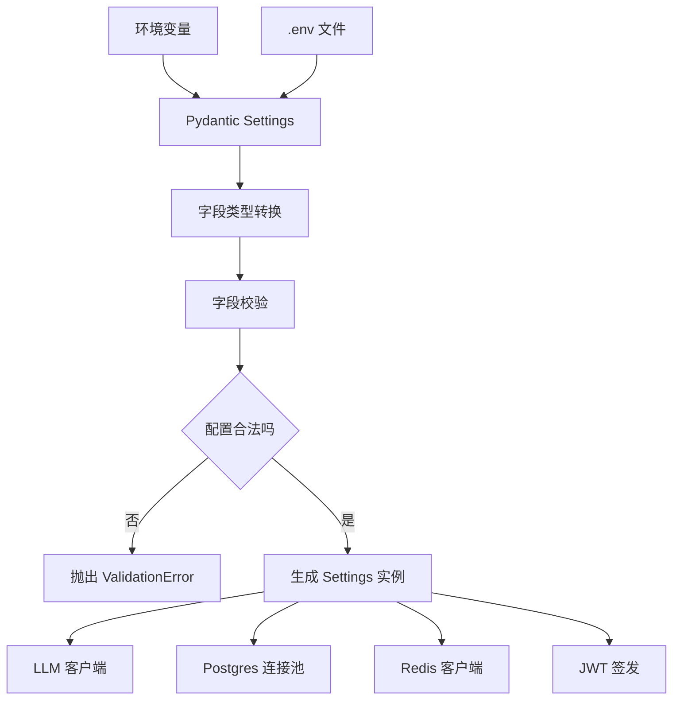
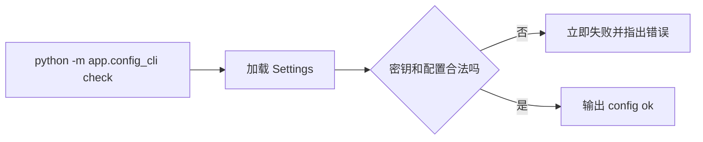

# Day 66 学习笔记

日期：2026-09-18

项目：`ai-job-agent`

主题：配置中心化、Pydantic Settings、SecretStr、配置校验和 Docker 磁盘清理

## 1. Day 66 做了什么

前两周的代码中，很多模块都直接写：

```python
os.getenv("OPENAI_API_KEY")
os.getenv("DATABASE_URL")
os.getenv("JWT_SECRET")
```

这种写法的问题是：

- 配置散落在多个文件里。
- 类型经常要自己转换。
- 错误配置可能在请求时才暴露。
- 密钥是普通字符串，容易被打印或日志泄露。
- 没有一个统一入口查看配置。

Day 66 建立一个统一的配置层：

```text
环境变量或 .env
  ->
app/config.py
  ->
校验、类型转换、密钥保护
  ->
LLM / PostgreSQL / Redis / JWT / Worker
```

## 2. Day 66 改了哪些文件

| 文件 | 变化 | 作用 |
|---|---|---|
| `pyproject.toml` | 修改 | 添加 `pydantic-settings` |
| `uv.lock` | 修改 | 锁定新依赖 |
| `app/config.py` | 新增 | 统一配置模型 |
| `app/config_cli.py` | 新增 | 检查、查看和生成密钥 |
| `app/llm.py` | 修改 | 使用 Settings |
| `app/async_llm.py` | 修改 | 使用 Settings |
| `app/postgres.py` | 修改 | 使用 Settings |
| `app/redis_client.py` | 修改 | 使用 Settings |
| `app/queue.py` | 修改 | 使用 Settings |
| `app/worker.py` | 修改 | 使用 Settings |
| `app/auth_security.py` | 修改 | 使用 Settings |
| `.env.example` | 修改 | 补充环境和 RAG 配置 |
| `tests/test_config.py` | 新增 | 测试配置校验和密钥保护 |
| `docs/day66.md` | 新增 | 当前文档 |

## 3. 项目闭环实际流程

### 3.1 配置加载流程



### 3.2 业务模块如何使用配置

以前：

```python
api_key = os.getenv("OPENAI_API_KEY")
```

现在：

```python
settings = get_settings()
api_key = settings.openai_api_key.get_secret_value()
```

好处是：

- 配置集中在一个地方。
- 启动时就知道配置是否完整。
- 不需要每个模块重复解析环境变量。
- 密钥不会直接以普通字符串暴露。

### 3.3 配置检查闭环



## 4. Pydantic Settings 基础概念

### 4.1 BaseSettings

`pydantic-settings` 提供的 `BaseSettings` 可以自动读取：

- 环境变量。
- `.env` 文件。

例如：

```python
class Settings(BaseSettings):
    openai_model: str = "deepseek-chat"
```

它会把环境变量 `OPENAI_MODEL` 的值读入 `openai_model`。

### 4.2 类型转换

```python
llm_max_concurrency: int = 10
```

如果环境变量是：

```text
LLM_MAX_CONCURRENCY=20
```

Pydantic 会自动把字符串 `"20"` 转成整数 `20`。

如果环境变量是：

```text
LLM_MAX_CONCURRENCY=abc
```

Pydantic 会直接报错，而不是等到代码运行时才发现。

### 4.3 `field_validator`

例如：

```python
@field_validator("environment")
@classmethod
def validate_environment(cls, value: str) -> str:
    allowed = {"development", "test", "staging", "production"}

    if value not in allowed:
        raise ValueError(...)

    return value
```

它表示：

```text
在创建 Settings 时，如果 environment 不在允许列表中，立即失败。
```

配置错误应该在启动阶段失败，而不是在用户请求过程中失败。

### 4.4 `validation_alias`

Day 66 中的一个报错就来自环境变量名。

```python
environment: str = Field(
    default="development",
    validation_alias="APP_ENV",
)
```

这里：

```text
Python 字段名是 environment
环境变量名是 APP_ENV
```

如果不写 `validation_alias="APP_ENV"`，Pydantic Settings 默认会找 `ENVIRONMENT`，而不是 `APP_ENV`。

### 4.5 SecretStr

`SecretStr` 是 Pydantic 提供的密钥类型。

例如：

```python
openai_api_key: SecretStr
jwt_secret: SecretStr
```

特点：

- 获取真实值时必须调用 `get_secret_value()`。
- `print(settings)` 或 `repr(settings)` 不会显示真实密钥。
- 减少密钥被误打印或写进日志的风险。

### 4.6 lru_cache

```python
@lru_cache(maxsize=1)
def get_settings() -> Settings:
    return Settings()
```

作用：

```text
第一次调用时创建 Settings。
之后的调用直接返回同一个对象。
```

这样不会每次请求都重新读取和校验配置。

## 5. 配置 CLI 解释

### 5.1 检查配置

```bash
.venv/bin/python -m app.config_cli check
```

输出：

```text
config ok: environment=development
```

它只负责加载配置并验证是否合法。

### 5.2 查看非敏感配置

```bash
.venv/bin/python -m app.config_cli show
```

它会输出：

```text
environment=development
openai_model=deepseek-chat
openai_api_key=***
jwt_secret=***
...
```

真实密钥不会出现。

### 5.3 生成密钥

```bash
.venv/bin/python -m app.config_cli generate-secret
```

它使用 Python 标准库 `secrets.token_urlsafe(48)` 生成适合 JWT 的随机密钥。

## 6. 测试文件分析

`tests/test_config.py` 的核心是验证配置层不会悄悄接受错误配置。

| 测试 | 作用 |
|---|---|
| `test_settings_requires_secrets` | 缺少密钥必须失败 |
| `test_settings_reads_secrets_as_secret_str` | 密钥不会出现在 repr 中 |
| `test_settings_rejects_unknown_environment` | 环境名必须受控 |
| `test_settings_validates_llm_concurrency` | 并发数不能小于 1 |
| `test_settings_validates_jwt_secret_length` | JWT 密钥不能太短 |
| `test_get_settings_caches_result` | 配置只创建一次 |

运行：

```bash
.venv/bin/pytest tests/test_config.py -q
```

## 7. 报错一：`python: command not found`

### 7.1 现象

```bash
python -m app.config_cli generate-secret
```

输出：

```text
zsh: command not found: python
```

### 7.2 原因

macOS 默认通常没有 `python` 这个命令，即使安装了 Python，也常见：

```text
python3
```

而这个项目使用 uv 创建的虚拟环境：

```text
.venv/bin/python
```

所以应该使用项目虚拟环境里的 Python。

### 7.3 修复

```bash
.venv/bin/python -m app.config_cli generate-secret
```

或：

```bash
uv run python -m app.config_cli generate-secret
```

## 8. 报错二：环境校验测试没有抛错

### 8.1 现象

```text
FAILED tests/test_config.py::test_settings_rejects_unknown_environment
Failed: DID NOT RAISE ValidationError
```

### 8.2 原因

测试设置了：

```python
monkeypatch.setenv("APP_ENV", "invalid")
```

但当时 Settings 字段是：

```python
environment: str = "development"
```

Pydantic Settings 会去找：

```text
ENVIRONMENT
```

而不是：

```text
APP_ENV
```

所以 `"invalid"` 没有进入 `environment` 字段，校验器没有执行。

### 8.3 修复

增加显式别名：

```python
environment: str = Field(
    default="development",
    validation_alias="APP_ENV",
)
```

修复后测试通过：

```bash
.venv/bin/pytest tests/test_config.py -q
```

输出：

```text
6 passed
```

## 9. 报错三：Docker 构建时磁盘已满

### 9.1 原因

在 macOS 上，Docker 的镜像、容器、volume 和构建缓存不是普通项目文件，而是保存在 Docker Desktop 管理的 Linux 虚拟机磁盘中。

所以：

```text
清理项目目录里的普通文件
  ->
不一定能释放 Docker 构建所需空间
```

反复执行：

```bash
docker compose up -d --build
```

容易积累：

- 旧镜像。
- 悬空镜像。
- 已经停止的容器。
- BuildKit 构建缓存。
- 不再使用的 volume。

### 9.2 如何查看占用

```bash
docker system df
```

输出类似：

```text
TYPE            TOTAL     ACTIVE    SIZE      RECLAIMABLE
Images          10        3         18GB      12GB
Containers      8         3         20MB      4MB
Local Volumes   8         3         3GB       1GB
Build Cache     40        0         8GB       8GB
```

重点看：

- `Build Cache`：构建缓存。
- `Images`：镜像。
- `Local Volumes`：数据卷。

### 9.3 安全的清理顺序

先停止当前项目容器，但保留数据卷：

```bash
docker compose down
```

清理构建缓存：

```bash
docker builder prune -f
```

清理悬空镜像：

```bash
docker image prune -f
```

清理已经停止的容器：

```bash
docker container prune -f
```

再次查看空间：

```bash
docker system df
```

### 9.4 如果空间还不够

删除所有没有被运行容器使用的镜像：

```bash
docker image prune -a -f
```

这个命令会删除旧的、当前没有运行的镜像，但不会删除 named volume。

### 9.5 不要轻易执行的命令

```bash
docker system prune -a --volumes -f
```

它会连 volume 一起删除，Postgres、Redis、Chroma、HuggingFace 缓存都可能被清空。

只有确定不要本地数据时才使用。

## 10. Docker 镜像清理单独说明

### 10.1 查看镜像

```bash
docker image ls
```

查看项目镜像：

```bash
docker image ls | grep ai-job-agent
```

输出中会看到：

```text
REPOSITORY            TAG       IMAGE ID       CREATED        SIZE
ai-job-agent-backend  latest    abc123...      1 hour ago     5.71GB
ai-job-agent-worker   latest    def456...      1 hour ago     5.71GB
```

### 10.2 删除某个镜像

```bash
docker image rm <IMAGE_ID>
```

也可以一次删除多个：

```bash
docker image rm <IMAGE_ID_1> <IMAGE_ID_2>
```

如果镜像被运行中的容器使用，Docker 会拒绝删除。

### 10.3 删除所有没有使用的镜像

```bash
docker image prune -a
```

删除前 Docker 会询问确认。

如果确定要执行：

```bash
docker image prune -a -f
```

### 10.4 什么是悬空镜像

悬空镜像通常显示为：

```text
<none>   <none>
```

它通常是多次构建同一个 tag 后，旧版本镜像失去 tag，但还占用空间。

清理悬空镜像：

```bash
docker image prune
```

### 10.5 为什么镜像可能特别大

本项目镜像中的 `.venv` 层约 5.71GB，主要来自：

- `sentence-transformers`
- `torch`
- `transformers`
- `chromadb`

删除旧镜像能释放空间，但新镜像仍然会很大。

后续更根本的优化是把 Embedding 和 Reranker 拆成独立服务，或者使用远程 Embedding API。

## 11. Docker CLI 与 Docker Desktop 的关系

### 11.1 Docker CLI 是什么

终端里的：

```bash
docker
docker compose
```

是命令行客户端。

它负责：

```text
接收命令
  ->
发送 API 请求
```

它自己不会直接运行容器。

### 11.2 Docker daemon 是什么

Docker daemon 是真正干活的程序。

它负责：

- 构建镜像。
- 创建容器。
- 管理网络。
- 管理 volume。

### 11.3 Docker Desktop 在 macOS 上做什么

macOS 不能直接运行 Linux 容器。

Docker Desktop 会启动一个轻量 Linux 虚拟机，把 Docker daemon 运行在虚拟机里。

所以完整链路是：

```text
macOS 终端
  ->
docker CLI
  ->
Docker API
  ->
Docker Desktop 的 Linux VM
  ->
Docker daemon
  ->
镜像和容器
```

### 11.4 对清理操作的启示

镜像和容器占用的是 Docker Desktop 虚拟机磁盘，不是项目目录。

因此：

```text
清理普通 Mac 文件
  ->
不一定能解决 Docker build 磁盘满
```

正确做法是：

```text
先执行 docker system df 查看
  ->
再清理 build cache、悬空镜像、停止的容器
```

## 12. 实际生产对标

| Day 66 做法 | 真实生产方案 |
|---|---|
| Pydantic Settings | 配置中心：Nacos、Apollo、Consul |
| `.env` | 云平台环境变量、K8s Secret |
| `SecretStr` | Vault、Secret Manager、KMS |
| `validation_alias` | 配置 Schema 和环境变量命名规范 |
| `field_validator` | 配置校验流水线、策略即代码 |
| `config_cli show` | 配置中心可视化、权限审计 |
| `lru_cache` | 进程内缓存，配置热更新需要额外机制 |

Day 66 建立的是配置模型和密钥保护的基础，真正生产环境还会加入：

- 密钥轮换。
- 配置变更审计。
- 多环境隔离。
- 配置热更新。
- 敏感字段访问权限控制。

## 13. Day 66 检查清单

- [ ] `pydantic-settings` 已加入依赖
- [ ] `app/config.py` 已创建
- [ ] `app/config_cli.py` 已创建
- [ ] LLM、PostgreSQL、Redis、Worker、JWT 已使用 Settings
- [ ] `APP_ENV` 使用 `validation_alias`
- [ ] `OPENAI_API_KEY` 和 `JWT_SECRET` 使用 SecretStr
- [ ] `.env.example` 已更新
- [ ] `.env` 已更换为随机 JWT 密钥
- [ ] `tests/test_config.py` 全部通过
- [ ] `app.config_cli check` 通过
- [ ] `app.config_cli show` 不泄露真实密钥
- [ ] Docker 磁盘占用已检查
- [ ] 旧镜像和构建缓存已安全清理

## 14. 下一步

Day 67 进入日志和指标。

重点解决：

```text
当前服务输出日志是否结构化？
如何生成 request id？
如何暴露 Prometheus metrics？
如何知道服务当前请求量、错误率、延迟？
```
