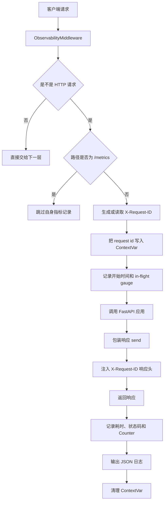

# Day 67 学习笔记

日期：2026-09-19

项目：`ai-job-agent`

主题：结构化日志、Request ID、ASGI 中间件和 Prometheus 指标

## 1. Day 67 做了什么

Day 66 把配置集中到了 `app/config.py`。

Day 67 的目标是让运行中的服务变得“可观察”：

```text
能看到每个请求发生了什么
  ->
能通过 request id 关联日志
  ->
能统计请求量、错误率、延迟
  ->
能判断服务是否健康
```

Day 67 新增：

```text
request_context
  ->
logging_config
  ->
metrics
  ->
http_observability
  ->
/metrics
  ->
单元测试
```

## 2. Day 67 改了哪些文件

| 文件 | 变化 | 作用 |
|---|---|---|
| `app/request_context.py` | 新增 | 保存当前请求 ID |
| `app/logging_config.py` | 新增 | JSON 结构化日志 |
| `app/metrics.py` | 新增 | Prometheus 指标 |
| `app/http_observability.py` | 新增 | 请求日志和指标中间件 |
| `app/main.py` | 修改 | 注册中间件和 `/metrics` |
| `pyproject.toml` | 修改 | 添加 `prometheus-client` |
| `uv.lock` | 修改 | 锁定新依赖 |
| `tests/test_logging_metrics.py` | 新增 | 测试日志、请求 ID 和指标 |
| `docs/day67.md` | 新增 | 当前文档 |

## 3. 项目闭环实际流程

### 3.1 一个 HTTP 请求经过中间件



### 3.2 日志如何和请求关联

```text
客户端请求
  ->
中间件生成 request_id
  ->
后续所有日志都自动带上 request_id
  ->
响应头也返回 request_id
```

这样当用户报错时，可以：

```text
用户提供响应头中的 x-request-id
  ->
运维在日志平台搜索这个 request_id
  ->
找到这个请求的全部日志
```

## 4. 为什么要结构化日志

普通日志可能长这样：

```text
INFO: 192.168.1.10 - "GET /health HTTP/1.1" 200
```

它虽然能读，但程序很难分析。

结构化日志输出 JSON：

```json
{
  "timestamp": "2026-09-19T10:00:00+00:00",
  "level": "INFO",
  "logger": "http",
  "message": "request completed",
  "request_id": "abc123",
  "method": "GET",
  "request_path": "/health",
  "status_code": 200,
  "duration_ms": 1.23
}
```

JSON 日志可以被日志平台自动解析、搜索、聚合和告警。

## 5. Request ID 和 ContextVar

### 5.1 为什么需要 Request ID

一个服务同时处理很多请求。

如果日志只是：

```text
request completed
request completed
request completed
```

你无法知道哪几行属于同一个请求。

Request ID 是每个请求的唯一标识。

### 5.2 ContextVar 是什么

Python 的 `contextvars.ContextVar` 可以在异步任务之间保存上下文。

例如：

```python
request_id_var = contextvars.ContextVar("request_id", default="-")
```

它解决的问题是：

```text
异步代码中不能简单使用全局变量保存“当前请求”
因为多个请求会同时运行，全局变量会互相覆盖
```

ContextVar 会为每个异步上下文保留独立的值。

## 6. ASGI 中间件

FastAPI 底层使用 ASGI。

ASGI 中间件的基本形式是：

```python
class ObservabilityMiddleware:
    def __init__(self, app):
        self.app = app

    async def __call__(self, scope, receive, send):
        await self.app(scope, receive, send)
```

它像一个“请求处理管道”中的一层：

```text
请求进入
  ->
ObservabilityMiddleware
  ->
FastAPI
  ->
路由处理
```

### 6.1 为什么使用原生 ASGI 中间件

FastAPI 的 `BaseHTTPMiddleware` 有时对 SSE 流式响应不友好。

Day 67 使用原生 ASGI middleware：

```text
不把响应重新包装
  ->
只包装 send
  ->
兼容 StreamingResponse 和 SSE
```

### 6.2 如何注入响应头

中间件包装了 `send`：

```python
async def send_wrapper(message):
    if message["type"] == "http.response.start":
        headers.append((b"x-request-id", request_id.encode("utf-8")))
        message = {**message, "headers": headers}

    await send(message)
```

这样响应返回给客户端时，会带上：

```text
x-request-id: <request_id>
```

## 7. Prometheus 指标

Prometheus 是常用的监控系统。

它通过定期抓取：

```text
GET /metrics
```

来获得服务的运行数据。

### 7.1 Counter

Counter 是计数器，只会增加。

适合统计：

- 请求总数。
- 错误总数。
- 工具调用总数。

本项目：

```python
ai_job_agent_http_requests_total
```

### 7.2 Gauge

Gauge 是当前值，可以增加也可以减少。

适合统计：

- 当前在途请求数。
- 当前队列长度。
- 当前数据库连接数。

本项目：

```python
ai_job_agent_http_inflight_requests
```

### 7.3 Histogram

Histogram 记录数值分布。

适合统计：

- 请求耗时。
- 响应大小。
- Token 数量。

本项目：

```python
ai_job_agent_http_request_duration_seconds
```

Histogram 可以计算：

```text
p50
p95
p99
```

### 7.4 Labels

指标可以带标签：

```python
["method", "path", "status"]
```

例如：

```text
ai_job_agent_http_requests_total{
  method="GET",
  path="/health",
  status="200"
}
```

标签用于区分不同维度。

生产环境要注意 label cardinality：

```text
不要使用用户 ID、完整 URL 等无限增长的值作为 label
否则时间序列会爆炸
```

## 8. 文件解释

### 8.1 `app/request_context.py`

它保存当前请求的 ID。

```python
def new_request_id(value: str | None = None) -> str:
    request_id = value or uuid.uuid4().hex
    request_id_var.set(request_id)
    return request_id
```

如果客户端传了 `X-Request-ID`，就沿用。

否则生成新的 UUID。

### 8.2 `app/logging_config.py`

它配置 Python 标准库 logging。

核心是 `JsonFormatter`：

```python
return json.dumps(payload, ensure_ascii=False)
```

每一条日志都会变成 JSON。

### 8.3 `app/metrics.py`

它定义：

- Counter。
- Histogram。
- Gauge。

并提供 `render()` 输出 Prometheus 文本。

### 8.4 `app/http_observability.py`

它把 Request ID、日志和指标串起来。

每个 HTTP 请求会：

```text
开始计时
  ->
增加 in-flight gauge
  ->
执行请求
  ->
记录状态码和耗时
  ->
输出 JSON 日志
```

## 9. 测试文件分析

`tests/test_logging_metrics.py` 验证：

| 测试 | 作用 |
|---|---|
| `test_json_formatter_outputs_request_id` | 日志必须是 JSON，且带 request id |
| `test_request_context_uses_supplied_id` | 客户端传入的 request id 会被使用 |
| `test_metrics_observe_http_request` | 指标名称和标签正确 |
| `test_metrics_endpoint_is_prometheus_text` | `/metrics` 返回 Prometheus 文本 |

运行：

```bash
.venv/bin/pytest tests/test_logging_metrics.py -q
```

## 10. 可能遇到的相关报错

### 10.1 `ModuleNotFoundError: No module named 'prometheus_client'`

原因：

忘记添加依赖。

解决：

```bash
uv add "prometheus-client>=0.21,<1"
```

然后重新安装：

```bash
uv sync
```

### 10.2 `/metrics` 返回 404

原因：

`app/main.py` 中没有添加：

```python
@app.get("/metrics")
def metrics_endpoint():
    ...
```

解决：

检查 main.py 中是否存在 `/metrics` 路由。

### 10.3 日志打印了两遍

原因：

可能有多个 handler，或者父 logger 和子 logger 都处理同一条日志。

Day 67 通过：

```python
root_logger.handlers.clear()
uvicorn_logger.handlers.clear()
uvicorn_logger.propagate = True
```

避免重复 handler。

### 10.4 响应头没有 `x-request-id`

原因：

中间件没有正确添加，或者被其他中间件覆盖。

解决：

确认：

```python
app.add_middleware(ObservabilityMiddleware)
```

已经执行。

### 10.5 指标 label 无限增长

原因：

如果直接把完整 URL 或用户输入作为 label：

```python
path="/users/123"
path="/users/456"
```

会产生大量时间序列。

生产环境应尽量使用路由模板：

```text
/users/{user_id}
```

## 11. 实际生产对标

| Day 67 做法 | 真实生产方案 |
|---|---|
| JSON 日志到 stdout | structlog、loguru、统一日志 SDK |
| Request ID | OpenTelemetry Trace ID、W3C Trace Context |
| Prometheus Counter | Prometheus + Grafana |
| Histogram 耗时 | SLO、错误预算、告警 |
| 原生 ASGI middleware | 服务网格 Sidecar、网关统一埋点 |
| 手动 HTTP 指标 | OpenTelemetry 自动埋点 |
| 单机日志 | Loki、ELK、CloudWatch、Datadog |

Day 67 先把日志和指标做出来。Day 68 会继续做 Trace，把：

```text
一次 Agent 请求
  ->
工具调用
  ->
LLM 调用
  ->
检索结果
```

整条链路串起来。

## 12. 验证命令

检查结构化日志：

```bash
docker compose logs --tail=50 backend
```

检查请求 ID：

```bash
curl -i http://127.0.0.1:8000/health
```

手动传入请求 ID：

```bash
curl -i -H "X-Request-ID: my-request-001" http://127.0.0.1:8000/health
```

检查指标：

```bash
curl http://127.0.0.1:8000/metrics
```

## 13. Day 67 检查清单

- [ ] `prometheus-client` 已添加
- [ ] `app/request_context.py` 已创建
- [ ] `app/logging_config.py` 已创建
- [ ] `app/metrics.py` 已创建
- [ ] `app/http_observability.py` 已创建
- [ ] `app/main.py` 已注册中间件
- [ ] `/metrics` 路由可访问
- [ ] 日志为 JSON
- [ ] 响应头包含 `X-Request-ID`
- [ ] `tests/test_logging_metrics.py` 通过
- [ ] backend 和 worker 正常启动

## 14. 下一步

Day 68 进入可观测性 Trace。

重点解决：

```text
如何记录一次 Agent 调用？
如何记录 LLM 调用、工具调用、检索步骤？
如何把 request id、trace id、metrics 关联起来？
生产项目如何接入 OpenTelemetry 或 Langfuse？
```
