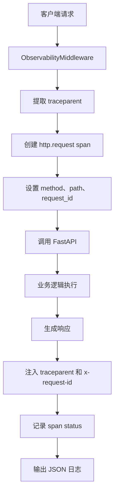
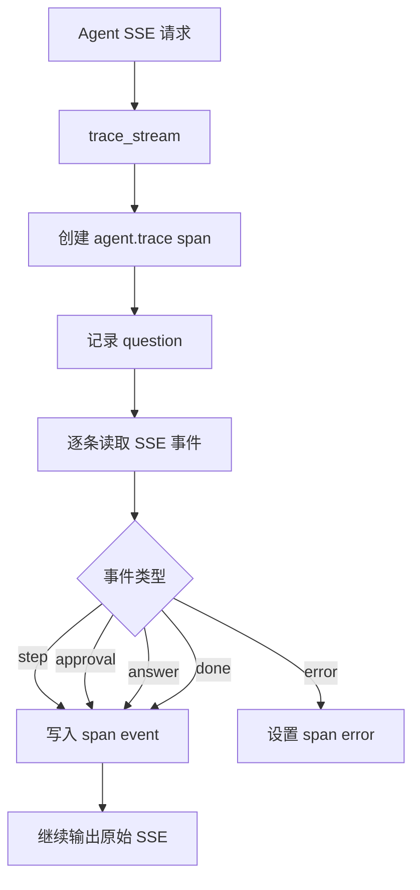

# Day 68 学习笔记

日期：2026-09-19

项目：`ai-job-agent`

主题：OpenTelemetry Trace、Span、W3C Trace Context 和 Agent 链路追踪

## 1. Day 68 做了什么

Day 67 完成了：

```text
结构化日志
  ->
Request ID
  ->
Prometheus 指标
```

但日志和指标主要回答：

```text
发生了什么？
请求量是多少？
耗时是多少？
```

它们还不能完整回答：

```text
一次 Agent 请求从进入系统到返回结果，中间经过了哪些步骤？
每个步骤谁调用谁？
错误发生在哪一层？
```

Day 68 引入 OpenTelemetry Trace，解决“一次完整调用链路”的问题。

## 2. Day 68 改了哪些文件

| 文件 | 变化 | 作用 |
|---|---|---|
| `app/tracing.py` | 新增 | 配置 TracerProvider 和导出器 |
| `app/config.py` | 修改 | 增加 OTEL 配置 |
| `app/logging_config.py` | 修改 | 日志输出 trace_id 和 span_id |
| `app/http_observability.py` | 修改 | HTTP 请求生成 server span |
| `app/observability.py` | 修改 | Agent 事件写入 span event |
| `docker-compose.yml` | 修改 | 传递 OTEL 环境变量 |
| `.env.example` | 修改 | 增加 OTEL 配置 |
| `pyproject.toml` | 修改 | 增加 OpenTelemetry 依赖 |
| `uv.lock` | 修改 | 锁定依赖 |
| `tests/test_tracing.py` | 新增 | 测试 Trace 和 span |
| `docs/day68.md` | 新增 | 当前文档 |

## 3. 项目闭环实际流程

### 3.1 HTTP 请求进入后端



### 3.2 Agent 流式请求进入 trace_stream



## 4. OpenTelemetry 基础概念

### 4.1 Trace

Trace 是一次完整请求的调用链路。

例如：

```text
浏览器
  ->
FastAPI
  ->
Agent
  ->
工具调用
  ->
LLM
```

### 4.2 Span

Span 是 Trace 中的一个操作单元。

例如：

- `http.request`
- `agent.trace`
- `search_knowledge`
- `openai.chat.completion`

一个 Trace 可以包含多个 Span。

### 4.3 Trace ID 和 Span ID

每个 Trace 有唯一的 trace_id。

每个 Span 有唯一的 span_id。

关系类似：

```text
trace_id 像一次完整旅行的订单号
span_id 像旅程中的每一段行程
```

### 4.4 Parent Span 和 Child Span

如果 HTTP 请求调用 Agent：

```text
http.request 是父 Span
agent.trace 是子 Span
```

如果 Agent 调用工具：

```text
agent.trace 是父 Span
search_knowledge 是子 Span
```

通过父子关系可以还原完整调用树。

### 4.5 TracerProvider

`TracerProvider` 负责创建 Tracer。

```python
provider = TracerProvider(resource=resource)
trace.set_tracer_provider(provider)
```

### 4.6 Resource

Resource 描述产生 Trace 的服务。

例如：

```python
{
    "service.name": "ai-job-agent",
    "deployment.environment": "development",
}
```

### 4.7 Exporter

Exporter 决定 Span 发送到哪里。

Day 68 支持：

- `ConsoleSpanExporter`：本地开发输出到终端。
- `OTLPSpanExporter`：发送到 OTLP Collector 或 Langfuse。

### 4.8 W3C Trace Context

跨服务传播 Trace 信息，通常使用 HTTP 请求头：

```text
traceparent: 00-<trace_id>-<span_id>-<flags>
tracestate: ...
```

`traceparent` 让不同服务可以识别同一次 Trace。

## 5. `app/tracing.py` 解释

### 5.1 配置 Provider

```python
provider = TracerProvider(resource=resource)
trace.set_tracer_provider(provider)
```

它告诉 OpenTelemetry：

```text
这个服务的 Trace 由这个 Provider 管理。
```

### 5.2 Console Exporter

```python
provider.add_span_processor(
    SimpleSpanProcessor(ConsoleSpanExporter())
)
```

适合本地开发。

每个 Span 结束后直接打印到终端。

### 5.3 OTLP Exporter

```python
exporter = OTLPSpanExporter(endpoint=...)
provider.add_span_processor(BatchSpanProcessor(exporter))
```

适合生产环境。

批量发送 Trace，减少网络请求次数。

### 5.4 防止重复配置

```python
global _provider_configured
if _provider_configured:
    return
```

如果模块被多次导入，也不会重复注册 Provider。

## 6. 日志如何关联 Trace

`app/logging_config.py` 中：

```python
span_context = trace.get_current_span().get_span_context()

trace_id = format(span_context.trace_id, "032x")
span_id = format(span_context.span_id, "016x")
```

这样每条日志会包含：

```json
{
  "trace_id": "abc...",
  "span_id": "def..."
}
```

排查问题时：

```text
先拿到 trace_id
  ->
在日志平台搜索 trace_id
  ->
找到这次请求的全部日志
```

## 7. `app/http_observability.py` 解释

### 7.1 提取请求中的 Trace Context

```python
carrier = {
    key.decode("latin-1").lower(): value.decode("latin-1")
    for key, value in headers.items()
}

request_context = get_global_textmap().extract(carrier)
```

如果上游服务已经传了 `traceparent`，当前服务会继续使用同一个 Trace。

### 7.2 创建 Server Span

```python
with tracer.start_as_current_span(
    "http.request",
    context=request_context,
    kind=trace.SpanKind.SERVER,
) as span:
    ...
```

这个 Span 表示“当前服务作为服务端处理请求”。

### 7.3 记录异常

```python
except Exception as exc:
    span.record_exception(exc)
    span.set_status(Status(StatusCode.ERROR))
```

生产 Trace 平台可以因此快速定位错误发生的位置。

### 7.4 注入响应头

```python
trace_carrier = {}
get_global_textmap().inject(trace_carrier)
```

响应中会带：

```text
traceparent
tracestate
```

这样前端或下一层服务可以继续使用这个 Trace。

## 8. `app/observability.py` 解释

### 8.1 创建 Agent Span

```python
with tracer.start_as_current_span("agent.trace") as span:
    ...
```

一次 Agent 调用会生成一个 `agent.trace` span。

### 8.2 写入 Span Event

```python
span.add_event(
    event_name,
    attributes={
        "data": json.dumps(masked_data, ensure_ascii=False)
    },
)
```

每个 SSE 事件都会变成 Span Event：

- `step`
- `approval`
- `answer`
- `error`
- `done`

### 8.3 脱敏

```python
masked_data = mask_value(data)
```

写入 Trace 前先脱敏，避免敏感信息进入 Trace 平台。

## 9. 测试文件分析

`tests/test_tracing.py` 验证：

| 测试 | 作用 |
|---|---|
| `test_json_formatter_includes_trace_context` | 日志必须包含 trace_id 和 span_id |
| `test_trace_stream_creates_span_and_events` | Agent 事件会转换成 span event |
| `test_http_middleware_injects_traceparent` | HTTP 响应包含 traceparent |

测试中使用：

```python
from opentelemetry.sdk.trace.export.in_memory_span_exporter import (
    InMemorySpanExporter,
)
```

InMemory exporter 把 Span 保存在内存中，方便断言。

## 10. 相关报错及原因

### 10.1 `cannot import name 'InMemorySpanExporter'`

错误：

```text
ImportError: cannot import name 'InMemorySpanExporter'
from 'opentelemetry.sdk.trace.export'
```

原因：

`InMemorySpanExporter` 已经移动到：

```text
opentelemetry.sdk.trace.export.in_memory_span_exporter
```

修复：

```python
from opentelemetry.sdk.trace.export.in_memory_span_exporter import (
    InMemorySpanExporter,
)
```

### 10.2 `cannot import name 'get_global_textmap'`

错误：

```text
ImportError: cannot import name 'get_global_textmap'
from 'opentelemetry.propagators'
```

原因：

正确的模块名是 `opentelemetry.propagate`，不是 `opentelemetry.propagators`。

修复：

```python
from opentelemetry.propagate import get_global_textmap
```

### 10.3 `curl: (18) transfer closed with outstanding read data remaining`

这个错误不是 curl 本身用错，而是后端 SSE 流在输出过程中异常终止。

当前项目的实际原因是：

```text
/agent/stream
  ->
加载 Embedding 模型
  ->
容器内 HuggingFace 缓存为空
  ->
尝试访问 hf-mirror.com 失败
  ->
抛出 OSError
  ->
流中断
```

后端日志中的关键错误：

```text
OSError: We couldn't connect to 'https://hf-mirror.com' to load the files,
and couldn't find them in the cached files.
```

本地修复方式是挂载宿主机 HuggingFace 缓存，并启用离线模式：

```yaml
HF_HUB_OFFLINE: "1"
TRANSFORMERS_OFFLINE: "1"
```

同时挂载：

```yaml
- ${HOME}/.cache/huggingface:/app/.cache/huggingface:ro
```

生产环境更推荐把 Embedding 和 Reranker 拆成独立服务，或使用远程 Embedding API。

## 11. 实际生产对标

| Day 68 实现 | 真实生产方案 |
|---|---|
| ConsoleSpanExporter | OTLP Collector、Jaeger、Tempo |
| W3C traceparent | 跨服务、跨语言 Trace 传播 |
| 手动 HTTP span | OpenTelemetry Auto Instrumentation |
| Agent span event | Langfuse、LangSmith、Arize Phoenix |
| 日志带 trace_id | Trace、Logs、Metrics 三支柱关联 |
| 内存 Agent trace | 集中式 Trace 平台 |
| 本地模型加载失败 | 独立模型服务、托管 Embedding |

Day 68 建立了可扩展的 Trace 基础。

后续接 Langfuse 时，只需：

```text
设置 OTEL_EXPORTER_OTLP_ENDPOINT
  ->
指向 Langfuse 的 OTLP endpoint
```

不需要重写业务逻辑。

## 12. 验证命令

查看 HTTP Trace：

```bash
curl -i http://127.0.0.1:8000/health
```

查看 Agent Trace：

```bash
curl -N -X POST http://127.0.0.1:8000/agent/stream \
  -H "Content-Type: application/json" \
  -d '{"question": "FastAPI 需要掌握什么"}'
```

查看后端日志：

```bash
docker compose logs --tail=50 backend
```

运行测试：

```bash
.venv/bin/pytest tests/test_tracing.py -q
```

## 13. Day 68 检查清单

- [ ] OpenTelemetry 依赖已添加
- [ ] `app/tracing.py` 已创建
- [ ] OTEL 配置已加入 `app/config.py`
- [ ] 日志包含 trace_id 和 span_id
- [ ] HTTP 请求生成 server span
- [ ] Agent 事件生成 span event
- [ ] 响应头包含 traceparent
- [ ] `.env.example` 和 Compose 已传递 OTEL 变量
- [ ] `tests/test_tracing.py` 通过
- [ ] 本地 HuggingFace 缓存问题已处理
- [ ] `/agent/stream` 能正常输出完整 SSE

## 14. 下一步

Day 69 进入成本和延迟。

重点解决：

```text
如何统计 token 使用量和成本？
如何做缓存？
如何做模型降级？
如何设置成本预算和延迟预算？
```
