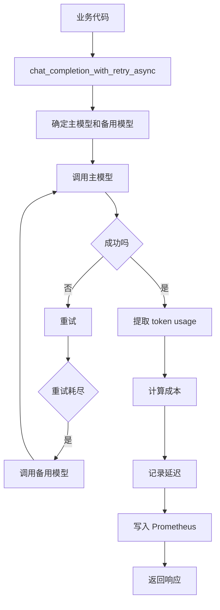
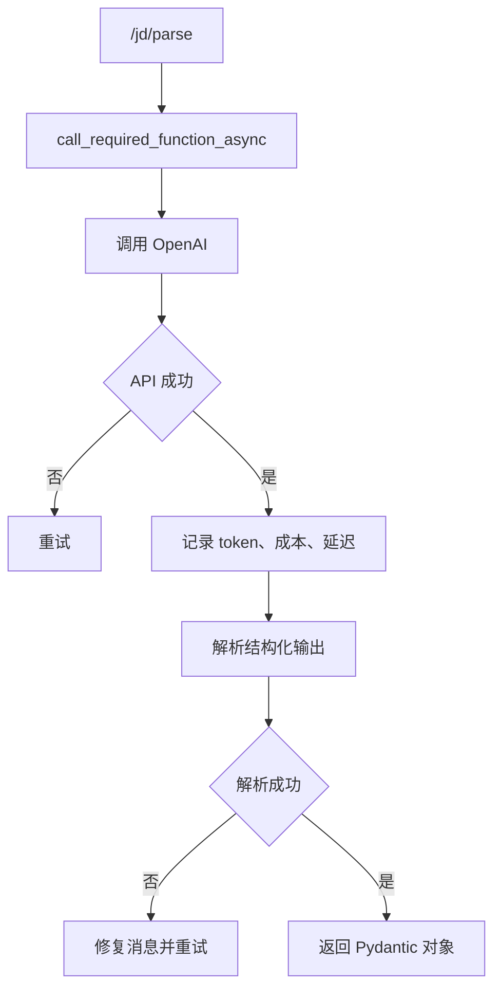
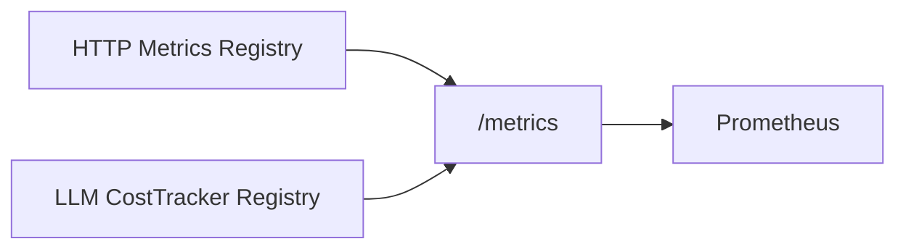

# Day 69 学习笔记

日期：2026-09-19

项目：`ai-job-agent`

主题：LLM 成本、Token、延迟、预算、缓存和模型降级

## 1. Day 69 做了什么

前面的项目已经能调用 LLM，但缺少一个关键能力：

```text
每次调用花了多少 token？
每次调用多少钱？
每次调用多慢？
是否超过成本预算？
能否命中缓存，减少重复调用？
主模型失败时，能否自动切换到备用模型？
```

Day 69 增加：

```text
CostTracker
  ->
LlmCache
  ->
模型降级
  ->
Prometheus LLM 指标
  ->
单元测试
```

## 2. Day 69 改了哪些文件

| 文件 | 变化 | 作用 |
|---|---|---|
| `app/cost_tracker.py` | 新增 | 记录 token、成本、延迟和预算 |
| `app/llm_cache.py` | 新增 | LLM 结果缓存 |
| `app/model_fallback.py` | 新增 | 备用模型解析和降级 |
| `app/async_llm.py` | 修改 | 自动记录成本并支持降级 |
| `app/async_function_calling.py` | 修改 | function calling 也记录成本 |
| `app/config.py` | 修改 | 增加成本、缓存、备用模型配置 |
| `docker-compose.yml` | 修改 | 传递成本和降级环境变量 |
| `.env.example` | 修改 | 增加成本和缓存配置 |
| `tests/test_cost_latency.py` | 新增 | 测试成本、缓存和降级 |
| `docs/day69.md` | 新增 | 当前文档 |

## 3. 项目闭环实际流程

### 3.1 非流式 LLM 调用



### 3.2 Function Calling 路径



### 3.3 Prometheus 指标输出



关键点是：

```text
HTTP 指标和 LLM 指标必须使用同一个 registry
否则 /metrics 只输出其中一部分
```

## 4. 核心概念

### 4.1 Token

模型不是按“字符”计费，而是按 token 计费。

一次调用通常包含：

- 输入 token：Prompt、上下文、工具定义。
- 输出 token：模型生成的文本。

### 4.2 成本估算

项目中：

```python
estimate_cost(model_name, input_tokens, output_tokens)
```

它会查询 `MODEL_REGISTRY` 中的：

```text
input_cost_per_million
output_cost_per_million
```

### 4.3 Usage

OpenAI 兼容 API 会返回：

```json
{
  "usage": {
    "prompt_tokens": 120,
    "completion_tokens": 30,
    "total_tokens": 150
  }
}
```

`CostTracker` 会优先读取真实 usage。

如果响应没有 usage，则使用本地 token 估算。

### 4.4 成本预算

`llm_cost_budget_usd` 是单进程成本上限。

当累计成本超过预算时：

```python
raise CostBudgetExceededError
```

生产环境中的预算通常是：

- 账号级别限额。
- 团队级别限额。
- 项目级别限额。

### 4.5 模型降级

模型降级是指：

```text
主模型不可用时
  ->
自动使用备用模型
```

本项目通过：

```python
LLM_FALLBACK_MODELS_CSV=deepseek-reasoner
```

配置备用模型。

### 4.6 结果缓存

缓存可以避免相同问题重复调用 LLM。

缓存 key 由：

- 模型名。
- 消息。
- 工具参数。

生成 SHA256。

例如：

```text
llm:chat:deepseek-chat:abcd1234...
```

### 4.7 延迟

延迟是从开始调用到拿到响应的耗时。

Prometheus 使用 Histogram 保存延迟分布，便于计算：

```text
p50
p95
p99
```

## 5. `app/cost_tracker.py` 解释

### 5.1 LlmUsageRecord

```python
@dataclass
class LlmUsageRecord:
    model: str
    input_tokens: int
    output_tokens: int
    cost_usd: float
    latency_ms: float
    cached: bool
```

它保存一次 LLM 调用的关键信息。

### 5.2 record()

```python
cost_usd = estimate_cost(model, input_tokens, output_tokens)
```

它会：

- 累计成本。
- 累计 token。
- 写入 Counter 和 Histogram。
- 检查预算。

### 5.3 共享 Registry

```python
from app.metrics import metrics as http_metrics

_default_cost_tracker = CostTracker(
    registry=http_metrics.registry,
    budget_usd=settings.llm_cost_budget_usd,
)
```

这是 Day 69 遇到的重要问题：

```text
如果 HTTP metrics 和 LLM metrics 使用不同 registry
/metrics 只会输出其中一个 registry
```

## 6. `app/async_llm.py` 解释

### 6.1 备用模型列表

```python
fallback_models = get_fallback_models(model)
models = [model]
models.extend(item for item in fallback_models if item != model)
```

最终调用顺序：

```text
主模型
  ->
备用模型 1
  ->
备用模型 2
```

### 6.2 自动记账

```python
if not stream:
    prompt_tokens, completion_tokens = _usage_tokens(
        response,
        messages,
    )

    effective_tracker.record(
        model=model_name,
        input_tokens=prompt_tokens,
        output_tokens=completion_tokens,
        latency_ms=duration_ms,
    )
```

非流式调用成功后自动记录。

流式调用暂时不在这里记录，因为流式 usage 需要等到生成结束。

## 7. `app/async_function_calling.py` 解释

### 7.1 为什么需要单独记录

`/jd/parse` 不走：

```text
chat_completion_with_retry_async
```

它走：

```text
call_required_function_async
  ->
client.chat.completions.create
```

所以如果不在这里埋点，`/jd/parse` 就不会产生 LLM 指标。

### 7.2 记录时机

每次 API 成功返回响应后：

```python
tracker.record(
    model=model_name,
    input_tokens=prompt_tokens,
    output_tokens=completion_tokens,
    latency_ms=duration_ms,
)
```

即使后续结构化输出解析失败，也会记录这次成本。

## 8. 测试文件分析

`tests/test_cost_latency.py` 验证：

| 测试 | 作用 |
|---|---|
| `test_cost_tracker_records_cost_and_tokens` | 成本和 token 累计正确 |
| `test_cost_tracker_enforces_budget` | 预算保护有效 |
| `test_build_cache_key_is_stable` | 相同输入生成相同 key |
| `test_llm_cache_get_and_set` | Redis 缓存读写正常 |
| `test_parse_model_csv` | 备用模型解析正确 |
| `test_async_llm_records_cost_and_falls_back` | 主模型失败后切换备用模型，并记录成本 |

运行：

```bash
.venv/bin/pytest tests/test_cost_latency.py -q
```

## 9. 相关报错及原因

### 9.1 调用 `/jd/parse` 后没有 LLM 指标

原因：

Day69 最初只在：

```text
chat_completion_with_retry_async
```

中记录成本。

但 `/jd/parse` 使用的是：

```text
call_required_function_async
```

所以这条路没有记录指标。

修复：

在 `app/async_function_calling.py` 中也调用：

```python
tracker.record(...)
```

### 9.2 修完 function calling 后仍然没有 LLM 指标

原因：

HTTP metrics 和 LLM CostTracker 使用了两个不同的 Prometheus registry。

```text
/metrics 只渲染 HTTP metrics 的 registry
  ->
LLM metrics 即使记录了也不会输出
```

修复：

让默认 CostTracker 使用 HTTP metrics 的 registry：

```python
_default_cost_tracker = CostTracker(
    registry=http_metrics.registry,
    budget_usd=settings.llm_cost_budget_usd,
)
```

### 9.3 Worker 显示 unhealthy

原因：

worker 复用了 backend 镜像，但镜像里的 `HEALTHCHECK` 是访问：

```text
http://127.0.0.1:8000/health
```

worker 运行 arq，不监听 HTTP，所以健康检查失败。

修复：

在 `docker-compose.yml` 中给 worker 单独配置 Redis 健康检查。

## 10. 实际生产对标

| Day 69 做法 | 真实生产方案 |
|---|---|
| 本地 CostTracker | 集中式成本数据库和账单系统 |
| 估算成本 | 供应商账单 API、精确价格表 |
| Prometheus 指标 | Grafana、Datadog、CloudWatch |
| 单进程预算 | 账号级、团队级预算治理 |
| Redis 结果缓存 | 语义缓存、CDN、对象缓存 |
| 固定备用模型 | 模型路由、A/B 测试、流量策略 |
| 失败切换 | 服务网格、模型网关、动态路由 |

Day 69 建立了成本和延迟可观测的基础。

生产项目还会加入：

- 精确账单。
- 缓存命中率。
- 模型路由策略。
- 成本告警。
- SLO 和错误预算。

## 11. 验证命令

调用非流式 LLM：

```bash
curl -X POST http://127.0.0.1:8000/jd/parse \
  -H "Content-Type: application/json" \
  -d '{"text": "招聘 AI Agent 工程师，要求掌握 Python、FastAPI、LangGraph"}'
```

查看 LLM 指标：

```bash
curl -s http://127.0.0.1:8000/metrics | grep ai_job_agent_llm
```

查看测试：

```bash
.venv/bin/pytest tests/test_cost_latency.py -q
```

## 12. Day 69 检查清单

- [ ] `app/cost_tracker.py` 已创建
- [ ] `app/llm_cache.py` 已创建
- [ ] `app/model_fallback.py` 已创建
- [ ] `app/async_llm.py` 已记录成本并支持降级
- [ ] `app/async_function_calling.py` 已记录成本
- [ ] CostTracker 与 HTTP metrics 使用同一 registry
- [ ] 成本和缓存配置已加入 `.env.example`
- [ ] Compose 已传递成本和降级环境变量
- [ ] `tests/test_cost_latency.py` 通过
- [ ] `/metrics` 能输出 LLM 指标
- [ ] 主模型失败时可以切换备用模型

## 13. 下一步

Day 70 进入 CI/CD。

重点解决：

```text
如何自动运行测试？
如何自动 lint？
如何自动构建镜像？
如何自动部署？
```
