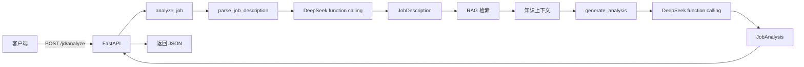

# Week 1 复盘

日期：2026-09-04

项目：`ai-job-agent`

复盘范围：Day 1 到 Day 7

第 1 周目标：跑通一个最小 AI Agent 项目，从 Python 环境、FastAPI、DeepSeek 调用、function calling，到基础 RAG 和多步流程。

## 1. 第 1 周完成了什么

| 天 | 任务 | 关键知识点 | 交付物 | 状态 |
|---|---|---|---|---|
| Day 1 | Python 环境与基础 | uv、venv、函数、类型标注、dict、list、async | `app/day1.py`、pytest | 完成 |
| Day 2 | FastAPI 和 Pydantic | 路由、请求体、Pydantic、response_model | `app/main.py`、`app/models.py` | 完成 |
| Day 3 | DeepSeek JSON 输出 | OpenAI SDK、Prompt、json.loads、Pydantic 校验 | `app/llm.py` | 完成 |
| Day 4 | function calling | tools、tool_choice、tool_calls、arguments | 更新 `app/llm.py` | 完成 |
| Day 5 | 基础 RAG 检索 | Embedding、向量相似度、numpy | `app/rag.py`、`app/rag_cli.py` | 完成 |
| Day 6 | RAG 接入 Agent 流程 | 多步编排、上下文注入、lru_cache | `app/agent.py`、`/jd/analyze` | 完成 |
| Day 7 | 周收尾 | 测试、README、Git、复盘 | README、Git 提交 | 完成 |

## 2. 第 1 周形成的能力

完成第 1 周后，项目已经具备：

- `GET /health`：健康检查
- `POST /jd/parse`：解析 JD 为结构化岗位信息
- `POST /jd/analyze`：解析 JD、检索知识、生成岗位分析
- `python -m app.rag_cli`：命令行检索知识库
- 单元测试覆盖接口、模型调用、RAG 和多步流程

核心能力：

1. 能写 Python 和 FastAPI 接口
2. 能用 Pydantic 校验输入输出
3. 能调用 DeepSeek 完成结构化输出
4. 能实现 function calling
5. 能实现基础 RAG
6. 能把解析、检索、生成组合成多步流程

## 3. 第 1 周核心概念

### 3.1 Python 基础

- `uv` 管理 Python 版本和依赖
- `venv` 隔离项目环境
- `dict`、`list`、类型标注
- `async/await`
- `from x import y`

### 3.2 FastAPI

- 路由使用装饰器
- 请求体使用 Pydantic 模型
- `response_model` 控制返回结构
- 参数校验失败返回 `422`

### 3.3 LLM 调用

- DeepSeek 使用 OpenAI 兼容接口
- `messages` 包含 system 和 user
- DeepSeek JSON 输出使用 `response_format={"type": "json_object"}`
- 返回内容在 `response.choices[0].message.content`

### 3.4 function calling

- `tools` 定义函数 Schema
- `tool_choice` 控制是否强制调用
- 返回位置是 `message.tool_calls`
- 参数在 `tool_call.function.arguments`
- `arguments` 是 JSON 字符串，需要 `json.loads()`

### 3.5 RAG

- DeepSeek 不做 Embedding
- Embedding 由 `BAAI/bge-small-zh-v1.5` 完成
- 文档向量和问题向量通过点积计算相似度
- 检索结果作为上下文注入 Prompt

### 3.6 多步流程

`/jd/analyze` 的流程：

```text
解析 JD -> 构造查询 -> RAG 检索 -> 格式化上下文 -> 生成分析
```

## 4. 第 1 周遇到的主要问题

### 4.1 pytest 找不到 app 模块

原因：

pytest 默认没有把项目根目录加入导入路径。

解决：

在 `pyproject.toml` 中加入：

```toml
[tool.pytest.ini_options]
pythonpath = ["."]
```

### 4.2 文件被撤回导致 ModuleNotFoundError

原因：

`app/day1.py` 或 `app/__init__.py` 被删除，只留下缓存。

解决：

恢复源文件。

### 4.3 PyPI 安装过慢

原因：

`sentence-transformers` 依赖大型包，尤其是 `torch`，默认 PyPI 源速度慢。

解决：

使用国内 PyPI 镜像：

```bash
export UV_DEFAULT_INDEX=https://pypi.tuna.tsinghua.edu.cn/simple
```

### 4.4 向量维度不匹配

错误：

```text
matmul: Input operand 1 has a mismatch
size 1 is different from 512
```

原因：

`encode([query])` 返回二维数组 `(1, 512)`，没有取出第一维。

解决：

```python
query_embedding = model.encode([query], normalize_embeddings=True)[0]
```

### 4.5 @ 运算类型错误

错误：

```text
unsupported operand type(s) for @: 'list' and 'list'
```

原因：

测试中的 `FakeModel` 返回普通列表，而不是 numpy 数组。

解决：

```python
import numpy as np

return np.array([vectors[text] for text in texts])
```

### 4.6 接口测试期望值过期

原因：

`/jd/parse` 从固定返回改为真实模型后，测试仍然断言旧的固定值。

解决：

在接口测试中 mock `parse_job_description`，不在接口测试中真实调用模型。

## 5. 第 1 周项目闭环



## 6. 第 1 周复盘问题

回答以下问题，判断自己是否真正掌握第 1 周内容。

### Python 和环境

1. `uv` 和 `venv` 分别解决什么问题？
2. Python 的 `dict` 和 `list` 与 TypeScript 中的哪些类型对应？
3. `from app.models import JobDescription` 和 TypeScript 的 import 有什么不同？
4. `async def` 和普通 `def` 的区别是什么？
5. 什么是 `if __name__ == "__main__"`？

### FastAPI 和 Pydantic

6. FastAPI 如何把一个 Python 函数绑定到 HTTP 路由？
7. 请求体模型为什么使用 `Pydantic BaseModel`？
8. `response_model` 有什么作用？
9. 空请求体为什么可能返回 `422`？
10. 如何测试 FastAPI 接口？

### LLM 和 function calling

11. DeepSeek 和 OpenAI API 的关系是什么？
12. `messages` 中的 system 和 user 分别代表什么？
13. DeepSeek JSON 输出和 function calling 有什么不同？
14. `tools` 和 `tool_choice` 分别做什么？
15. `message.tool_calls` 的结构是什么？
16. `tool_call.function.arguments` 为什么需要 `json.loads()`？
17. 模型调用工具后，工具是谁真正执行的？

### RAG

18. 什么是 RAG？
19. DeepSeek 能做 Embedding 吗？
20. Embedding 向量如何用于检索？
21. `encode([query])` 和 `encode([query])[0]` 的返回形状有什么区别？
22. 为什么测试中要使用 `FakeModel` 而不是真实模型？
23. RAG 检索结果是如何进入 Prompt 的？

### 多步流程和测试

24. `/jd/analyze` 的完整数据流是什么？
25. `analyze_job()` 做了哪几步？
26. `lru_cache` 在这个项目中解决了什么问题？
27. `model_dump_json()` 和 `json.dumps()` 有什么区别？
28. 测试多步流程时，需要 mock 哪些外部依赖？
29. 接口测试和模型测试的边界是什么？
30. 如何避免测试产生 API 费用？

### 项目复盘

31. 如果让你重新实现 `/jd/analyze`，你会改变哪些设计？
32. 当前项目最脆弱的一步是什么？
33. 如果 DeepSeek 返回错误 JSON，你的代码会怎么处理？
34. 如果知识库很大，当前 RAG 会有什么问题？
35. 第 1 周最让你困惑的概念是什么？

## 7. 第 1 周能力水平

对应 `docs/overview.md` 的能力等级：

- 当前水平：**L3**
- 已经能实现基础 RAG 和单 Agent 雏形
- 尚未实现完整的多步 Agent 循环
- 尚未实现会话记忆、评估、流式前端和生产部署

## 8. 第 1 周复盘结论

完成标准：

- [ ] 能独立解释每个核心概念
- [ ] 能独立写出 `parse_job_description`
- [ ] 能独立写出 RAG 检索
- [ ] 能独立画出 `/jd/analyze` 数据流
- [ ] 能 mock 外部依赖并写测试
- [ ] 能说清楚每个错误的原因和修复
- [ ] 项目有 README 和 Git 提交

第 1 周的目标不是掌握所有 Agent 知识，而是形成一套可运行的端到端骨架。

## 9. 进入第 2 周前的提醒

第 2 周会重点扩展 RAG：

- 文本切分
- 混合检索
- 向量持久化
- 会话记忆
- 引用来源
- RAG 评估

第 1 周的 `app/rag.py`、`app/agent.py` 和测试方法会成为第 2 周的基础。
