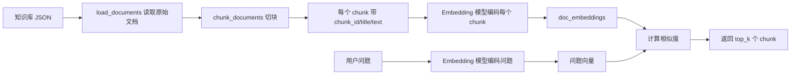

# Day 8 学习笔记

日期：2026-09-02

项目：`ai-job-agent`

目标：给 RAG 增加“文本切分”能力，让较长的知识库文档先被切成小块，再对每一块做向量化和检索；理解固定长度切分、重叠切分、结构化切分三种策略。

## 1. Day 8 做了什么

Day 5 的 RAG 把每篇文档的 `text` 整体当作一个检索单元。对于很短的文档没有问题，但如果文档变长，整篇文档会被压缩成一个向量，检索不够精准，而且把整篇文档放进上下文也很浪费。

Day 8 把“文档 -> 向量”的流程中间加了一步“文档 -> 切块 -> 向量”：



一句话描述：

> 知识库先加载成原始文档，再按策略切分成多个带元数据的 chunk，之后才对这些 chunk 做 Embedding 和相似度检索；检索返回的是最相关的 chunk，而不是整篇文档。

## 2. 为什么需要文本切分

### 2.1 之前的问题

`RAGRetriever` 之前的写法是：

```python
self.texts = [doc["text"] for doc in documents]
self.doc_embeddings = model.encode(self.texts, normalize_embeddings=True)
```

它把每篇文档的完整 `text` 变成一个向量。文档越长，一个向量里塞进去的语义就越多，检索时很难准确命中具体段落。

### 2.2 切分解决什么

切分让检索单位从“整篇文档”变成“小块”。这样：

- 检索更精准，能定位到具体段落。
- 回答时只需要把命中的小块放进上下文，节省 token。
- 更容易给答案标注来源，例如“这段来自 `doc-fastapi-0`”。

### 2.3 三种切分策略

| 策略 | 做法 | 优点 | 缺点 |
|---|---|---|---|
| 固定长度 | 每 `chunk_size` 个字符切一块 | 简单、可预测 | 可能把一个词或一句话切断 |
| 重叠 | 下一块往回退 `overlap` 个字符 | 避免边界语义丢失 | 会有重复内容 |
| 结构化 | 按换行、段落等边界切 | 尽量保持语义完整 | 块大小不均匀 |

## 3. 今天改了哪些文件

| 文件 | 变化 | 作用 |
|---|---|---|
| `app/chunking.py` | 新增 | 实现固定长度、按段落、文档级切块三个函数 |
| `app/rag.py` | 修改 | 导入 `chunk_documents`，让 `build_retriever` 先切块再编码 |
| `app/rag_cli.py` | 修改 | 打印 `chunk_id` 和 `text`，而不是已经不存在的 `id` |
| `app/agent.py` | 修改 | `format_context` 同时兼容 chunk 和旧文档 |
| `data/knowledge_base.json` | 修改 | 新增一条较长的 `doc-fastapi` 文档 |
| `tests/test_chunking.py` | 新增 | 测试切块逻辑和检索返回 chunk 的行为 |

## 4. 核心代码与解释

### 4.1 chunk 长什么样

切分之后，每个 chunk 都是一个字典：

```python
{
    "chunk_id": "doc-fastapi-0",
    "doc_id": "doc-fastapi",
    "title": "FastAPI 后端开发",
    "text": "切出来的这一段文本",
    "chunk_index": 0,
}
```

字段含义：

- `chunk_id`：块的唯一标识，用来给答案标注来源。
- `doc_id`：这个块来自哪篇原始文档。
- `title`：保留原始标题，方便展示。
- `text`：真正要拿去编码和检索的文本。
- `chunk_index`：这个块是原文档里的第几块。

注意：这个结构是代码运行时生成的，不需要手动写进 `data/knowledge_base.json`。知识库里只放原始文档，`chunk_id`、`chunk_index` 这些由代码算出来。

### 4.2 固定长度 + 重叠切分

```python
def chunk_text_fixed(text: str, chunk_size: int = 80, overlap: int = 16) -> list[str]:
    if overlap >= chunk_size:
        raise ValueError("overlap 必须小于 chunk_size")

    chunks = []
    start = 0
    while start < len(text):
        end = min(start + chunk_size, len(text))
        chunks.append(text[start:end])
        if end >= len(text):
            break
        start = end - overlap
    return chunks
```

逐行解释：

- `start` 表示当前块的开始位置，从 `0` 开始。
- `end = min(start + chunk_size, len(text))`：结束位置不能超过文本总长度，所以用 `min` 限制。
- `text[start:end]`：用切片截取一段字符，这是 Python 取子字符串的写法。
- 如果已经切到末尾，就退出循环。
- 否则 `start = end - overlap`：下一块从上一块结束位置往前退回 `overlap` 个字符，形成重叠。

### 4.3 按段落切分

```python
def chunk_text_by_paragraph(text: str) -> list[str]:
    return [p.strip() for p in text.split("\n") if p.strip()]
```

解释：

- `text.split("\n")`：按换行符把文本拆成多段。
- `p.strip()`：去掉每段首尾的空格和换行。
- `if p.strip()`：过滤掉空段落，避免产生空字符串。
- 这是列表推导式，相当于 TypeScript 里的 `filter(Boolean).map(trim)` 组合。

### 4.4 文档级切块入口

```python
def chunk_documents(documents, strategy="fixed", chunk_size=80, overlap=16):
    chunks = []
    for doc in documents:
        if strategy == "paragraph":
            pieces = chunk_text_by_paragraph(doc["text"])
        else:
            pieces = chunk_text_fixed(doc["text"], chunk_size, overlap)

        for index, piece in enumerate(pieces):
            chunks.append({
                "chunk_id": f"{doc['id']}-{index}",
                "doc_id": doc["id"],
                "title": doc["title"],
                "text": piece,
                "chunk_index": index,
            })
    return chunks
```

解释：

- `strategy` 决定用哪种切法，默认是 `fixed`。
- `enumerate(pieces)` 会在遍历时同时给出 `index` 和 `piece`，比手动维护计数器更清晰。
- `f"{doc['id']}-{index}"` 是 f-string 字符串拼接，生成例如 `doc-fastapi-0`。

### 4.5 接入 RAGRetriever

`app/rag.py` 顶部新增导入：

```python
from app.chunking import chunk_documents
```

然后修改 `build_retriever`：

```python
def build_retriever(path: Path, strategy: str = "fixed") -> RAGRetriever:
    documents = load_documents(path)
    chunks = chunk_documents(documents, strategy=strategy)
    model = SentenceTransformer(DEFAULT_EMBEDDING_MODEL)
    return RAGRetriever(chunks, model)
```

关键点：`RAGRetriever` 本身不需要改。它只需要一份 `list[dict]`，其中每个字典有 `text` 字段。我们传入 chunk 列表，它就会对每个 chunk 的 `text` 编码。

这是“单一职责”的体现：切块归 `chunking.py`，检索归 `rag.py`，二者通过一份列表数据衔接。

### 4.6 format_context 兼容两种结构

```python
def format_context(results: list[dict]) -> str:
    lines = []

    for item in results:
        doc = item["doc"]
        score = item["score"]
        chunk_id = doc.get("chunk_id", doc.get("id", "unknown"))
        lines.append(f"[{chunk_id}] {doc['title']}: {doc['text']} (score={score:.3f})")

    return "\n".join(lines)
```

解释：

- `doc.get("chunk_id", doc.get("id", "unknown"))` 会优先取 `chunk_id`。
- 如果这个字典没有 `chunk_id`（例如旧结构只有 `id`），就退回取 `id`。
- 如果两个都没有，用 `"unknown"` 兜底，避免程序崩溃。

## 5. Python 语法知识点

### 5.1 函数参数默认值

```python
def chunk_text_fixed(text, chunk_size=80, overlap=16):
```

调用时可以省略有默认值的参数：

```python
chunk_text_fixed("hello")                 # chunk_size=80, overlap=16
chunk_text_fixed("hello", chunk_size=4)   # overlap 仍然用默认值 16
```

### 5.2 while 循环

`while` 是“只要条件成立就一直循环”，适合不知道要循环多少次的场景。这里循环直到 `start` 越过文本末尾。

### 5.3 enumerate

```python
for index, piece in enumerate(pieces):
    print(index, piece)
```

会同时拿到下标和值，避免自己写 `index = 0`、`index += 1`。

### 5.4 dict.get 的兜底

```python
doc.get("chunk_id", "unknown")
```

如果 `chunk_id` 不存在，返回 `"unknown"`，不会像 `doc["chunk_id"]` 那样直接抛 `KeyError`。

### 5.5 模块导入和 NameError

每个 `.py` 文件都是一个模块，有自己的命名空间。另一个文件要用这里的函数，必须显式 `import`，否则会报 `NameError`。

## 6. 遇到的问题与原因

### 6.1 NameError: name 'chunk_documents' is not defined

现象：

```text
NameError: name 'chunk_documents' is not defined
```

原因：

只创建了 `app/chunking.py`，但没有在 `app/rag.py` 顶部导入 `chunk_documents`。Python 不会自动发现其他文件里的函数。

解决：

在 `app/rag.py` 顶部加：

```python
from app.chunking import chunk_documents
```

### 6.2 JSONDecodeError: Expecting property name enclosed in double quotes

现象：

```text
json.decoder.JSONDecodeError: Expecting property name enclosed in double quotes
```

原因：

往 `data/knowledge_base.json` 里加内容时，把 `chunk_id`、`chunk_index` 这些 chunk 字段写进了知识库，并且最后一个字段后面多了逗号。JSON 不允许尾逗号，而且知识库应该只放原始文档。

解决：

知识库里只保留 `id`、`title`、`text`，最后一个元素后面不要写逗号。

### 6.3 SSL: UNEXPECTED_EOF_WHILE_READING

现象：

下载 Embedding 模型时一直重试：

```text
SSL: UNEXPECTED_EOF_WHILE_READING
```

原因：

本机到 Hugging Face 镜像的 HTTPS 连接在 TLS 握手阶段被系统代理打断。`unset http_proxy https_proxy all_proxy` 只能清掉 shell 环境变量，关不掉 macOS 系统代理。

解决：

关闭 macOS 系统代理，或关闭正在运行的 Clash/Surge 等代理软件，再运行检索命令。

### 6.4 KeyError: 'id'

现象：

检索命令加载模型成功后报：

```text
KeyError: 'id'
```

原因：

`build_retriever` 现在返回的是 chunk，chunk 里没有 `id`，只有 `chunk_id`；但 `app/rag_cli.py` 还在打印 `doc['id']`。

解决：

把 `rag_cli.py` 里的 `doc['id']` 改成 `doc['chunk_id']`。

### 6.5 KeyError: 'chunk_id'

现象：

运行 pytest 时 `test_analyze_job` 失败：

```text
KeyError: 'chunk_id'
```

原因：

`format_context` 用了 `doc['chunk_id']`，但 `tests/test_agent.py` 里的 `FakeRetriever` 返回的还是旧结构，只有 `id`，没有 `chunk_id`。

解决：

用 `doc.get("chunk_id", doc.get("id", "unknown"))` 做兼容，让两种结构都能跑。

## 7. 测试

`tests/test_chunking.py` 覆盖了四类逻辑：

- 固定切块的块数和重叠是否正确。
- 重叠参数不合法时是否抛出 `ValueError`。
- 按段落切分能否过滤空行和去掉空格。
- 切块后的 `chunk_id`、`doc_id`、`chunk_index` 是否正确。
- `RAGRetriever` 在传入 chunk 后，检索返回的是最相关的 chunk。

测试结果：

```text
14 passed
```

## 8. Day 8 检查清单

- [ ] 理解为什么长文档需要先切块
- [ ] 理解固定长度、重叠、结构化三种切分策略
- [ ] `app/chunking.py` 已创建
- [ ] `build_retriever` 已完成“加载 -> 切块 -> 编码”
- [ ] `rag_cli.py` 能打印 `chunk_id` 和 `text`
- [ ] `format_context` 能兼容 chunk 和旧文档
- [ ] `tests/test_chunking.py` 已创建并通过
- [ ] `uv run pytest` 全部通过
- [ ] 检索 CLI 能返回切块结果

## 9. 明天要做什么

Day 9 进入“改进检索”：在切块基础上加入 BM25、混合检索和重排，提升检索质量。
