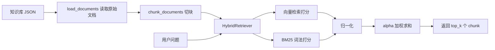

# Day 9 学习笔记

日期：2026-09-03

项目：`ai-job-agent`

目标：在 Day 8 切块的基础上，给检索增加词法匹配 BM25，把向量分和词法分结合成混合检索，并了解重排的作用。

## 1. Day 9 做了什么

Day 8 已经能切块，但检索还只看向量相似度。Day 9 增加了另一条打分路径：



一句话描述：

> 同一个查询会同时走“向量相似度”和“BM25 词法匹配”两条打分路径，分别归一化后再加权求和，最后返回分数最高的前 `top_k` 个 chunk。

## 2. 为什么需要改进检索

### 2.1 向量检索的短板

向量检索看的是“语义接近”。但有些词很具体，例如 `FastAPI`、`Docker`、`pytest`，如果向量模型对这些词不够敏感，可能检索到“意思接近但不是用户要找的词”的内容。

### 2.2 BM25 补什么

BM25 是传统的词法匹配算法，关心“查询词有没有真的出现在文档里”。它不依赖模型，而是根据词频、出现该词的文档数量、文档长度来打分。

两者结合就是混合检索：向量负责语义，BM25 负责精确词匹配。

### 2.3 重排补什么

混合检索先粗选出前若干条，再用更强的 CrossEncoder 对“查询 + 候选文本”逐对打分。它比双塔向量更准，但更慢，所以只用于少量候选。

## 3. 今天改了哪些文件

| 文件 | 变化 | 作用 |
|---|---|---|
| `app/bm25.py` | 新增 | 实现 `tokenize` 和简化版 `BM25` |
| `app/rag.py` | 修改 | 新增 `_normalize`、`HybridRetriever`、`rerank`，切换 `build_retriever` |
| `app/rag_cli.py` | 修改 | `top_k` 调整为 5，打印分数和内容 |
| `tests/test_bm25.py` | 新增 | 测试中文分词和 BM25 打分 |
| `tests/test_hybrid.py` | 新增 | 测试混合检索和归一化 |

## 4. 核心代码与解释

### 4.1 中文 tokenize

BM25 需要先切词。英文有空格，中文没有，所以写一个简单分词器：

```python
def tokenize(text: str) -> list[str]:
    tokens = []
    for part in text.lower().split():
        has_chinese = any("\u4e00" <= ch <= "\u9fff" for ch in part)
        if has_chinese:
            chars = [ch for ch in part if "\u4e00" <= ch <= "\u9fff"]
            tokens.extend(chars)
            tokens.extend(chars[i] + chars[i + 1] for i in range(len(chars) - 1))
        else:
            tokens.append(part)
    return tokens
```

解释：

- `text.lower().split()`：先按空格拆开，并把英文转小写。
- `"\u4e00"` 到 `"\u9fff"` 是中文汉字的 Unicode 范围。
- `has_chinese` 判断这一段里有没有中文。
- 中文会拆成单字，再补上相邻双字，例如 `部署` 拆成 `部`、`署`、`部署`。
- 双字能保留一点词语边界信息，比只有单字更容易匹配。

### 4.2 BM25 打分

```python
class BM25:
    def __init__(self, k1: float = 1.5, b: float = 0.75):
        self.k1 = k1
        self.b = b
        self.corpus_tokens = []
        self.doc_freq = Counter()
        self.doc_len = []
        self.avg_len = 0.0
        self.n_docs = 0

    def fit(self, corpus: list[str]) -> None:
        self.corpus_tokens = [tokenize(text) for text in corpus]
        self.n_docs = len(self.corpus_tokens)
        self.doc_len = [len(tokens) for tokens in self.corpus_tokens]
        self.avg_len = sum(self.doc_len) / max(1, self.n_docs)

        for tokens in self.corpus_tokens:
            for term in set(tokens):
                self.doc_freq[term] += 1

    def score(self, query: str) -> list[float]:
        query_tokens = tokenize(query)
        scores = []

        for tokens in self.corpus_tokens:
            tf = Counter(tokens)
            doc_len = len(tokens)
            total = 0.0

            for term in query_tokens:
                if term not in tf:
                    continue
                df = self.doc_freq.get(term, 0)
                idf = math.log((self.n_docs - df + 0.5) / (df + 0.5) + 1)
                numerator = tf[term] * (self.k1 + 1)
                denominator = tf[term] + self.k1 * (
                    1 - self.b + self.b * doc_len / self.avg_len
                )
                total += idf * numerator / denominator

            scores.append(total)

        return scores
```

关键概念：

- `fit`：把每篇文档切词，统计每个词出现在多少篇文档里，即 `doc_freq`。
- `tf`：某词在这篇文档里出现几次。
- `idf`：词越常见，`idf` 越小，用于降低“的、了、是”这类常见词的重要性。
- `k1`：控制词频增长带来的收益，避免一个词出现很多次就无限加分。
- `b`：控制文档长度惩罚，避免长文档单纯因为长而占优势。

### 4.3 归一化

```python
def _normalize(scores: np.ndarray) -> np.ndarray:
    scores = np.asarray(scores, dtype=float)
    low = scores.min()
    high = scores.max()
    if high == low:
        return np.zeros_like(scores)
    return (scores - low) / (high - low)
```

解释：

- 向量分和 BM25 分的范围不同，不能直接相加。
- `(scores - low) / (high - low)` 把分数压到 `0` 到 `1` 之间。
- `if high == low` 处理所有分数都相等的情况，此时直接返回全 0，避免除以 0。

### 4.4 混合检索

```python
class HybridRetriever:
    def __init__(self, documents, model, alpha=0.5):
        self.documents = documents
        self.model = model
        self.alpha = alpha
        self.texts = [doc["text"] for doc in documents]
        self.doc_embeddings = model.encode(self.texts, normalize_embeddings=True)
        self.bm25 = BM25()
        self.bm25.fit(self.texts)

    def retrieve(self, query, top_k=3):
        query_embedding = self.model.encode([query], normalize_embeddings=True)[0]
        vector_scores = self.doc_embeddings @ query_embedding
        bm25_scores = np.array(self.bm25.score(query))

        final_scores = (
            self.alpha * _normalize(vector_scores)
            + (1 - self.alpha) * _normalize(bm25_scores)
        )

        top_indices = np.argsort(final_scores)[::-1][:top_k]

        return [
            {"doc": self.documents[index], "score": float(final_scores[index])}
            for index in top_indices
        ]
```

解释：

- `alpha=0.5` 表示向量分和 BM25 分各占一半。
- `alpha=1` 时退化成纯向量检索，`alpha=0` 时退化成纯 BM25。
- 返回值仍然保持 `{"doc": ..., "score": ...}` 结构，所以 `agent.py` 和 `rag_cli.py` 不用大改。

### 4.5 重排

```python
def rerank(query: str, results: list[dict], top_k: int = 3) -> list[dict]:
    pairs = [(query, item["doc"]["text"]) for item in results]
    model = CrossEncoder("BAAI/bge-reranker-base")
    scores = model.predict(pairs)
    order = np.argsort(scores)[::-1][:top_k]
    return [results[i] for i in order]
```

解释：

- 先把查询和每个候选文本组成一对。
- `CrossEncoder` 把一对文本一起送进模型，输出一个相关度分数。
- 按这个分数重新排序，取前 `top_k`。
- 这里为了简单没有缓存模型，生产环境应该用 `lru_cache`，避免每次请求都重新加载。

## 5. Python 语法知识点

### 5.1 collections.Counter

`Counter` 可以统计列表里每个元素出现的次数：

```python
from collections import Counter

c = Counter(["a", "b", "a"])
print(c)          # Counter({'a': 2, 'b': 1})
print(c["a"])     # 2
```

### 5.2 math.log

`math.log(x)` 计算自然对数。BM25 用它计算 IDF。

### 5.3 any 和 Unicode 判断

```python
any("\u4e00" <= ch <= "\u9fff" for ch in part)
```

`any()` 表示只要列表里有一个值是 `True`，整个表达式就是 `True`。

### 5.4 列表推导式生成双字

```python
chars[i] + chars[i + 1] for i in range(len(chars) - 1)
```

对 `["部", "署"]` 会生成 `["部署"]`；对 `["A", "I"]` 会生成 `["AI"]`。

### 5.5 numpy 的最小值、最大值和排序

- `scores.min()`、`scores.max()` 返回最小值和最大值。
- `np.argsort(scores)` 返回从小到大的索引。
- `[::-1]` 反转成从大到小，`[:top_k]` 取前几个。

### 5.6 下划线开头的函数

`_normalize` 前面的下划线表示“这是内部辅助函数，外部一般不要直接调用”。它只是约定，不是强制限制。

## 6. 容易踩的坑和报错

### 6.1 NameError: name 'BM25' is not defined

原因：在 `app/rag.py` 里用了 `BM25`，但没有写：

```python
from app.bm25 import BM25
```

每个 Python 文件都有自己的命名空间，不会自动认识其他文件里的类或函数。

### 6.2 中文直接用 split 切不出词

如果 `tokenize` 只写 `text.split()`，中文句子没有空格，整句话会变成一个 token，BM25 几乎匹配不到词。所以中文需要拆单字或使用 `jieba` 等分词工具。

### 6.3 归一化时没有处理 high == low

如果所有分数都一样，`high - low` 就是 0，会触发 `ZeroDivisionError` 或产生 `nan`。所以 `_normalize` 里要判断 `high == low`。

### 6.4 混合检索直接相加

向量分范围可能很大，BM25 分范围可能很小。如果直接 `vector_scores + bm25_scores`，小的那一方会被完全淹没。先归一化再相加才公平。

### 6.5 下载 CrossEncoder 模型时 SSL 错误

原因和 Day 8 一样，是网络或系统代理问题。下载前关闭 macOS 系统代理，并设置：

```bash
export HF_ENDPOINT=https://hf-mirror.com
```

## 7. 测试为什么要这样写

### 7.1 test_bm25.py

第一个测试验证 `tokenize`：

- 中文能拆成单字和双字。
- 英文会小写并保留为完整单词。

第二个测试验证 BM25 的核心行为：

- 包含查询词的文档得分大于 0。
- 不包含查询词的文档得分为 0。

这样就能确认“词法匹配”真的在起作用，而不是只验证函数能跑。

### 7.2 test_hybrid.py

`FakeModel` 用三组 one-hot 向量代替真实 Embedding 模型，避免测试时下载模型。

测试内容：

- `HybridRetriever` 返回的字典里有 `doc` 和 `score`。
- 查询 `python` 时，包含 `python` 的文档排在第一位。
- `_normalize` 能把分数映射到 `0` 到 `1`。
- 所有分数相等时返回全 0，不会报错。

写测试的一般思路是：先用假数据模拟外部依赖，再验证函数的关键行为，而不是真的去调用 DeepSeek 或下载模型。

## 8. Day 9 检查清单

- [ ] 理解向量检索和 BM25 的区别
- [ ] `app/bm25.py` 已实现中文分词和 BM25
- [ ] `app/rag.py` 已增加 `HybridRetriever` 和 `_normalize`
- [ ] `build_retriever` 已切换到混合检索
- [ ] `app/rag_cli.py` 使用 `top_k=5` 并打印分数
- [ ] `tests/test_bm25.py` 和 `tests/test_hybrid.py` 已创建并通过
- [ ] `uv run pytest` 或 `.venv/bin/pytest -q` 全部通过

## 9. 明天要做什么

Day 10 进入“持久化向量库”：把当前内存中的向量和 BM25 索引存到 Chroma 或 pgvector，让服务重启后不需要重新建索引。
