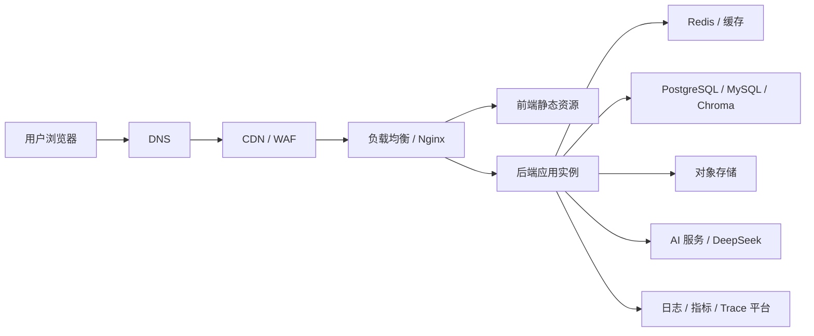
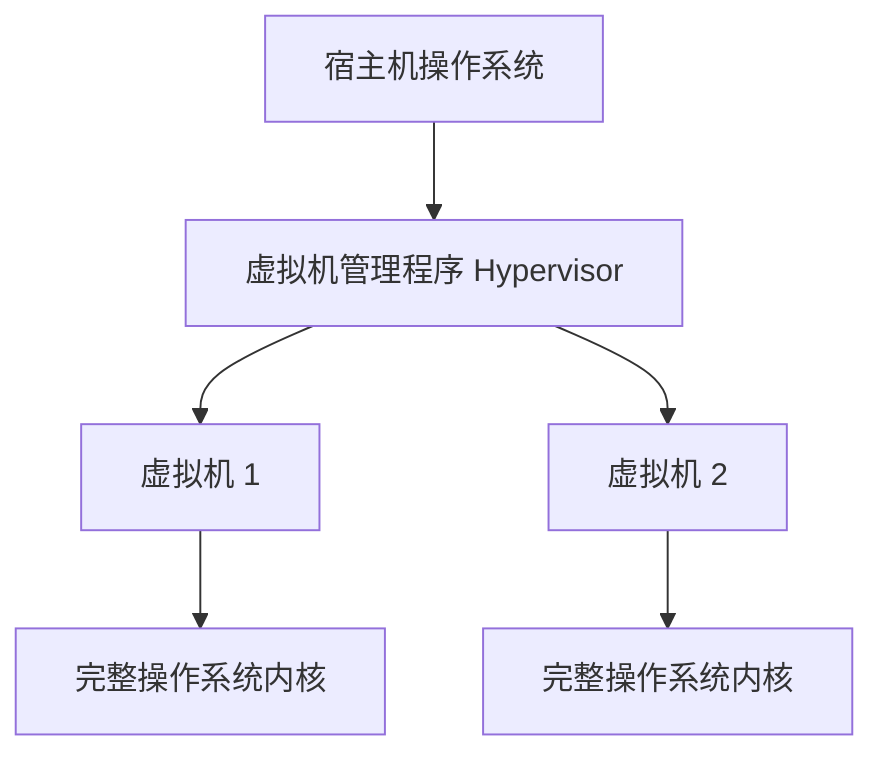
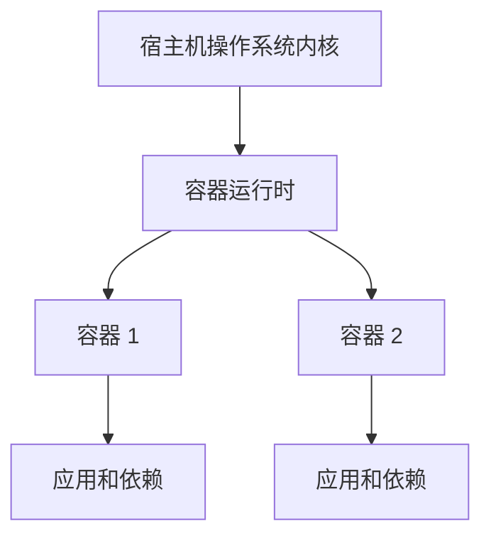
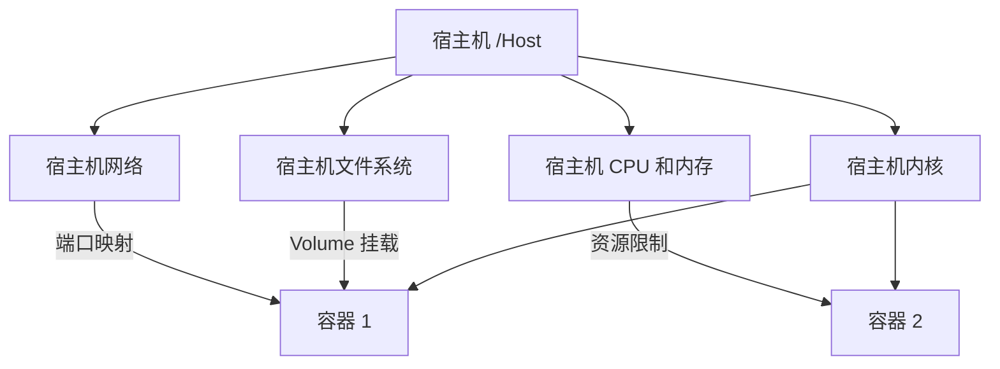
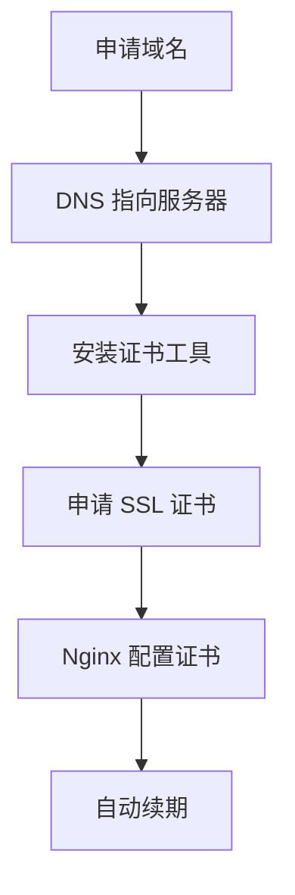
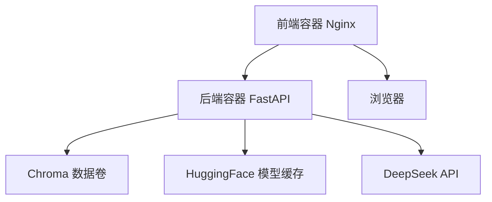

# 前后端部署与运维

> 本文面向刚接触运维的开发者。目标不是让你立刻成为运维专家，而是帮你建立一条从“本地能跑”到“生产环境能稳定运行”的完整链路。
>
> 内容会从 Docker、容器、宿主机、Nginx 这些基础概念开始，逐步展开到生产环境部署、网络、日志、安全、CI/CD 和常见故障排查。
>
> 文中的“本项目”指当前 `ai-job-agent` 项目，但大部分内容也适用于其他前后端项目。

## 1. 一个完整部署请求经过哪些地方

一个真实生产环境可能比本地复杂很多：



请求并不是直接“前端到后端”这么简单。生产环境通常会经过：

1. **DNS**：把域名转换成服务器 IP。
2. **CDN / WAF**：缓存静态文件、拦截恶意流量。
3. **反向代理 / 负载均衡**：Nginx、Traefik、ALB、Ingress。
4. **前端静态资源**：HTML、JS、CSS，可能由 Nginx 或对象存储提供。
5. **后端应用实例**：FastAPI、Node.js、Java 等。
6. **数据库 / 缓存 / 对象存储**：保存业务数据。
7. **外部 AI 服务**：本项目会调用 DeepSeek。
8. **可观测性平台**：日志、指标、Trace。

## 2. 本地开发和生产的核心区别

| 项目 | 本地开发 | 生产部署 |
|---|---|---|
| 启动方式 | `npm run dev`、`uvicorn --reload` | 容器或进程管理器 |
| 是否一直运行 | 关了终端可能停止 | 服务崩溃后自动重启 |
| 访问方式 | `localhost` | 域名、HTTPS |
| 日志 | 终端里看 | 集中收集 |
| 配置 | 本地 `.env` | 密钥管理、环境变量 |
| 数据 | 本地文件 | 持久化卷、数据库 |
| 错误影响 | 只有自己 | 影响所有用户 |
| 发布 | 手动 | 自动化流水线 |
| 资源 | 开发机资源充足 | CPU、内存、带宽都有成本 |

生产部署的目标不只是“能访问”，还包括：

- 稳定运行。
- 失败后能恢复。
- 能水平扩展。
- 日志和指标可观察。
- 配置可管理。
- 数据可备份。
- 权限和网络足够安全。

## 3. 宿主机、虚拟机、容器到底有什么区别

### 3.1 宿主机

宿主机是实际运行 Docker 的机器。

它可以是：

- 你的 Mac。
- 一台云服务器。
- 一台公司内部服务器。

在命令行中，宿主机就是你在上面执行 `docker` 命令的那台机器。

### 3.2 虚拟机

虚拟机在宿主机上模拟出一台完整的电脑，包括操作系统内核。



虚拟机隔离性强，但占用资源多、启动慢。

### 3.3 容器

容器不需要模拟一台完整电脑，它直接复用宿主机的内核。



所以容器比虚拟机轻量。

### 3.4 一个关键结论

容器不是虚拟机。

容器共享宿主机内核，但通过 Linux 内核特性把进程、文件系统、网络等隔离开。

这也意味着：

```text
Linux 宿主机可以运行 Linux 容器
macOS 或 Windows 上运行 Linux 容器，通常底层仍需要一个 Linux 虚拟机
```

你本机 Docker Desktop 启动后，看似在 macOS 上运行容器，实际上 Docker Desktop 内部会启动一个轻量 Linux 虚拟机。

## 4. 宿主机和容器的关系

### 4.1 关系图



### 4.2 容器共享什么

容器和宿主机共享：

- CPU。
- 内存。
- 磁盘。
- 内核。

### 4.3 容器隔离什么

容器之间隔离：

- 进程。
- 文件系统。
- 网络。
- 用户权限。
- 主机名。

这些隔离不是靠一台虚拟电脑实现，而是靠 Linux 内核能力。

## 5. 容器隔离背后的专业词

### 5.1 Namespace

Namespace 是 Linux 内核提供的“视图隔离”。

可以理解为：

> 给每个容器戴上一副只能看到自己东西的眼镜。

常见 namespace：

| Namespace | 隔离内容 |
|---|---|
| PID | 进程号 |
| NET | 网络设备 |
| MNT | 文件系统挂载 |
| UTS | 主机名 |
| USER | 用户和组 |
| IPC | 进程间通信 |

所以容器 A 里的进程号 `1`，和容器 B 里的进程号 `1` 并不冲突。

### 5.2 Cgroup

Cgroup 负责资源限制和统计。

可以理解为：

> 给每个容器设置一个 CPU、内存、磁盘的额度。

例如：

```text
容器最多使用 2 个 CPU
容器最多使用 512MB 内存
```

如果没有 Cgroup，一个容器死循环就可能耗尽整台宿主机资源。

### 5.3 OverlayFS

OverlayFS 是容器镜像分层使用的文件系统。

它允许：

- 只读层：基础镜像和依赖。
- 可写层：容器运行时的临时修改。

多个容器可以共享相同的只读层，减少磁盘占用。

### 5.4 Container Runtime

容器运行时是真正创建和运行容器的软件。

常见运行时：

- runc
- containerd
- CRI-O

普通开发者通常不需要直接操作 runtime，因为 Docker 会调用它们。

### 5.5 OCI

OCI 是 Open Container Initiative，负责定义容器镜像和运行时的标准。

这意味着：

> 只要镜像符合 OCI 标准，不同运行时通常都能运行。

## 6. 镜像和容器再深入一层

### 6.1 镜像不是一个大文件

镜像由多个只读层组成。

每个 Dockerfile 指令通常会生成一个新层：

```dockerfile
FROM python:3.12-slim
WORKDIR /app
COPY app ./app
RUN pip install ...
```

每一行都可能产生一层。

### 6.2 镜像层有什么好处

如果只修改了 `app/main.py`，Docker 可以复用之前缓存的基础层和依赖层，只重新构建最后几层。

这也是为什么 Dockerfile 中依赖安装通常放在源码复制之前：

```dockerfile
COPY pyproject.toml uv.lock ./
RUN uv sync ...

COPY app ./app
```

这样改业务代码时，不需要重新安装依赖。

### 6.3 Tag 和 Digest

镜像标签不是唯一标识。

例如：

```text
python:3.12-slim
```

这个标签可能随时更新。

真正的唯一标识是 Digest，类似：

```text
sha256:78387bc3881b8273120a12ebe6c1ab22b018ccc2c9adf565ae1ac9b536e184ea
```

生产环境为了可重复部署，应尽量使用明确的 tag 或 digest，而不是 `latest`。

## 7. Dockerfile 和 Compose 的职责

| 文件 | 职责 |
|---|---|
| Dockerfile | 描述如何构建一个镜像 |
| docker-compose.yml | 描述如何运行一个或多个服务 |
| .env | 提供本地配置变量 |
| .dockerignore | 控制构建上下文 |

常见流程：


## 8. 端口、DNS 和服务发现

### 8.1 宿主机端口映射

Compose 中：

```yaml
ports:
  - "5173:80"
```

表示：

```text
宿主机 5173 -> 容器 80
```

### 8.2 容器内部 DNS

同一个 Compose 网络中，容器可以用服务名通信：

```nginx
proxy_pass http://backend:8000;
```

`backend` 不是 IP，而是服务名。Docker 内部 DNS 会把它解析成容器 IP。

### 8.3 为什么不能只靠 IP

容器重启后 IP 可能变化。

使用服务名比写死 IP 更稳定。

## 9. Nginx 在生产环境中的作用

Nginx 不是只能做“转发”，它承担很多职责：

1. 提供前端静态文件。
2. 反向代理到后端。
3. 负载均衡。
4. HTTPS 证书。
5. 缓存。
6. Gzip 压缩。
7. 限制访问频率。
8. 统一入口和安全头。

### 9.1 静态文件服务

前端构建后：

```text
dist/
  index.html
  assets/
```

Nginx 直接返回这些文件。

### 9.2 反向代理

浏览器只和 Nginx 通信，Nginx 再转发给后端。

这样可以隐藏后端真实地址，统一入口，方便加证书和日志。

### 9.3 负载均衡

多个后端实例时，Nginx 可以按不同策略分配请求：

- 轮询。
- 最少连接。
- IP Hash。

```nginx
upstream backend {
    server backend1:8000;
    server backend2:8000;
}
```

### 9.4 SSE 需要特殊配置

普通响应可以缓冲，但 SSE 是持续输出，必须关闭缓冲：

```nginx
proxy_buffering off;
proxy_cache off;
proxy_read_timeout 300s;
```

## 10. 前端生产部署的细节

### 10.1 React 构建

开发时：

```bash
npm run dev
```

生产时：

```bash
npm run build
```

构建后得到静态文件，由 Nginx 或 CDN 提供。

### 10.2 前端环境变量

前端环境变量通常在构建阶段写入，而不是运行时修改。

例如：

```bash
VITE_API_BASE_URL=https://api.example.com npm run build
```

这一点和后端不同，后端通常运行时读取环境变量。

### 10.3 SPA 刷新 404

React 是单页应用，页面路径由 JS 控制。

如果用户直接访问：

```text
/agent
```

服务器可能找不到 `/agent` 文件。

Nginx 使用：

```nginx
try_files $uri /index.html;
```

让所有页面请求都回退到 `index.html`。

## 11. 后端生产部署的细节

### 11.1 FastAPI 为什么不直接用开发命令

开发：

```bash
uvicorn app.main:app --reload
```

生产：

```bash
uvicorn app.main:app --host 0.0.0.0 --port 8000
```

生产通常不使用 `--reload`，因为自动重载会占用额外资源，也不适合稳定运行。

### 11.2 Worker 和并发

真实生产环境可能需要多个 worker。

FastAPI 常用 Uvicorn 或 Gunicorn 管理多个 worker。

不过不是 worker 越多越好，还需要结合 CPU、内存和业务类型调整。

### 11.3 优雅退出

发布新版本时，旧进程不能突然被杀掉，否则正在处理的请求会失败。

优雅退出会：

1. 停止接收新请求。
2. 处理完当前请求。
3. 再退出。

### 11.4 健康检查

生产环境需要健康检查来判断服务是否可用：

```text
GET /health
```

健康检查通常用于：

- 负载均衡决定是否转发。
- 容器平台决定是否重启。
- 发布时判断新版本是否成功。

## 12. 数据持久化和 Volume

容器是临时的，数据不是。

如果数据库文件直接写在容器内部，容器删除后数据可能丢失。

解决方式是 Volume。

### 12.1 Bind Mount

把宿主机目录直接挂进容器：

```yaml
volumes:
  - ./data/chroma:/app/data/chroma
```

### 12.2 Named Volume

由 Docker 管理，宿主机位置通常不需要知道：

```yaml
volumes:
  - chroma_data:/app/data/chroma

volumes:
  chroma_data:
```

### 12.3 两者区别

| 类型 | 管理方式 | 典型用途 |
|---|---|---|
| Bind Mount | 宿主机指定目录 | 本地开发、挂模型缓存 |
| Named Volume | Docker 管理 | 生产数据库、持久化数据 |

## 13. 环境变量和密钥管理

### 13.1 开发环境

开发时使用 `.env` 很方便，但不能把 `.env` 提交到 Git。

### 13.2 生产环境

生产环境密钥不应只放在 `.env` 里，更安全的方式是：

- 云平台 Secret Manager。
- 服务器环境变量。
- CI/CD 平台的加密变量。
- Vault 等密钥管理工具。

### 13.3 密钥写死在镜像里的风险

如果 Dockerfile 里有：

```dockerfile
COPY .env .env
```

镜像可能包含密钥，任何拿到镜像的人都能读取。

所以应该通过运行时环境变量注入。

## 14. Docker Compose 和 Kubernetes 的区别

### 14.1 Docker Compose

Compose 适合：

- 本地开发。
- 单机部署。
- 快速演示。
- 小型项目 MVP。

它管理一台宿主机上的多个容器。

### 14.2 Kubernetes

Kubernetes 适合：

- 多台服务器。
- 自动扩展。
- 自动恢复。
- 滚动发布。
- 多环境管理。

它比 Compose 复杂很多。

### 14.3 什么时候上 Kubernetes

如果：

- 单台服务器已经不够。
- 需要频繁发布和回滚。
- 团队规模变大。
- 需要多环境一致性。

再考虑 Kubernetes。

否则先做好 Docker Compose 已经足够。

## 15. 生产部署步骤

一个较完整的部署流程：

1. 准备服务器。
2. 安装 Docker 和 Compose。
3. 配置域名和 HTTPS。
4. 管理密钥。
5. 拉取代码和镜像。
6. 启动服务。
7. 配置防火墙和安全组。
8. 配置备份。
9. 配置日志和监控。
10. 准备回滚方案。

### 15.1 准备服务器

可以选择云服务器、公司服务器或虚拟机。

需要确认：

- CPU、内存、磁盘。
- 操作系统。
- 网络和带宽。
- 备份策略。

### 15.2 配置域名和 HTTPS

生产环境应使用 HTTPS。

常见流程：



证书通常来自：

- Let's Encrypt。
- 云厂商证书服务。
- 公司内部 CA。

### 15.3 配置防火墙

默认只开放必要端口：

```text
80
443
22（运维 SSH）
```

数据库端口通常不应直接暴露到公网。

### 15.4 发布和回滚

发布新版本前准备：

- 旧镜像 tag。
- 数据库备份。
- 回滚命令。

常见发布方式：

- 蓝绿部署。
- 滚动发布。
- 金丝雀发布。

## 16. CI/CD

CI/CD 是持续集成和持续部署。


目标：

- 每次提交都自动验证。
- 每次发布都可重复。
- 每次失败都能快速回滚。

## 17. 日志、指标和 Trace

### 17.1 日志

容器日志应输出到标准输出：

```bash
stdout
stderr
```

再由日志系统收集。

### 17.2 指标

指标是数值，例如：

- 每秒请求数。
- 响应时间。
- CPU 使用率。
- 错误率。

### 17.3 Trace

Trace 是一次完整请求的轨迹。

本项目 Day 27 做的本地 trace 就是这一思路的简化版。

生产环境常用：

- Langfuse。
- OpenTelemetry。
- Grafana Tempo。

## 18. 安全基础

常见安全问题：

1. 密钥泄露。
2. 容器以 root 运行。
3. 使用过旧基础镜像。
4. 数据库端口暴露公网。
5. 没有资源限制。
6. 没有 HTTPS。
7. 没有防火墙。
8. 日志泄露敏感信息。

最小安全建议：

- 不提交 `.env`。
- 不使用 `latest`。
- 最小化镜像。
- 使用非 root 用户。
- 定期更新基础镜像。
- 限制容器资源。
- 数据库只在内网。
- 使用 HTTPS。

## 19. 常见故障排查

### 19.1 502

通常是反向代理找不到后端。

排查：

```bash
docker-compose ps
docker-compose logs backend
```

### 19.2 504

通常是后端处理时间过长。

可以：

- 增加超时时间。
- 优化后端性能。
- 检查是否调用外部服务卡住。

### 19.3 容器启动后立即退出

看日志：

```bash
docker logs 容器名
```

常见原因：

- 启动命令错误。
- 环境变量缺失。
- 端口被占用。
- 依赖未安装。

### 19.4 数据丢失

检查 Volume：

```bash
docker volume ls
```

确认数据库或向量库是否写到持久化位置。

### 19.5 拉取镜像失败

检查：

- 网络。
- 代理。
- 镜像源。
- 镜像名。
- 凭据。

## 20. 本项目部署复盘

本项目 Day 28 实际上完成了一个单机 MVP：



它适合：

- 本地演示。
- 单台服务器部署。
- 学习容器化。

还不是完整生产级方案。生产级还需要：

- HTTPS。
- 健康检查。
- 自动重启策略。
- 日志集中收集。
- 备份策略。
- CI/CD。
- 镜像仓库。
- 非 root 用户。
- 资源限制。

## 21. 命令速查

### 21.1 镜像

```bash
docker images
docker build -t app:latest .
docker pull python:3.12-slim
docker tag python:3.12-slim app:python
```

### 21.2 容器

```bash
docker ps
docker ps -a
docker logs 容器名
docker stop 容器名
docker rm 容器名
docker exec -it 容器名 sh
```

### 21.3 Compose

```bash
docker-compose up -d --build
docker-compose ps
docker-compose logs -f backend
docker-compose exec backend sh
docker-compose down
```

### 21.4 Volume

```bash
docker volume ls
docker volume inspect 卷名
```

### 21.5 清理

```bash
docker system df
docker system prune
```

注意：`prune` 会清理无用的镜像和资源，执行前要确认。

## 22. 建议学习顺序

建议按下面顺序深入：

1. 先跑通 Dockerfile。
2. 再跑通 Compose。
3. 理解镜像分层和缓存。
4. 理解端口和网络。
5. 理解 Volume 和备份。
6. 理解 Nginx 反向代理。
7. 学习健康检查和日志。
8. 学习 HTTPS 和域名。
9. 再学 CI/CD。
10. 最后再接触 Kubernetes。

每一步都先解决一个实际问题，再扩展新概念，比一次性啃完所有知识更有效。
