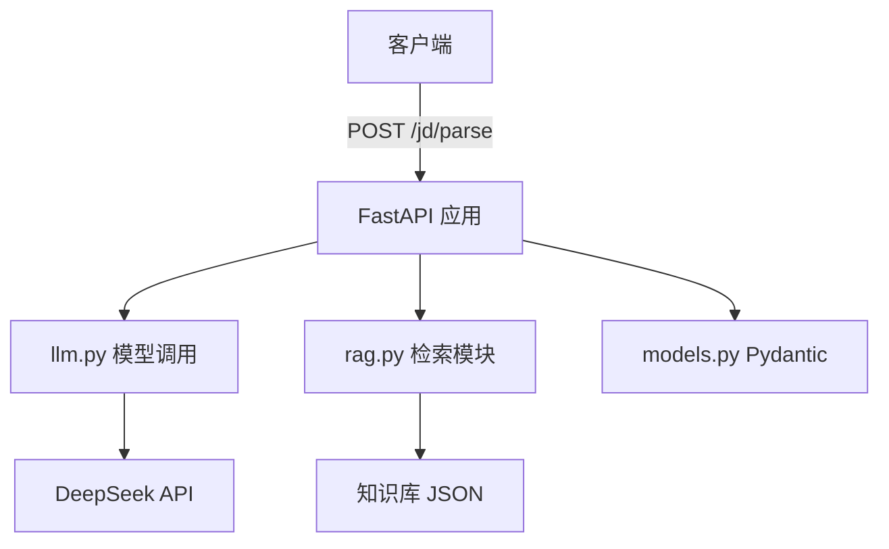
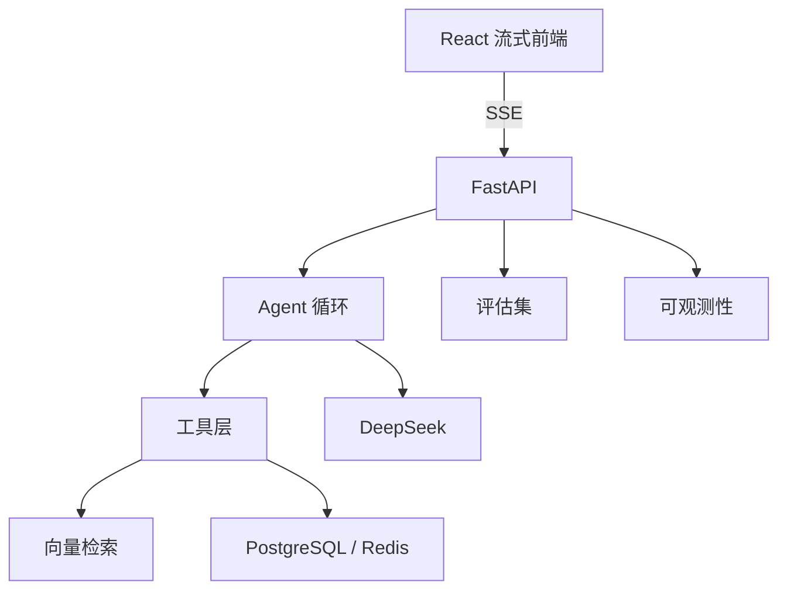

# AI Agent 开发学习知识框架

日期：2026-08-21

目标岗位：AI Agent 应用工程师、AI 应用工程师、大模型应用开发工程师、Agent 全栈工程师。

目标不是成为模型训练算法工程师，而是成为能够设计、开发、评估、上线 AI Agent 产品的工程师。

## 1. 核心结论

AI Agent 开发值得转，但需要补齐 Python、后端、LLM 应用工程和系统设计能力。

前端背景的优势：

- TypeScript、React、Next.js
- 流式 UI、复杂交互
- 浏览器自动化和前端调试
- 产品感和原型能力

需要补齐的能力：

- Python、FastAPI、Pydantic
- LLM API、Prompt、结构化输出
- RAG、Embedding、向量检索
- Agent 循环、工具调用、记忆
- 评估、可观测性、部署运维

## 2. AI Agent 是什么

AI Agent 是让大语言模型作为推理核心，自主完成以下循环：

```text
理解目标 -> 拆解任务 -> 调用工具 -> 获取结果 -> 继续推理 -> 最终交付
```

它和普通聊天机器人的区别：

| 普通 LLM 应用 | AI Agent |
|---|---|
| 一次问答 | 多步任务 |
| 只生成文本 | 可以调用工具 |
| 上下文固定 | 有记忆和状态 |
| 不操作外部世界 | 可以读取、搜索、执行 |

### 2.1 典型工作场景

- 企业知识库问答：RAG + 文档检索 + 引用来源
- 智能客服：多轮对话 + 工单系统 + 人工转接
- 数据分析助手：自然语言转 SQL、图表、结论
- 浏览器自动化 Agent：抓取、整理、生成报告
- 编程 Agent：写代码、调试、运行测试
- 研究 Agent：搜索、阅读、总结、对比
- 企业 Agent 平台：工具注册、权限、审计、编排

### 2.2 AI Agent 工程师日常工作

- 设计 Agent 架构和状态机
- 定义 Prompt 和结构化输出
- 开发工具和 function calling
- 搭建 RAG 和知识库
- 管理会话、记忆和上下文
- 实现多 Agent 协作
- 设计评估集和回归测试
- 处理护栏、权限、人工确认
- 做流式交互、可观测性和部署
- 优化成本、延迟和稳定性

## 3. 核心概念

### 3.1 LLM

Large Language Model，大语言模型。

它接收 Prompt 和上下文，生成下一段文本。项目中 DeepSeek 就是 LLM。

### 3.2 Prompt

输入给模型的指令、上下文和示例。

Prompt 工程包括：

- 角色设定
- 任务说明
- 输出格式
- few-shot 示例
- 边界约束

### 3.3 Token 和 Context

模型处理文本时会把文字切分成 token。

Context 是模型一次能处理的最大 token 数量。

上下文越接近上限，成本越高，延迟也可能越高。

### 3.4 Structured Output

让模型按固定结构输出，而不是自由文本。

常用形式：

- JSON
- JSON Schema
- function calling 参数

本项目已经通过 Pydantic 校验结构化输出。

### 3.5 Function Calling

模型根据工具 Schema 返回函数名和参数，但不会真正执行函数。

真正执行工具的是 Python 代码。

本项目 Day 4 已经实现：

```python
tools=[SAVE_JOB_DESCRIPTION_TOOL]
tool_choice={"type": "function", "function": {"name": "save_job_description"}}
```

### 3.6 RAG

Retrieval-Augmented Generation，检索增强生成。

流程：

```text
文档 -> 切分 -> Embedding -> 向量库
问题 -> Embedding -> 相似度检索 -> 放入 Prompt -> 模型回答
```

RAG 能减少幻觉，让模型使用私有或最新资料。

### 3.7 Embedding

把文字转成向量，用于计算语义相似度。

本项目使用：

```python
BAAI/bge-small-zh-v1.5
```

DeepSeek 主要负责生成，Embedding 由本地模型完成。

### 3.8 Vector Database

用于存储和检索向量的数据库。

常见选型：

- pgvector
- Qdrant
- Chroma
- Milvus
- Pinecone

早期学习阶段可以先使用内存列表或 Chroma。

### 3.9 Agent Loop

Agent 的循环执行模式：

```text
1. 模型分析当前状态
2. 模型决定下一步动作
3. 调用工具
4. 获取工具结果
5. 把结果放回上下文
6. 重复，直到任务完成
```

常见模式是 ReAct：

```text
Reasoning + Acting
推理 + 行动
```

### 3.10 Memory

记忆分类：

- 短期记忆：当前会话消息
- 长期记忆：用户偏好、历史事实
- 工作记忆：当前任务状态

实现方式：

- 消息列表
- 数据库存储
- 向量检索历史
- 摘要压缩

### 3.11 Multi-Agent

多个 Agent 协作完成任务。

常见结构：

- Supervisor：主管 Agent 分配任务
- Handoff：一个 Agent 把任务交给另一个 Agent
- Worker：多个专业 Agent 并行工作

### 3.12 MCP

Model Context Protocol，模型上下文协议。

它定义了模型如何连接外部工具、资源和数据源。

可以把 MCP 理解为工具和 Agent 之间的标准接口。

### 3.13 Guardrails

护栏，用来保证 Agent 安全执行：

- 输入校验
- 输出校验
- 工具权限
- 敏感信息过滤
- 防止提示注入
- 危险操作审批

### 3.14 Evaluation

评估 Agent 是否可靠。

评估指标包括：

- 准确率
- 召回率
- 答案忠实度
- 工具调用正确率
- 任务完成率
- 延迟和成本

评估是区分 Demo 和可上线系统的关键。

### 3.15 Observability

可观测性，追踪 Agent 每一步做了什么。

重点记录：

- Prompt
- 模型输出
- 工具调用
- 检索结果
- 错误
- 延迟
- 成本

常用工具：Langfuse、LangSmith、Arize Phoenix、OpenTelemetry。

### 3.16 Streaming

流式输出，让模型边生成边返回。

前端通常使用：

- SSE
- WebSocket
- Vercel AI SDK

Agent 前端还需要展示：

- 工具调用状态
- 中间步骤
- 人工确认按钮
- 最终产物

## 4. 技术栈和岗位技能要求

### 4.1 后端与语言

- Python
- FastAPI
- Pydantic
- httpx
- async/await

### 4.2 LLM 与 Agent

- OpenAI 兼容 API
- DeepSeek API
- function calling
- OpenAI Agents SDK
- LangGraph
- MCP

### 4.3 RAG 与数据

- sentence-transformers
- numpy
- pgvector、Chroma、Qdrant
- PostgreSQL、Redis

### 4.4 工程化

- Docker
- 环境变量管理
- 日志、指标、trace
- 评估集
- CI/CD

### 4.5 前端

- React、Next.js
- TypeScript
- SSE/WebSocket
- 流式 UI

## 5. 主项目：AI 求职分析 Agent

### 5.1 项目定位

这个项目既是你学习 AI Agent 的载体，也是求职作品集。

最终目标：

1. 输入 JD 文本或 URL
2. 解析岗位职责和技能要求
3. 与简历匹配
4. 检索岗位知识库
5. 生成学习建议、面试问题和简历修改建议
6. 通过流式前端展示结果

### 5.2 当前架构



### 5.3 目标架构



## 6. 学习阶段和能力标准

| 阶段 | 能力标准 | 预计时间 |
|---|---|---|
| L0 环境入门 | 能搭环境、运行 Python | 第 1 天 |
| L1 单次模型调用 | 能调用 LLM，返回结构化结果 | 第 3 天 |
| L2 工具调用 | 能实现 function calling | 第 4 天 |
| L3 基础 RAG | 能实现向量检索 | 第 5 天 |
| L4 单 Agent | 能实现多步 Agent 循环 | 第 3 周 |
| L5 可上线 Agent | 有评估、监控、部署 | 第 10 周 |
| L6 高级工程师 | 能设计复杂多 Agent 系统 | 12 周后持续积累 |

## 7. 十二周总览

| 周 | 主题 | 目标 |
|---|---|---|
| 第 1 周 | Python、FastAPI、LLM、RAG 起步 | 跑通最小项目 |
| 第 2 周 | RAG 进阶、记忆、上下文 | 能检索并生成可靠回答 |
| 第 3 周 | Agent 循环、多工具、护栏 | 实现单 Agent |
| 第 4 周 | 前端、评估、可观测、部署 MVP | 完成可演示产品 |
| 第 5 周 | LLM 和 Prompt 深入 | 掌握模型使用和评估 |
| 第 6 周 | RAG 工程化 | 掌握检索质量 |
| 第 7 周 | 多 Agent 架构 | 掌握任务编排 |
| 第 8 周 | MCP、工具、安全 | 掌握工具生态和护栏 |
| 第 9 周 | 后端工程 | 掌握数据库、缓存、队列 |
| 第 10 周 | 生产化 | 掌握部署和可观测性 |
| 第 11 周 | 第二个项目 | 增加作品集复杂度 |
| 第 12 周 | 面试冲刺 | 达到可面试状态 |

## 8. 第 1 周详细计划

当前进度：Day 1 到 Day 5 已完成，Day 6 和 Day 7 待完成。

| 天 | 任务 | 掌握知识点 | 交付物 | 状态 |
|---|---|---|---|---|
| Day 1 | Python 环境与基础 | uv、venv、函数、类型标注、dict、list、async | `app/day1.py`、pytest | 已完成 |
| Day 2 | FastAPI 和 Pydantic | 路由、请求体、Pydantic、response_model | `app/main.py`、`app/models.py` | 已完成 |
| Day 3 | DeepSeek JSON 输出 | OpenAI SDK、Prompt、json.loads、Pydantic 校验 | `app/llm.py` | 已完成 |
| Day 4 | function calling | tools、tool_choice、tool_calls、arguments | 更新 `app/llm.py` | 已完成 |
| Day 5 | 基础 RAG 检索 | Embedding、向量相似度、numpy | `app/rag.py`、`rag_cli.py` | 已完成 |
| Day 6 | RAG 接入 Agent 流程 | 检索上下文、Prompt 组合 | `/jd/analyze` 或增强 `/jd/parse` | 待完成 |
| Day 7 | 复盘、测试、提交 | 单元测试、README、Git | 完整第 1 周项目 | 待完成 |

### Day 6 建议任务

目标：让模型不仅解析 JD，还能根据检索到的知识片段回答问题。

可以新增接口：

```text
POST /jd/analyze
```

流程：

1. 接收 JD 文本
2. 解析 JD 为 `JobDescription`
3. 用 `JobDescription.keywords` 或原始文本做 RAG 检索
4. 把检索结果拼进 Prompt
5. 让 DeepSeek 生成岗位分析和学习建议

### Day 7 建议任务

- 检查所有测试
- 补齐 README
- 运行 CLI 和 API 做完整验证
- 提交 Git
- 在 `docs/week1.md` 记录总结

## 9. 第 2 周详细计划

主题：RAG 进阶、记忆、上下文管理

| 天 | 任务 | 知识点 |
|---|---|---|
| Day 1 | 文本切分策略 | 固定长度、重叠、结构化切分 |
| Day 2 | 改进检索 | BM25、混合检索、重排 |
| Day 3 | 持久化向量库 | Chroma 或 pgvector |
| Day 4 | 会话记忆 | 短期记忆、消息历史 |
| Day 5 | RAG 接入回答 | 上下文拼接、引用来源 |
| Day 6 | RAG 评估 | 召回率、答案忠实度 |
| Day 7 | 项目整合 | 测试、复盘、提交 |

第 2 周达到水平：

- 能搭建基础 RAG 应用
- 能管理会话历史
- 能评估检索质量

## 10. 第 3 周详细计划

主题：Agent 循环、多工具、护栏

| 天 | 任务 | 知识点 |
|---|---|---|
| Day 1 | ReAct 循环 | 推理和行动交替 |
| Day 2 | 工具注册与多工具 | 工具 Schema、工具分发 |
| Day 3 | DeepSeek 多工具调用 | 多工具 function calling |
| Day 4 | 错误处理 | 重试、降级、超时 |
| Day 5 | 人工确认 | human-in-the-loop |
| Day 6 | 安全护栏 | 提示注入、输出校验 |
| Day 7 | Agent 状态 | 任务状态、检查点 |

第 3 周达到水平：

- 能实现单 Agent 多步执行
- 能控制工具权限
- 能处理异常和人工介入

## 11. 第 4 周详细计划

主题：前端、评估、可观测性、MVP 部署

| 天 | 任务 | 知识点 |
|---|---|---|
| Day 1 | 流式输出原理 | SSE、WebSocket |
| Day 2 | FastAPI 流式响应 | StreamingResponse |
| Day 3 | React 聊天前端 | 消息列表、流式渲染 |
| Day 4 | Agent 状态展示 | 工具调用、审批按钮 |
| Day 5 | 评估集 | 测试用例、评分标准 |
| Day 6 | 可观测性 | Langfuse 或 Phoenix |
| Day 7 | Docker 部署 MVP | Dockerfile、环境变量 |

第 4 周达到水平：

- 能完成一个可演示的端到端 Agent 产品

## 12. 第 5 周详细计划

主题：LLM 和 Prompt 深入

| 天 | 任务 | 知识点 |
|---|---|---|
| Day 1 | Token 和 Context | 分词、上下文预算 |
| Day 2 | Prompt 模式 | few-shot、CoT |
| Day 3 | 结构化输出深入 | JSON Schema、Pydantic |
| Day 4 | function calling 深入 | 参数设计、错误恢复 |
| Day 5 | 模型选择 | 成本、延迟、能力 |
| Day 6 | Prompt 评估 | 一致性、鲁棒性 |
| Day 7 | 构建 Prompt 库 | 可复用模板 |

第 5 周达到水平：

- 能设计稳定、可复用的 Prompt 体系

## 13. 第 6 周详细计划

主题：RAG 工程化

| 天 | 任务 | 知识点 |
|---|---|---|
| Day 1 | Chunking 深入 | 元数据、语义边界 |
| Day 2 | Embedding 模型对比 | 中文、多语言、成本 |
| Day 3 | pgvector 或 Qdrant | 向量索引、过滤 |
| Day 4 | 混合检索和重排 | BM25、Cross Encoder |
| Day 5 | Query Rewriting | 改写、扩展、多跳 |
| Day 6 | RAG 评估体系 | 端到端评估 |
| Day 7 | RAG 接入 Agent | 工具化检索 |

第 6 周达到水平：

- 能建设可评估的生产级 RAG

## 14. 第 7 周详细计划

主题：多 Agent 架构

| 天 | 任务 | 知识点 |
|---|---|---|
| Day 1 | Plan and Execute | 先规划后执行 |
| Day 2 | Supervisor 模式 | 主 Agent 调度 |
| Day 3 | Handoff | Agent 交接 |
| Day 4 | LangGraph 或 Agents SDK | 状态图、节点 |
| Day 5 | 长任务执行 | 状态恢复、中断 |
| Day 6 | 多 Agent 记忆 | 共享状态、通信 |
| Day 7 | 生产级多 Agent 设计 | 隔离、幂等、超时 |

第 7 周达到水平：

- 能设计多 Agent 任务编排

## 15. 第 8 周详细计划

主题：MCP、工具生态和安全

| 天 | 任务 | 知识点 |
|---|---|---|
| Day 1 | MCP 原理 | Client、Server、Tool |
| Day 2 | 编写 MCP Server | 暴露工具 |
| Day 3 | Agent 连接 MCP | 工具发现和调用 |
| Day 4 | 工具权限 | 审批、最小权限 |
| Day 5 | 提示注入防御 | 输入隔离、系统边界 |
| Day 6 | 敏感数据处理 | 脱敏、审计 |
| Day 7 | 红队测试 | 对抗输入、异常用例 |

第 8 周达到水平：

- 能安全接入外部工具生态

## 16. 第 9 周详细计划

主题：后端工程

| 天 | 任务 | 知识点 |
|---|---|---|
| Day 1 | 异步 FastAPI | async def、并发 |
| Day 2 | PostgreSQL | SQL、事务 |
| Day 3 | Redis | 缓存、会话 |
| Day 4 | 任务队列 | arq、Celery |
| Day 5 | 身份认证 | JWT、RBAC |
| Day 6 | 压力测试 | 并发、吞吐 |
| Day 7 | 错误处理体系 | 重试、降级、熔断 |

第 9 周达到水平：

- 能处理真实后端工程问题

## 17. 第 10 周详细计划

主题：生产化和部署

| 天 | 任务 | 知识点 |
|---|---|---|
| Day 1 | Dockerfile | 构建镜像 |
| Day 2 | docker-compose | 多服务编排 |
| Day 3 | 配置和密钥 | 环境变量、Secret |
| Day 4 | 日志和指标 | 结构化日志、Prometheus |
| Day 5 | 可观测性 | Langfuse、OpenTelemetry |
| Day 6 | 成本和延迟 | 缓存、模型降级 |
| Day 7 | CI/CD | 自动测试、自动部署 |

第 10 周达到水平：

- 能部署和运维 Agent 服务

## 18. 第 11 周详细计划

主题：第二个项目

| 天 | 任务 | 知识点 |
|---|---|---|
| Day 1 | 选择项目 | 客服、数据分析、浏览器 Agent |
| Day 2 | 设计架构 | 工具、Agent、数据流 |
| Day 3 | 实现工具和 RAG | 完整工具链 |
| Day 4 | 实现流式前端 | 用户体验 |
| Day 5 | 建立评估集 | 可量化结果 |
| Day 6 | 部署 | Docker、域名 |
| Day 7 | 文档和演示 | README、演示视频 |

第 11 周达到水平：

- 拥有第二个更复杂的作品集项目

## 19. 第 12 周详细计划

主题：面试冲刺

| 天 | 任务 | 知识点 |
|---|---|---|
| Day 1 | 简历关键词 | 岗位匹配 |
| Day 2 | 项目叙事 | STAR 法则 |
| Day 3 | Python 面试题 | 数据结构、并发 |
| Day 4 | Agent 系统设计 | 架构题 |
| Day 5 | 项目复盘 | 指标、取舍 |
| Day 6 | 模拟面试 | 表达和追问 |
| Day 7 | 最终检查 | 作品集、简历、投递 |

第 12 周达到水平：

- 能通过 AI Agent 初中级岗位面试

## 20. 当前学习进度对齐

当前日期：2026-08-21

已完成：

- Day 1：Python 环境与基础
- Day 2：FastAPI 和 Pydantic
- Day 3：DeepSeek JSON 输出
- Day 4：function calling
- Day 5：基础 RAG 检索

下一步：

- Day 6：把 RAG 检索结果接入 Agent 流程
- Day 7：复盘、测试、提交第 1 周项目

当前水平：L3，基础 RAG 检索已经跑通，还没有完整的多步 Agent 循环。

## 21. 复盘方法

每周结束时回答：

1. 这周做出了什么可以演示的功能
2. 掌握了哪些新概念
3. 哪些测试证明了代码正确
4. 哪些问题还没解决
5. 下周最重要的一个目标是什么

每完成一个阶段，都建议更新 GitHub README 和 `docs/` 下的学习笔记。

## 22. 作品集和简历重点

简历应体现：

- Python、FastAPI、Pydantic
- DeepSeek 或 OpenAI 兼容 API
- function calling
- RAG、Embedding、向量检索
- Agent 循环、多工具
- 评估、可观测性、Docker

不要写：

- 精通大模型训练
- 只会 Prompt 调优
- 只有 Demo，没有评估和上线

最终作品集至少包含：

1. AI 求职分析 Agent
2. 第二个 Agent 项目
3. 每个项目的架构图
4. 评估集和指标
5. README、演示视频

## 23. 学习原则

1. 项目优先，理论随项目补
2. 每天完成一个可验证的小目标
3. 用 TypeScript 对照学习 Python
4. 不追求一次性学完框架
5. 用测试确认理解
6. 每个错误都记录原因和修复
7. 持续做端到端功能，而不是只写孤立代码
8. 从第 1 周开始就建立可演示项目

## 24. 最终目标

12 周后，你应该能够：

- 独立搭建 FastAPI + DeepSeek + RAG 的 Agent 应用
- 实现 function calling 和多工具调用
- 实现 Agent 循环和人工介入
- 实现流式前端和可观测性
- 建立评估集并量化效果
- 使用 Docker 部署服务
- 在面试中讲清项目架构、取舍和指标
- 达到 AI Agent 初中级岗位的应聘要求
